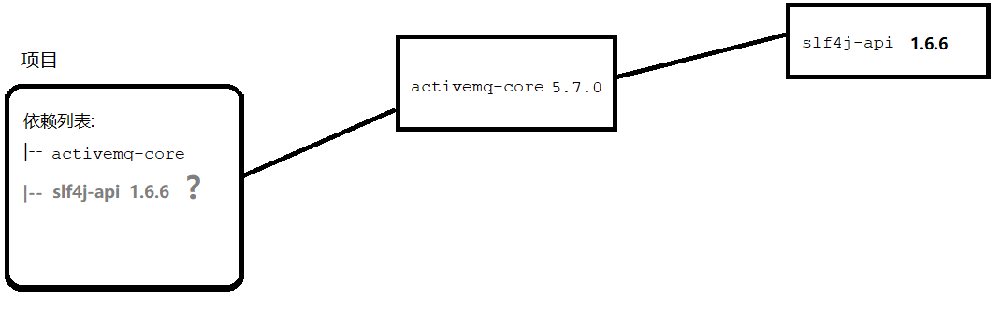
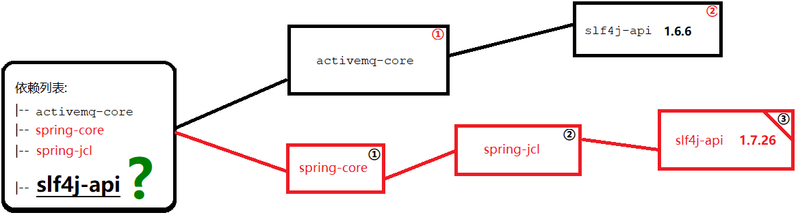
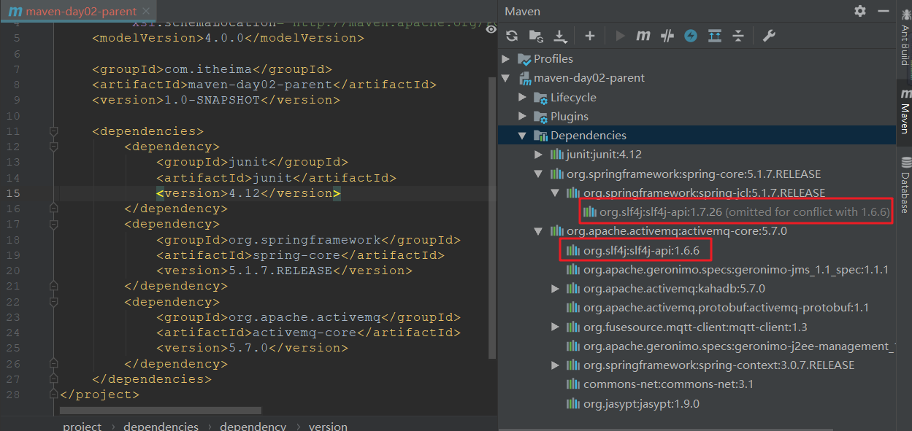
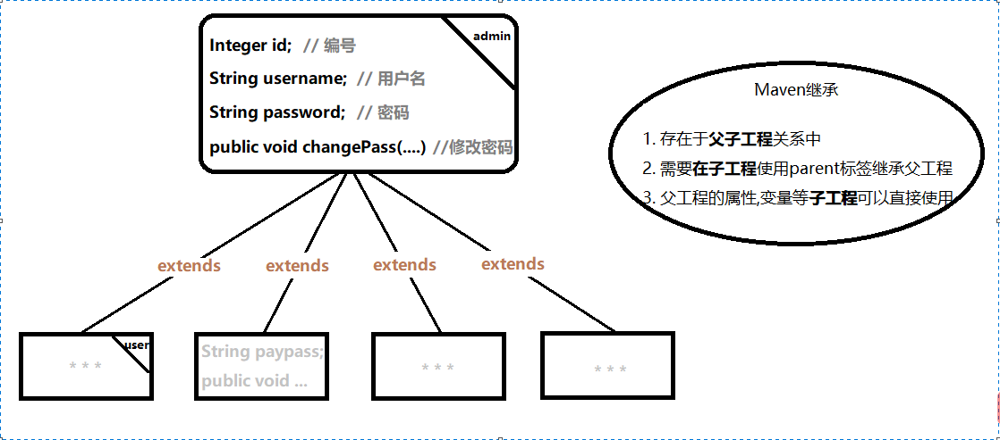
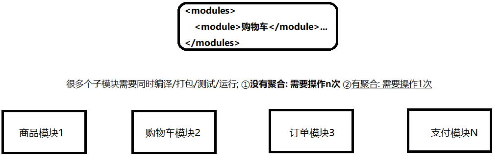
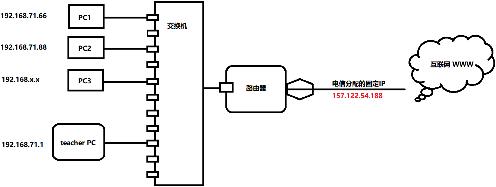
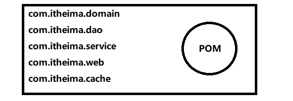
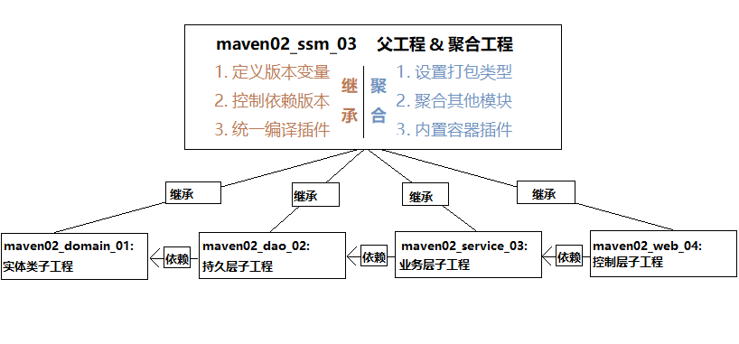
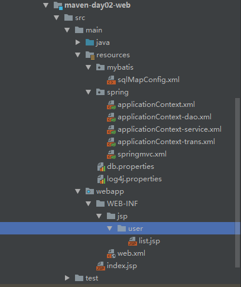

#### 01复习【理解】

##### 目标

- Maven是什么

- Maven相关概念

- Maven的使用

  

##### Maven是什么

- [Apache Maven](http://maven.apache.org/) 是一种 **项目管理工具**。
- 使用 **pom.xml** (项目对象模型) 描述项目与项目之间的关系。
- 最强大的功能就是能够自动下载项目 **jar包** 。

##### Maven相关概念

- 仓库
  - 生活常见的仓库有 **粮仓, 米仓** ;
  - 存放的是生活所需品 - **粮食**。
  - 

- 坐标是什么
  - 仓库中的jar包像地球上海量的建筑。
  - 

- 依赖是什么
  - 依赖是pom文件中对jar引用的配置

  - 必须包含坐标信息

  - 配置的jar引用将会自动下载

  - 【扩展】scope可以指定引用范围, 默认是compile。

    | 依赖范围 | 说明     | 编译是否有效 | 测试是否有效 | 运行是否有效 | 是否打包 | 实际应用    |
    | -------- | -------- | ------------ | ------------ | ------------ | -------- | ----------- |
    | compile  | 编译范围 | √            | √            | √            | √        | ssm         |
    | test     | 测试范围 | √            | √            | ×            | ×        | junit       |
    | provided | 容器范围 | √            | √            | ×            | ×        | servlet-api |
    | runtime  | 运行范围 | ×            | √            | √            | √        | jdbc驱动    |

##### Maven的使用

- 下载安装
  - [Maven3](http://archive.apache.org/dist/maven/maven-3/)

- 创建项目
  - 项目名称: maven-day02-parent

- 依赖案例

```xml
<dependency>
    <groupId>junit</groupId>
    <artifactId>junit</artifactId>
    <version>4.12</version>
</dependency>
```


##### 小结

- Maven是什么?

  - 

- 学习了Maven哪些概念?

  - 

  

#### 02使用idea操作Mvn【了解】

##### 目标

- 为什么在IDEA上操作Maven
- 如何在IDEA上使用Maven (**配置**)


##### 为什么在IDE上操作Maven

- 手工操作很繁琐, 很难一步完成。
- 手工操作容易出现失误, 遗忘等..

##### IDEA需要做什么配置

- File > Settings > Build, Execution, Deployment > Build Tools > Maven
- **Maven home directory** : 安装目录
- **User settings file** : C:\Users\Administrator.m2\settings.xml
- **Local repository** : 本地仓库路径 


##### 小结

- 为什么在IDEA上操作Maven?
  - 


#### 03特性 - 依赖传递【掌握】

##### 目标

- 什么是依赖传递

- 依赖传递的细节

  

##### 什么是依赖传递

 

- 案例activemq-core依赖传递演示

```xml

```


##### 依赖传递的细节

###### 依赖传递的阻止

- 使用optional标签可以阻止继续传递 

```xml

```

- 默认false: 继续传递, true: 阻止继续传递


###### 依赖传递的排除

    

- 若有相同的依赖如何 **舍取** ?

  - **默认** 短路优先

    - 最终采用距离最近的依赖版本

      

  - 如果想用最新版本的log4j呢? ( **版本冲突** )

    - 排除短路优先选择的依赖
  
    ```xml
    
    ```


##### 小结

- 什么是依赖传递?
  - 
- 依赖传递导致了什么问题?
  - 


#### 04高级特性 - 继承【理解】

##### 目标

- 什么是继承
- **如何去继承**
- 继承的作用


##### 什么是继承

 

##### 如何去继承

- child继承父工程

```xml

```


##### 继承的作用

- 继承依赖
  
  - 
  
- 继承变量
  - 父工程变量配置

    ```xml
    
    ```

  - 子工程变量引用

    ```xml
    
    ```

- 版本控制

  - 使用dependencyManagement标签在父工程定义版本依赖, 子工程使用时不需要指定版本号


##### 小结

- 继承的作用是什么?
  - 
- 如何去继承 (**解除**) ?
  - 


#### 05高级特性 - 聚合【理解】

##### 目标

- **没有聚合的情况**
- **聚合工程的作用**
- 创建并**使用聚合项目**: maven-day02-agg


##### 没有聚合的情况

  

   

##### 聚合工程的作用

- 对聚合工程进行 编译 等操作时, 被聚合的工程 **会同步进行该操作**


##### 创建并使用聚合工程

- 创建聚合工程: maven-day02-agg

- 聚合其他工程

```xml

```

- 编译测试查看效果


##### 小结

- 聚合的作用是什么?
  - 


#### 06远程仓库 - 私服【掌握】

##### 目标

- 中央仓库的缺点
- 什么是私服
- 如何搭建私服


##### 中央仓库的缺点

- 地址: [http://repo1.maven.org/maven2/](http://repo1.maven.org/maven2/) (**下载慢**)
- 限制: 同ip段的机器反复下载可能会被限制访问 (**黑名单**)

 

 

##### 什么是私服

- 私服是远程仓库的1种
  - 解决访问限制问题
  - 即使不能上网也可以下载jar包
  - 可以上传自己的jar包

- 下载私服文件
  - nexus: [官网下载](https://help.sonatype.com/repomanager2/download#Download-OlderOSSversions(notrecommended)) 
  - 课前资料中已经下载 “ nexus-2.12.0-01-bundle.zip ” 。
  - 也可以将 “nexus-2.1.2.war”放置在 tomcat 的 webapps 目录下使用。 

##### 如何搭建私服

1. 解压“nexus-2.12.0-01-bundle.zip” 
2. 修改默认端口, 路径为：nexus-2.12.0-01\conf\nexus.properties
3. “ nexus-2.12.0-01\bin\jsw\windows-x86-64\ ” 目录下, 双击 console-nexus.bat 为后台启动 nexus
4. 双击“install-nexus.bat”则会注册为一个 windows 服务
5. 访问: [http://localhost:8081/nexus](http://localhost:8081/nexus)
6. 默认管理员账户: admin|admin123 


##### 小结

- 为什么要搭建私服?
  - 


#### 07私服的应用【掌握】

##### 目标

- **认识私服**的仓库类型
- 在项目中**使用私服**下载资源
- **上传自己的jar包** (两种方式)


##### 认识私服的仓库类型

- proxy：
- hosted： 
- virtual：
- group：

##### 项目中使用私服下载资源

- 配置私服

```xml
<!-- 远程仓库配置 -->
<mirror>
    <!-- ID -->
    <id>nexus</id>
    <!-- 名称: 私服 -->
    <name>nexus</name>
    <!-- 下载地址 -->
    <url>http://127.0.0.1:8081/nexus/content/groups/public/</url>
    <!-- 拦截请求 -->
    <mirrorOf>central</mirrorOf>
</mirror>
```


##### 上传自己的jar包

###### 自动上传方式

- 项目配置

```xml
<distributionManagement>
    <repository>
        <id>releases</id>
        <name>Internal Releases</name>
        <url>http://localhost:8081/nexus/content/repositories/releases/</url>
    </repository>
    <snapshotRepository>
        <id>snapshots</id>
        <name>Internal Snapshots</name>
        <url>http://localhost:8081/nexus/content/repositories/snapshots/</url>
    </snapshotRepository>
</distributionManagement>
```
- Maven配置
```xml
<servers>
    <!-- 服务器认证信息 -->
    <server>
        <!-- ID应与POM中对应 -->
        <id>releases</id>
        <username>admin</username>
        <password>admin123</password>
    </server>
    <server>
        <id>snapshots</id>
        <username>deployment</username>
        <password>deployment123</password>
    </server>
</servers>
```

- 上传命令: `mvn deploy`


###### 后台上传方式

1. 进入后台选中3rd party仓库 
2. 进入-Select GAV Definition Source 
3. 下拉滚动条进入-Select Artifact(s) for Upload 


##### 小结

- 如何使用私服?
  - 
- 如何上传自己的jar包?
  - 


#### 08常见插件【了解】

##### 目标

- 了解插件的概念
- compiler和tomcat7插件的用法


##### 插件的概念

- 插件是某种功能的maven工具
  - 
  - 
- 插件是以 **jar包** 形式存在仓库


##### compiler和tomcat7插件的用法

```xml
<!-- java 编译插件 -->
<plugin>
    <groupId>org.apache.maven.plugins</groupId>
    <artifactId>maven-compiler-plugin</artifactId>
    <version>3.8.0</version>
    <configuration>
        <source>1.8</source>
        <target>1.8</target>
        <encoding>UTF-8</encoding>
    </configuration>
</plugin>
<!-- tomcat7容器插件 -->
<plugin>
    <groupId>org.apache.tomcat.maven</groupId>
    <artifactId>tomcat7-maven-plugin</artifactId>
    <version>2.2</version>
    <configuration>
        <!-- 指定端口 -->
        <port>8080</port>
        <!-- 请求路径 -->
        <path>/</path>
    </configuration>
</plugin>
```


##### 小结

- Maven插件是什么?
  - 
- compile插件的作用是什么?
  - 
- tomcat7插件的作用是什么?

  - 


#### 09整合SSM - 父工程【理解】

##### 目标

- **分析旧系统的结构缺点**
- **模块化系统结构分析**: 使用所学构建新的项目
- **创建第1个工程模块**: maven-day02-ssm


##### 分析旧系统的结构缺点

  


##### 模块化系统结构分析

 

- 架构图理解测试: **图中哪个模块传递的依赖最多** ?


##### 创建第1个工程模块

- 版本配置

```xml

```

- 版本控制

```xml

```

- 编译插件

```xml

```


##### 小结

- 新的系统结构运用了maven的那些特性?

  - 
  - 
  - 

  


#### 10整合SSM - main【理解】

##### 目标

- 创建maven-day02-main聚合工程

 

##### 创建聚合工程

- 聚合子工程

```xml

```

- Tomcat插件

```xml

```


##### 小结

- 如果在聚合项目中启动tomcat将发生什么?
  - 


#### 11整合SSM - domain【理解】

##### 目标

- 创建maven-day02-domain实体类子工程

 

##### 创建实体类工程

- pom.xml

```xml

```

- 实体类

```java

```


##### 小结

- 实体类工程需要外部依赖吗?
  - 


#### 12整合SSM - dao【理解】

##### 目标

- 创建maven-day02-dao持久层子工程

 

##### 创建持久层工程

- pom.xml

```xml

```

- dao

```java

```

##### 小结

- 为什么依赖中不需要指定版本号?
  - 


#### 13整合SSM - service【理解】

##### 目标

- 创建maven-day02-service业务层子工程

 

##### 创建业务层工程

- pom.xml

```xml

```

- service

```java

```


##### 小结

- 业务层依赖了什么jar包?
  - 


#### 14整合SSM - web【理解】

##### 目标

- 创建maven-day02-web控制层子工程


 

##### 创建控制层工程

- pom.xml

```xml

```

- controller

```java

```

- resources

 


##### 小结

- web子工程与其他子工程有什么不同?
  - 


#### 15web - resources【了解】

##### 目标

- 了解web子项目中的各个配置内容

##### web.xml

```xml
<?xml version="1.0" encoding="UTF-8"?>
<web-app xmlns:xsi="http://www.w3.org/2001/XMLSchema-instance"
         xmlns="http://java.sun.com/xml/ns/javaee"
         xsi:schemaLocation="http://java.sun.com/xml/ns/javaee
        http://java.sun.com/xml/ns/javaee/web-app_2_5.xsd"
         id="WebApp_ID" version="2.5">
    
    <!--配置spring提供的监听器：ContextLoaderListener,说明：
        1.ContextLoaderListener监听器，监听ServletContext对象的创建和销毁，一旦ServletContet
        对象创建，就创建spring的容器，并且把spring容器放到ServletContext对象中
        2.该监听器默认只能加载WEB-INF目录下applicationContext.xml文件
        3.通过<context-param>标签配置指定spring配置文件的位置，改变默认的加载位置
    -->
    <listener>
        <listener-class>org.springframework.web.context.ContextLoaderListener</listener-class>
    </listener>

    <!--配置spring的配置文件位置(全局参数)-->
    <context-param>
        <param-name>contextConfigLocation</param-name>
        <param-value>classpath:spring/applicationContext.xml</param-value>
    </context-param>
    
    
    <!--配置前端控制器（DispatcherServlet）-->
    <servlet>
        <servlet-name>ssm</servlet-name>
        <servlet-class>org.springframework.web.servlet.DispatcherServlet</servlet-class>

        <!--加载springmvc的主配置文件-->
        <init-param>
            <param-name>contextConfigLocation</param-name>
            <param-value>classpath:spring/springmvc.xml</param-value>
        </init-param>

        <!--配置tomcat启动就加载前端控制器-->
        <load-on-startup>1</load-on-startup>
    </servlet>

    <servlet-mapping>
        <servlet-name>ssm</servlet-name>
        <!--配置请求的url规则，说明：
            1.*.do，表示以.do结尾的请求进入前端控制器
            2./，表示所有请求都进入前端控制器
        -->
        <url-pattern>*.do</url-pattern>
    </servlet-mapping>
</web-app>
```

##### WEB-INF/jsp/user/list.jsp

```jsp
<%@ page contentType="text/html;charset=UTF-8" language="java" %>
<%--导入jstl标签库--%>
<%@ taglib prefix="c" uri="http://java.sun.com/jsp/jstl/core" %>
<html>
<head>
    <title>用户列表jsp页面</title>
</head>
<body>
    用户列表：
    <table>
        <tr>
            <th>用户Id</th>
            <th>用户名称</th>
            <th>用户地址</th>
        </tr>
        <c:forEach items="${list}" var="user">
            <tr>
                <td>${user.id}</td>
                <td>${user.username}</td>
                <td>${user.address}</td>
            </tr>
        </c:forEach>
    </table>
</body>
</html>
```

##### spring/applicationContext.xml

```xml
<?xml version="1.0" encoding="UTF-8"?>
<beans xmlns="http://www.springframework.org/schema/beans"
       xmlns:xsi="http://www.w3.org/2001/XMLSchema-instance"
       xsi:schemaLocation="http://www.springframework.org/schema/beans
       http://www.springframework.org/schema/beans/spring-beans.xsd">


    <!--导入其它模块的配置文件-->
    <import resource="classpath:spring/applicationContext-dao.xml"/>
    <import resource="classpath:spring/applicationContext-service.xml"/>
    <import resource="classpath:spring/applicationContext-trans.xml"/>

</beans>
```

##### applicationContext-dao.xml

```xml
<?xml version="1.0" encoding="UTF-8"?>
<beans xmlns="http://www.springframework.org/schema/beans"
       xmlns:xsi="http://www.w3.org/2001/XMLSchema-instance"
       xmlns:context="http://www.springframework.org/schema/context"
       xsi:schemaLocation="http://www.springframework.org/schema/beans
       http://www.springframework.org/schema/beans/spring-beans.xsd
       http://www.springframework.org/schema/context
       http://www.springframework.org/schema/context/spring-context.xsd">

    <!--加载属性资源文件,说明：
        context:property-placeholder：加载属性资源文件
    -->
    <context:property-placeholder location="classpath:db.properties"/>

    <!--配置数据源对象-->
    <bean id="dataSource" class="com.alibaba.druid.pool.DruidDataSource">
        <!--注入连接数据库的四个基本要素-->
        <property name="driverClassName" value="${db.driver}"/>
        <property name="url" value="${db.url}"/>
        <property name="username" value="${db.username}"/>
        <property name="password" value="${db.password}"/>
    </bean>

    <!--让spring框架接管SqlSessionFactory对象-->
    <bean id="sqlSessionFactory" class="org.mybatis.spring.SqlSessionFactoryBean">
        <!--注入数据源对象DataSource-->
        <property name="dataSource" ref="dataSource"/>

        <!--加载mybatis主配置文件-->
        <property name="configLocation" value="classpath:mybatis/sqlMapConfig.xml"/>
     </bean>

    <!--配置mapper扫描器，相当于实现sqlMapConfig.xml中的mappers-->
    <bean class="org.mybatis.spring.mapper.MapperScannerConfigurer">
        <!--配置要扫描的包-->
        <property name="basePackage" value="com.itheima.maven.day02.dao"/>
    </bean>


</beans>
```

##### applicationContext-service.xml

```xml
<?xml version="1.0" encoding="UTF-8"?>
<beans xmlns="http://www.springframework.org/schema/beans"
       xmlns:xsi="http://www.w3.org/2001/XMLSchema-instance"
       xmlns:context="http://www.springframework.org/schema/context"
       xsi:schemaLocation="http://www.springframework.org/schema/beans
       http://www.springframework.org/schema/beans/spring-beans.xsd
       http://www.springframework.org/schema/context
       http://www.springframework.org/schema/context/spring-context.xsd">

    <!--配置包扫描service-->
    <context:component-scan base-package="com.itheima.maven.day02.service"/>

</beans>
```

##### applicationContext-trans.xml

```xml
<?xml version="1.0" encoding="UTF-8"?>
<beans xmlns="http://www.springframework.org/schema/beans"
       xmlns:xsi="http://www.w3.org/2001/XMLSchema-instance"
       xmlns:aop="http://www.springframework.org/schema/aop"
       xmlns:tx="http://www.springframework.org/schema/tx"
       xsi:schemaLocation="http://www.springframework.org/schema/beans
       http://www.springframework.org/schema/beans/spring-beans.xsd
       http://www.springframework.org/schema/aop
       http://www.springframework.org/schema/aop/spring-aop.xsd
       http://www.springframework.org/schema/tx
       http://www.springframework.org/schema/tx/spring-tx.xsd">

    <!--配置事务管理器-->
    <bean id="transactionManager" class="org.springframework.jdbc.datasource.DataSourceTransactionManager">
        <!--注入数据源对象-->
        <property name="dataSource" ref="dataSource"/>
    </bean>

    <!--配置aop-->
    <aop:config>
        <!--配置切入点表达式-->
        <aop:pointcut id="pt1" expression="execution(* com.itheima.maven.day02.service..*.*(..))"/>

        <!--建立通知（事务管理器）与切入点表达式的关系-->
        <aop:advisor advice-ref="txAdvice" pointcut-ref="pt1"/>
    </aop:config>

    <!--配置通知-->
    <tx:advice id="txAdvice" transaction-manager="transactionManager">
        <!--配置事务属性-->
        <tx:attributes>
            <!--配置增删改方法，要求事务-->
            <tx:method name="save*" propagation="REQUIRED" read-only="false"/>
            <tx:method name="add*" propagation="REQUIRED" read-only="false"/>
            <tx:method name="update*" propagation="REQUIRED" read-only="false"/>
            <tx:method name="del*" propagation="REQUIRED" read-only="false"/>

            <!--配置查询的方法，只要支持事务即可-->
            <tx:method name="find*" propagation="SUPPORTS" read-only="true"/>
            <tx:method name="get*" propagation="SUPPORTS" read-only="true"/>
            <tx:method name="query*" propagation="SUPPORTS" read-only="true"/>
        </tx:attributes>
    </tx:advice>

</beans>
```

##### spring/springmvc.xml

```xml
<?xml version="1.0" encoding="UTF-8"?>
<beans xmlns="http://www.springframework.org/schema/beans"
       xmlns:xsi="http://www.w3.org/2001/XMLSchema-instance"
       xmlns:context="http://www.springframework.org/schema/context"
       xmlns:mvc="http://www.springframework.org/schema/mvc"
       xsi:schemaLocation="http://www.springframework.org/schema/beans
       http://www.springframework.org/schema/beans/spring-beans.xsd
       http://www.springframework.org/schema/context
       http://www.springframework.org/schema/context/spring-context.xsd
       http://www.springframework.org/schema/mvc
       http://www.springframework.org/schema/mvc/spring-mvc.xsd">

    <!--配置包扫描controller-->
    <context:component-scan base-package="com.itheima.maven.day02.web"/>

    <!--注册: 注解处理映射器 和 注解处理适配器 以及一些其他额外的支持
 		DefaultAnnotationHandlerMapping; AnnotationMethodHandlerAdapter
	-->
    <mvc:annotation-driven/>

    <!--配置视图解析器-->
    <bean class="org.springframework.web.servlet.view.InternalResourceViewResolver">
        <!--配置视图的公共目录路径（前缀）-->
        <property name="prefix" value="/WEB-INF/jsp/"/>
        <!--配置视图的扩展名称（后缀）-->
        <property name="suffix" value=".jsp"/>
     </bean>

</beans>
```

##### db.properties

```properties
db.driver=com.mysql.cj.jdbc.Driver
db.url=jdbc:mysql:///mybatisdb?serverTimezone=UTC&useSSL=false
db.username=root
db.password=root
```

##### sqlMapConfig.xml

```xml
<?xml version="1.0" encoding="UTF-8" ?>
<!DOCTYPE configuration
        PUBLIC "-//mybatis.org//DTD Config 3.0//EN"
        "http://mybatis.org/dtd/mybatis-3-config.dtd">
<configuration>

    <!--配置别名-->
    <typeAliases>
        <!--包扫描方式配置别名-->
        <package name="com.itheima.domain"/>
    </typeAliases>

</configuration>
```


##### 小结

- 哪些配置文件需要在web.xml中配置?
  - 


#### 16整合SSM - 启动【理解】

##### 目标

- 学习两种启动方式


##### 双击 tomcat7:run

##### 命令 mvn tomcat7:run

##### 访问 发起查询请求

- 地址: http://localhost:8080/ssm/list.do


##### 小结

- 如何选用两种启动方式?

  - 


#### 17总结【理解】

- 如何优先使用私服上的资源?
  - 
- 整合SSM中哪个项目使用了聚合特性?
  - 
- 整合SSM中哪些项目利用了继承特性?
  - 
- 为什么web项目中的坐标没有版本号?
  - 

