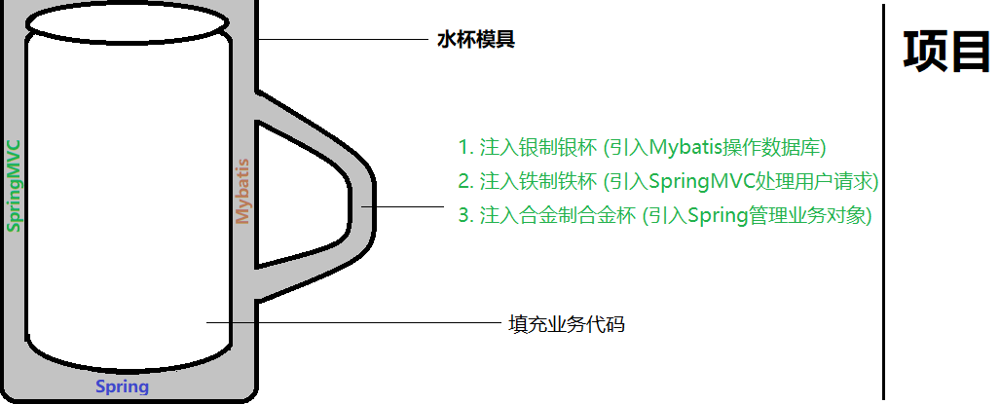

### 01复习

#### 目标

- 理解框架的概念
- 了解框架的好处
- 准备开发环境


#### 1. 框架的概念

- 框架(Framework)是代码的可重用设计, 是对底层技术的封装

 

#### 2. 框架的好处

1. 简单易用 (底层技术难以理解和使用)
2. 使用高效 (往往提供了很多解决方案)
3. 稳定可靠 (通过大量测试和实际运用)


#### 小结

- 什么是框架?
  - 
- 框架的好处?
  - 
  - 
  - 


### 02Mybatis框架【了解】

#### 目标

- 了解**Mybatis框架**
- 理解代码分层架构


#### 1. Mybatis框架

- 官网: http://www.mybatis.org/mybatis-3/
- 历史
  - MyBatis 本是apache的一个开源项目 **iBatis**
  - 2010年代码迁移到了google code, 并且改名为 **MyBatis**
  - 2013年11月代码迁移到 **Github**。
- 特点
  - 
  - 
  - 


#### 2. 代码分层架构

- 项目中的代码分类不断演进, 现主流三层架构:
- 三层架构是指将代码分为三类(层): 表现层，业务层，持久层。
  - 表现层常见框架 - SpringMvc

  - 业务层常见框架 - Spring

  - 持久层常见框架 - Mybatis


#### 小结

- Mybatis的特点?
  - 
- 什么是三层架构?
  - 


### 03直接使用jdbc【理解】

#### 目标

- 使用jdbc查询用户
- 分析案例中的问题


#### 1. 使用jdbc查询用户

1. 工程名称: mybatis01_jdbc_01

2. 添加依赖: pom.xml

   ```xml
   
   ```

3. 演示查询: com.itheima.jdbc.Main

   ```java
   // 1. 加载驱动
   // 2. 获取连接
   // 3. 定义SQL
   // 4. 解析预编译对象
   // 5. 设置参数
   // 6. 执行操作
   // 7. 处理结果集
   // 8. 关闭资源
   ```

#### 2. 分析案例中的问题

1. 频繁创建和关闭数据库连接 
   - 
2. Sql语句硬编码在Java代码中
   - 
3. 结果集处理复杂 (可重用性差)
   - 


#### 小结


- 为什么不直接使用jdbc?

  - 


### 04Mybatis案例【掌握】

#### 目标

- 使用Mybatis查询用户


#### 1. 使用Mybatis查询用户

1. 工程名称: mybatis01_demo_02

2. 添加依赖: pom.xml

   ```xml
   <!-- 1. 添加mybatis 依赖 -->
   <!-- 2. 添加mysql 依赖 -->
   ```

3. 导入配置: sqlMapConfig.xml ([官网](http://www.mybatis.org/mybatis-3/zh/getting-started.html))

   ```xml
   
   ```

4. 创建实体: com.itheima.demo.User

   ```java
   
   ```

5. 添加映射: com.itheima.demo.UserMapper

   ```java
   
   ```

6. 导入映射: userMapper.xml

   ```xml
   
   ```

7. 演示查询: MybatisTests ([官网](http://www.mybatis.org/mybatis-3/zh/getting-started.html))

   ```java
   // 1. 创建会话
   // 2. 执行操作
   // 3. 处理结果
   ```

   

#### 小结

- 启用Mybatis框架需要哪些配置?
  - 


### 05自造框架 - 技术选择【了解】

#### 目标

- 理解自造框架的意义
- 理解自造框架的技术


#### 1. 自造框架的意义

- 为了解决原生jdbc的问题
  - jdbc频繁开关连接资源很浪费: 
  - 结果集处理麻烦代码重复率高: 
  - sql语句硬编码在java代码中: 
  - 连接参数硬编码在java代码中: 


#### 2. 自造框架的技术

- JDBC ---- 连接数据库
- C3P0 ---- 连接池技术提升资源使用率
- 反射技术 ---- 封装结果集返回对象
- Dom4J ---- 解析配置文件
- 动态代理技术 ---- 根据配置信息生成实例对象
- 泛型技术 ---- 指定返回的对象类型
- Junit ---- 单元测试


#### 小结

- Mybatis为什么需要xml配置文件 ?
  - 
- Mybatis为什么不需要实现类?

  - 


### 06自造框架 - 环境准备【理解】

#### 目标

- 准备自造框架的环境


#### 1. 准备环境

1. 工程名称: mybatis01_custom_03

2. 添加依赖: pom.xml

   ```xml
   <!-- dom4j依赖 (dom4j+jaxen) -->
   <!-- mysql依赖 -->
   <!-- c3p0连接池依赖 -->
   <!-- Junit单元测试依赖 -->
   ```

3. 文件拷贝: **使用Myabtis的配置** (不使用Myabtis)

   - sqlMapConfig.xml
   - com.itheima.custom.User

   - com.itheima.custom.UserMapper
   - userMapper.xml


#### 小结

- 需要准备哪些java类?
  - 
- 需要准备哪些配置?
  - 


### 07自造框架 - 对象封装【理解】

#### 目的

- 封装配置文件
- 加载配置文件
- 封装执行工具


#### 1. 封装配置文件

1. com.itheima.custom.core.Configuration - **sqlMapConfig.xml**

   ```java
   // 1. 提供方法: 加载主配置文件
   
   // 2. 提供方法: 创建连接池对象
   ```

2. com.itheima.custom.core.Mapper - **userMapper.xml**

   ```java
   
   ```

3. com.itheima.custom.core.SqlSession - **提供getMapper()方法**

   ```java
   
   ```


#### 3. 封装执行工具

1. com.itheima.custom.kit.Execute

   ```java
   // 1. public static <T> List<T> selectList(Connection con, Mapper mapper);
   // 2. private static List handler(rs, resultType)
   ```

2. com.itheima.custom.kit.SqlSessionFactory

   ```java
   
   ```


#### 小结

- 反射私有变量要注意什么?
  - 

- 可以不提供SqlSessionFactory类吗?
  - 


### 08自造框架 - 加载主配置文件【理解】

#### 目标

- 加载sqlMapConfig.xml


#### 1. 加载主配置文件

1. 解析文件: com.itheima.custom.core.Configuration.loadMybatisXML

   ```java
   
   ```
   
2. 创建数据源: com.itheima.custom.core.Configuration.createComboPooledDataSource

   ```java
   // 创建数据源: ComboPooledDataSource
   ```

3. 单元测试: CustomTests

   ```java
   
   ```


#### 小结

- 封装后主配置文件在什么时候加载?

  - 

  

### 09自造框架 - 加载映射文件【理解】

#### 目标

- 加载userMapper.xml


#### 1. 加载映射文件

1. 解析文件: com.itheima.custom.core.Configuration.loadMapperXml

   ```java
   
   ```

2. 单元测试: CustomTests.testConfig

   ```java
   
   ```

   

#### 小结

- 为什么使用Map存储Mapper对象?
  - 


### 10自造框架 - 动态代理【理解】

#### 目标

- 了解jdk动态代理工具的使用
- 使用jdk动态代理创建映射器


#### 1. 工具的使用

- 官网API: Proxy

```java
public static Object newProxyInstance(
    						// 1. 类加载器
    						ClassLoader loader,
    						// 2. 实现的接口
                            Class<?>[] interfaces,
    						// 3. 代理对象方法的处理器
                            InvocationHandler h) 
throws IllegalArgumentException;
```

#### 2. 创建映射器

1. 创建代理: com.itheima.custom.core.SqlSession

   ```java
   
   ```

2. 单元测试: CustomTests.testDynamic

   ```java
   
   ```

   


#### 小结

- 创建映射器使用了什么技术?

  - 

  


### 11自造框架 - 框架测试【理解】

#### 目标

- 编写自造框架的使用案例


#### 1. 自造框架的使用案例

1. CustomTests.testCustom

   ```java
   // 1. 创建会话
   // 2. 执行操作
   // 3. 处理结果
   ```


#### 小结

- 使用自造框架案例的步骤?
  - 


### 12总结【了解】

1. 什么是框架?
   - 
2. 三层架构是哪三层?
   - 
3. jdbc存在什么问题?
   - 
   - 
   - 
4. mybatis框架的特点?
   - 
   - 
   - 
5. 为什么要使用框架操作数据库?
   - 
6. 映射器的创建使用了什么技术?
   - 
7. 自造框架引入了哪些外部依赖?
   - 
   - 
   - 

