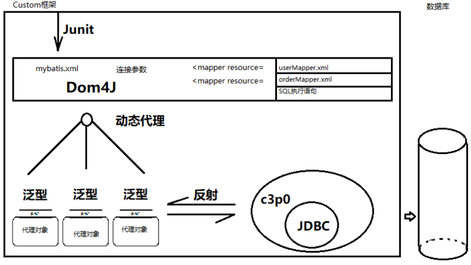

#### 01课程介绍与准备【准备】

##### 目标

- 了解课程安排
- 准备开发环境

##### 步骤

###### 学习记录

1. 课堂笔记
2. 课前资料
3. 视频
4. 代码
5. 预习资料
6. 答疑

###### 学习计划

1. mybatis框架
2. spring框架
3. springmvc框架

###### 环境准备

-  jdk8+
-  maven3+
-  idea2017+
-  mysql5+
-  **执行sql语句准备数据**


##### 小结

1. 课后学习记录有哪些?

   

2. 将要学习哪些框架

   


#### 02学习Mybatis框架【了解】

##### 目标

- 了解什么是 **框架 ** ?
- 了解什么是 **Mybatis框架** ?

##### 步骤

###### 生活例子

- 生活中的 **水杯模具** 相当于开发中的 **框架**

###### 框架特点

- 

###### 框架概述

- 

###### 代码分层

- J2EE项目中经过不断演化后, 现分层为表现层，业务层，持久层。
  - 表现层常见框架 - SpringMvc

  - 业务层常见框架 - Spring

  - 持久层常见框架 - Mybatis

  

###### Mybatis

- [官网](http://www.mybatis.org/mybatis-3/)
  - 
- 历史
  - 
- 特点
  - 


##### 小结

1. 框架有哪些特点呢?

   - 

2. Mybatis有哪些特点呢?

   - 


#### 03为什么不直接使用jdbc【理解】

##### 目标

- 找出jdbc存在的问题

##### 步骤

- ==根据ID查找用户==

1. 创建Maven项目 (已准备)
2. 创建jdbc模块 (已准备)
3. 创建测试类 (已准备)
4. **引入依赖**
5. **开发步骤**
6. **测试**


##### 操作

###### 引入依赖

```xml

```

###### 开发步骤

```java

```


###### 测试

```java

```

##### 小结


- jdbc存在哪些问题?
  - 


- 为什么不直接使用jdbc?

  - 


#### 04快速入门Mybatis【掌握】

##### 目标

- Mybatis入门体验( **环境搭建** )

##### 步骤

- ==查找所有用户==

1. 创建模块 (已准备)
2. **引入依赖包** 
3. **创建java类** 
4. **添加配置文件** ([官网](http://www.mybatis.org/mybatis-3/))
5. 编写启动程序 (官网)


##### 操作

###### 创建模块

- 模块名称: mybatis-day01-framework

###### 引入依赖

```xml

```

###### 创建类

1. 用户类

   ```java
   
   ```

2. 操作类

   ```java
   
   ```

###### 添加配置

1. sql文件

   ```xml
   
   ```

2. 数据库文件

   ```xml
   
   ```

###### 开发步骤

1. 创建连接
2. 执行操作
3. 关闭资源

###### 代码示例

```java

```


##### 小结

1. Mybatis环境搭建需要哪些配置?

   1. 


#### 05自造框架 ─ 框架设计【了解】

##### 目标

- 学习自定义框架的设计步骤

##### 步骤

###### 问题汇总

- jdbc频繁开关连接资源很浪费
- 结果集处理麻烦代码重复率高
- sql语句硬编码在java代码中
- 连接参数硬编码在java代码中


###### 架构设计

- 用连接池技术提升连接资源使用率
- 封装结果集成为对象返回
- 分开存放sql语句
- 分开存放连接参数


###### 技术分析

 


###### 技术选型

- JDBC ---- 连接数据库
- C3P0 ---- 连接池技术提升资源使用率
- 反射技术 ---- 封装结果集返回对象
- Dom4J ---- 解析配置文件
- 动态代理技术 ---- 根据配置信息生成实例对象
- 泛型技术 ---- 指定返回的对象类型
- Junit ---- 单元测试


##### 小结

- 框架设计的思路或者步骤是怎样的?
  1. 先整理遇到的问题 (问题汇总)
  2. 再设计解决方案 (架构设计)
  3. 然后选用相应技术实现设计 (技术选型)


#### 06自造框架 ─ 环境准备【理解】

##### 目标

- 准备自定义框架的环境

##### 步骤

###### 整理步骤

1. 创建模块 (已准备)
2. **引入依赖**
3. **引入文件**

##### 操作

###### 创建模块

- 模块名称: mybatis-day01-custom

###### 引入依赖

```xml

```

###### 引入文件

- ==引入案例 **所有文件** , 唯独不引入Mybatis.==

       	1. User.java (已复制)
       	2. UserMapper.java (已复制)
       	3. mybatis.xml (已复制)
       	4. userMapper.xml(已复制)


##### 小结

1. 需要准备哪些java类?

   

2. 需要准备哪些配置?

   


#### 07自造框架 ─ 代码设计【理解】 

##### 目的

- 学习Mybatis代码设计的封装

##### 步骤

###### 封装配置文件

1. Configuration.java - **mybatis.xml**
2. Mapper.java - **userMapper.xml**
3. SqlSession.java - 提供生成实例对象的方法

###### 加载配置文件

1. **mybatis.xml**
2. **userMapper.xml**

###### 封装操作工具

1. public static <T> List<T> selectList(Connection con, Mapper mapper);
2. private static List handler(rs, resultType)

##### 操作

###### 核心代码封装

1. Configuration.java封装主配置文件

```java

```

2. Mapper.java封装操作映射配置文件

```java

```

2. SqlSession.java提供映射器的动态代理

```java

```

###### 核心配置加载

```java

```

###### 创建数据库源

```java

```

###### 操作工具封装

```java

```

##### 小结

- 封装文件内容的java类有哪些?

  

- 反射时应注意什么?

  

  

#### 08自造框架 ─ 加载主配置文件【理解】

##### 目标

- 巩固dom4j
- 学习mybatis.xml文件的封装

##### 步骤

###### 解析

##### 操作

###### 解析

```java

```

##### 小结

1. 查询指定名称的节点语法是怎样的?

    

2. Configuration.java中封装了哪些内容?

   

    

#### 09自造框架 ─ 加载映射器文件【理解】

##### 目标

- 巩固dom4j
- 学习mapper.xml文件的封装

##### 步骤

###### 解析

##### 操作

###### 解析

```java

```

##### 小结

1. 获取所有元素的语法是怎样的?

    

2. Mapper.java中封装了哪些内容?

   - 

   

#### 10自造框架 ─ 实现动态代理【理解】

##### 目标

- 实现sql对象的动态代理对象的创建
- 实现代理对象方法调用的处理器

##### 步骤

###### 解析API

###### API调用

###### 方法处理器

###### 操作实现


##### 操作

###### 解析API

```scheme
public static Object newProxyInstance(ClassLoader loader,
                                      Class<?>[] interfaces,
                                      InvocationHandler h)
                               throws IllegalArgumentException
返回一个指定接口的代理类实例，该接口可以将方法调用指派到指定的调用处理程序。

参数：
loader - 定义代理类的类加载器
interfaces - 代理类要实现的接口列表
h - 指派方法调用的调用处理程序
返回：
一个带有代理类的指定调用处理程序的代理实例，它由指定的类加载器定义，并实现指定的接口
抛出：
IllegalArgumentException - 如果违反传递到 getProxyClass 的参数上的任何限制
NullPointerException - 如果 interfaces 数组参数或其任何元素为 null，或如果调用处理程序 h 为 null
```

###### API调用

```java

```

###### 方法处理器

```java

```

###### 操作实现

1. 开发步骤

   

2. 代码示例

   ```java
   
   ```

3. 数据源创建

```

```

##### 小结

- 我们对代理对象调用时做了哪些操作?

  1. 

  


#### 12自造框架 ─ 测试自定义框架【理解】

##### 目标

- 验证自定义的Mybatis的功能

##### 步骤

###### 启动框架

- ==开发步骤与Mybatis入门案例一致==

1. 创建连接
2. 执行操作
3. 关闭资源

###### 操作实现

##### 操作

###### 启动框架

```java

```

###### 操作实现

```html
Disconnected from the target VM, address: '127.0.0.1:59494', transport: 'socket'
User{id=1, username='王五', birthday=null, sex='2', address='null'}
User{id=10, username='张三', birthday=2014-07-10, sex='1', address='北京市'}
User{id=16, username='张小明', birthday=null, sex='1', address='河南郑州'}
User{id=22, username='陈小明', birthday=null, sex='1', address='河南郑州'}
User{id=24, username='张三丰', birthday=null, sex='1', address='河南郑州'}
User{id=25, username='陈小明', birthday=null, sex='1', address='河南郑州'}
User{id=26, username='王五', birthday=null, sex='null', address='null'}
```


##### 小结

- 自定义框架与Mybatis框架的关系?
  1. 


#### 12总结【了解】

##### 目的

- 总结今天学习的内容

##### 步骤

###### 回顾什么是框架?

- 框架是可重用的代码设计, 简单易用.

###### 回顾jdbc有哪些问题?

- 代码重复
- 浪费资源
- 手动设置参数
- sql硬编码在java代码中

###### 回顾自定义框架的思路?

1. 整理遇到的问题(想解决的问题)
2. 架构设计(怎么解决)
3. 技术分析

###### 回顾Mybatis有哪些特点?

- 开源的
- 基于jdbc封装的
- 简单易用的
- 持久层的

##### 小结

- 今天的重点内容在哪里?

  - 重点是入门案例


