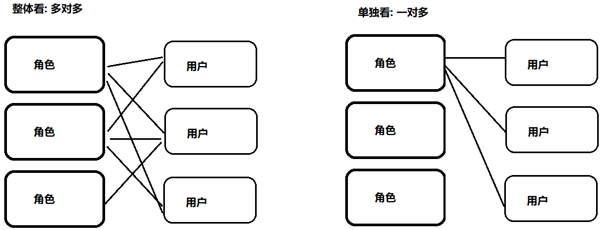
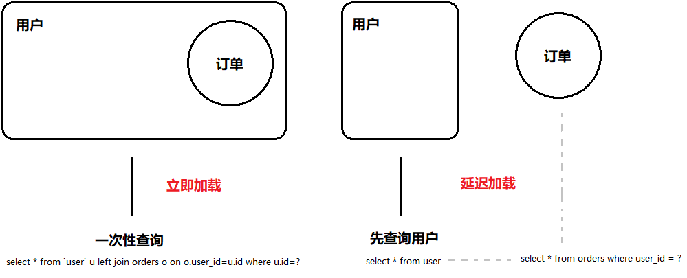

### 01复习

#### 目标

- 理解占位符的区别
- 搭建传统开发环境


#### 1. #{}与${}

|          |                   #{*}                   |            ${*}            |
| :------: | :--------------------------------------: | :------------------------: |
| 名称区别 |                  占位符                  |           拼接符           |
| 作用区别 | 通过预编译代替占位符 ( **防止SQL注入** ) |    直接拼接到最终的SQL     |
| 使用区别 |     *可以是任意字符串 (**简单类型**)     | *只能是value ( **3.4.5** ) |

#### 2. 搭建环境

1. 工程名称: mybatis02_pool_01

2. 添加依赖: pom.xml

   ```xml
   <!-- 1.mybatis -->
   <!-- 2.mysql -->
   <!-- 3.c3p0 (mchange) -->
   <!-- 4.log4j -->
   <!-- 5.junit -->
   ```

3. 添加配置: sqlMapConfig.xml

   ```xml
   
   ```

4. 创建实体: com.itheima.pool.User

   ```java
   
   ```

5. 添加映射: com.itheima.pool.UserMapper

   ```java
   
   ```

6. 提供实现: com.itheima.pool.UserMapperImpl

   ```java
   
   ```

7. 映射配置: userMapper.xml

   ```xml
   
   ```

8. 日志配置: log4j.properties

   ```properties
   # 日志级别, 输出位置 
   log4j.rootLogger=DEBUG, stdout
   # 控制台处理器
   log4j.appender.stdout=org.apache.log4j.ConsoleAppender
   # 格式化处理器
   log4j.appender.stdout.layout=org.apache.log4j.PatternLayout
   # 格式化转换器
   log4j.appender.stdout.layout.ConversionPattern=%5p [%t] - %m%n
   ```

9. 环境测试: ImplTests

   ```java
   
   ```


#### 小结

- 传统开发与代理开发的区别?
  - 
  - 


### 02连接池类型【了解】

#### 目标

- 使用内部连接池
- 使用外部连接池


#### 1. 使用内部连接池

1. 配置: sqlMapConfig.xml

   ```xml
   <!-- 1. 配置POOLED: 使用内部连接池  -->
   <!-- 2. 配置UNPOOLED: 不使用连接池 -->
   ```

2. 观察: com.itheima.pool.UserMapperImpl

   ```java
   // 1. 打印会话对象: 观察内存地址变化
   // 多次执行发生变化: 没有连接池
   // 多次执行没有变化: 有用连接池
   ```


#### 2. 使用外部连接池

1. 创建连接池: com.itheima.impl.C3p0DataSourceFactory

   ```java
   // 创建ComboPooledDataSource连接池
   ```

2. 配置外部连接池: sqlMapConfig.xml

   ```xml
   <!-- 注意名称: driverClass,jdbcUrl,user -->
   ```


#### 小结

- 连接池的配置有哪些?
  - 
  - 
  - 


### 03动态SQL - 环境【了解】

#### 目标

- 搭建动态SQL的环境


#### 1. 搭建环境

1. 工程名称: mybatis03_dyn_02

2. 添加依赖: pom.xml

   ```xml
   
   ```

3. 导入配置: sqlMapConfig.xml

   ```xml
   
   ```

4. 导入实体: com.itheima.dyn.User

   ```java
   
   ```

5. 查询用户: com.itheima.dyn.UserMapper

   ```java
   // 根据username and sex 查询用户集合
   ```

6. 映射配置: userMapper.xml

   ```xml
   <!-- 使用arg0 arg1取值 -->
   ```

7. 环境测试: DynTests

   ```java
   
   ```


#### 小结

- 性别传`null`会影响查询结果吗?
  - 


### 04动态SQL标签 - if【掌握】

#### 目标

- 使用if标签控制占位符的个数


#### 1. 使用if标签

1. 使用标签: userMapper.xml

   ```xml
   <!-- 所有参数是空不拼接条件 -->
   ```

2. 单元测试: DynTests

   ```java
   
   ```


#### 小结

- if标签的作用是什么?
  - 
- 如果用户名传`null`会怎样?
  - 


### 05动态SQL标签 - where【掌握】

#### 目标

- 使用where标签解决`and`个数问题


#### 1. 使用where标签

1. 使用标签: userMapper.xml

   ```java
   
   ```

2. 单元测试: DynTests

   ```xml
   
   ```


#### 小结

- where标签的作用是什么?
  - 
- 可以同时使用where关键字和where标签吗?
  - 


### 06动态SQL标签 - set【掌握】

#### 目标

- 使用set标签解决`,`号个数的问题


#### 1. 使用set标签

1. 修改用户: com.itheima.dyn.UserMapper

   ```java
   
   ```

2. 使用标签: userMapper.xml

   ```xml
   
   ```

3. 单元测试: DynTests

   ```java
   
   ```

   

#### 小结

- set标签的作用是什么?
  - 
  - 
- 可以同时使用set关键字和set标签吗?
  - 


### 07动态SQL标签 - sql【了解】

#### 目标

- 使用sql标签定义sql片段


#### 1. 使用sql标签

1. 使用标签: userMapper.xml

   ```xml
   
   ```


#### 小结

- sql和include标签的作用是什么?
  - 


### 08动态SQL标签 - foreach【掌握】

#### 目标

- 使用foreach标签查询部分用户


#### 1. 使用foreach标签

1. 查询部分用户: com.itheima.dyn.UserMapper

   ```java
   
   ```

2. 使用标签: userMapper.xml

   ```xml
   
   ```

3. 单元测试: DynTests

   ```java
   
   ```


#### 小结

- foreach标签的作用是什么?
  - 
- 遍历集合和数组有什么不同?
  - 


### 09关联查询 - O2O【掌握】

#### 目标

- 实现一对一多表查询


#### 1. 一对一关联查询

1. 改造工程: mybatis03_many_03

2. 创建实体: com.itheima.dyn.Order

   ```java
   
   ```

3. 查询订单: com.itheima.dyn.OrderMapper.findO2O

   ```java
   // 清空操作
   ```

4. 映射配置: orderMapper.xml

   `SELECT o.*, u.id uid, u.* from orders o left join `user` u on o.user_id = u.id`

   - 第1种方案: 在Order类中添加User类的字段 ( **封装查询** )

   - 第2种方案: 在Order类中引用user对象 ( **一次性查询** )

   - 第3种方案: 在Order类中引用user对象 ( **分批查询 **) 

     ```xml
     <-- 清空操作 -->
     ```

     - 查询用户数据: userMapper.xml

     ```xml
     <resultMap id="ByUser" type="com.itheima.dyn.User">
         <id column="id" property="id"/>
         <result column="username" property="username"/>
         <result column="birthday" property="birthday"/>
         <result column="sex" property="sex"/>
         <result column="address" property="address"/>
     </resultMap>
     <select id="findById" resultMap="ByUser">
         select * from user id = #{id}
     </select>
     ```

5. 单元测试: ManyTests.testO2O

   ```java
   
   ```


#### 小结

- 关联查询的方案有哪些?
  - 
  - 
  - 
- 标签association的作用?
  - 


### 10关联查询 - O2M【掌握】

#### 目标

- 实现一对多关联查询


#### 1. 一对多关联查询

1. 改造实体: com.itheima.dyn.User

   ```java
   
   ```

2. 查询用户: com.itheima.dyn.UserMapper.findO2M

   ```java
   
   ```

3. 改造映射: userMapper.xml

   ```xml
   
   ```

   - 查询订单数据: orderMapper.xml

     ```xml
   <resultMap id="ByOrder" type="com.itheima.dyn.Order">
         <id column="id" property="id"/>
         <result column="user_id" property="userId"/>
         <result column="createtime" property="createTime"/>
         <result column="note" property="note"/>
     </resultMap>
     
     <select id="findByUserId" resultMap="ByOrder">
         select id uid, o.*  from orders  o where  o.user_id = #{id}
     </select>
     ```

4. 单元测试: ManyTests.testO2M

   ```java
   
   ```


#### 小结

- 标签collection的作用?
  - 


### 11关联查询 - M2M【掌握】

#### 目标

- 理解多对多关联查询
- 实现多对多关联查询


#### 1. 理解多对多关联

 

#### 2. 多对多关联查询

1. 准备数据: 02课前资料/01sql/role.sql

2. 创建角色: com.itheima.dyn.Role

   ```java
   
   ```

3. 改造用户:  com.itheima.dyn.User

   ```java
   
   ```

4. 关联查询: com.itheima.dyn.UserMapper.findM2M

   ```java
   
   ```

5. 映射配置: userMapper.xml

   ```xml
   
   ```

   - 查询角色数据: roleMapper.xml ( **可以放置userMapper.xml中** )

     ```xml
     <resultMap id="ByRole" type="com.itheima.dyn.Role">
         <id column="role_id" property="roleId"/>
         <result column="role_name" property="roleName"/>
         <result column="role_detail" property="roleDetail"/>
     </resultMap>
     
     <select id="findByUserId" resultMap="ByRole">
         select r.* from user_role ur left join role r on  ur.role_id = r.role_id where ur.user_id = #{id}
     </select>
     ```

     

6. 单元测试: ManyTests.M2M

   ```java
   
   ```


#### 小结

- 多对多与1对多是什么关系?
  - 


### 12关联查询 - 延迟加载【理解】

#### 目标

- 理解延迟加载
- 实现延迟加载


#### 1. 理解延迟加载

 

#### 2. 实现延迟加载

1. 映射配置: userMapper.xml

   ```xml
   
   ```
   
2. 单元测试: LazyTests

   ```java
   
   ```

   


#### 小结

- 延迟加载的数据在什么时候加载?

  - 

  
  
  

### 13关联查询 - 注解方式【理解】

#### 目标

- 使用注解实现关联查询


#### 1. 注解实现

1. 改造配置: sqlMapConfig.xml

   ```xml
   
   ```

2. 订单映射: com.itheima.dyn.OrderMapper

   ```java
   // @Results({}): 相当于映射文件中<ResultMap>标签
   ```

3. 用户映射: com.itheima.dyn.UserMapper

   ```java
   
   ```

4. 单元测试: ManyTests

   ```java
   
   ```


#### 小结

- @Results的作用?
  - 
- @Many的作用?
  - 


### 14总结

1. 连接池的配置有哪些选项?
   - 
   - 
   - 
2. 什么是动态化SQL?
   - 
3. 至少说出3个动态化SQL标签?
   - 
   - 
   - 
4. 延迟加载的数据是什么时候加载的?
   - 
5. 传统开发与代理开发的区别?
   - 
6. Mybatis中的方法支持重载吗?
   - 
7. Mybatis框架的特点?
   - 
   - 
   - 