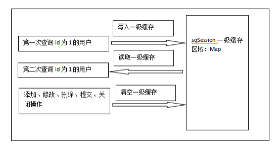
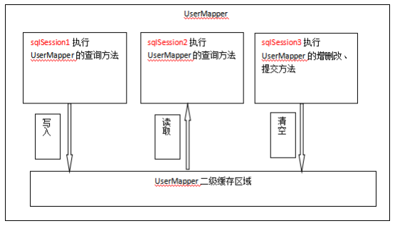

#### 01复习【了解】

##### 目标

- 回顾动态SQL
- 回顾关联查询

##### 步骤

###### 动态sql标签

- if: 
- where: 
- set: 
- sql,include: 
- foreach: 
  - 数组必须以array接收
  - list用list或者collection


###### 关系映射

使用ResultMap标签定义数据字段与对象属性的对应关系

- association
  - 用于配置1对1的关联关系
- collection
  - 用于配置1对多的关联关系


##### 操作

- ==测试1对多环境==

  - 创建新的模块引入依赖
  - 模块名称: mybatis-day04-lazy


##### 小结

- 属性与字段不同时需要用到什么标签建立映射关系?
  - 
- 多对多时需要使用ResultMap的哪个子标签建立映射关系?
  - 


#### 02延迟加载 - O2O【理解】

##### 目标

- ==查询所有订单==
- ==按需加载用户==

##### 步骤

1. [官网](http://www.mybatis.org/mybatis-3/zh/configuration.html#settings)学习如何配置延迟加载
2. mybatis.xml: **开启延迟加载** 
3. userMapper.xml: **改造association标签**
4. **测试延迟加载**

##### 操作

###### 开启延迟加载

```xml

```

###### 改造association标签

```xml

```

###### 测试延迟加载

```java

```


##### 小结

- lazyLoadingEnabled的作用是什么 ?
  - 
- aggressiveLazyLoading的作用是什么?
  - 


#### 03延迟加载 - O2M【理解】

##### 目标

- ==查询所有用户==
- ==按需加载订单==

##### 步骤

1. userMapper.xml: **改造collection标签**
2. **测试延迟加载**

##### 操作

- 与1对1的使用方式有什么不同?


##### 小结

#### 04缓存 - 一级缓存【理解】

##### 目标

- ==重复查询所有用户==
- **使用缓存减少查询数据库的次数**

##### 步骤

1. idea: 创建新的项目
2. **测试重复同1个操作**
3. **清理缓存**
4. **测试清理缓存的接口**

###### 图解



##### 操作

###### 完整的测试代码


##### 小结

- 1级缓存的使用范围 ?

  

- 什么时候会从缓存中获取数据?

  

- 什么时候会清除缓存数据?

  - 


#### 05缓存 - 二级缓存【理解】

##### 目标

- 在不同的SqlSession中利用缓存

##### 步骤

- ==重复查询所有用户==

1. 测试**不同的会话连接中**重复查询所有用户
2. [官网](http://www.mybatis.org/mybatis-3/zh/sqlmap-xml.html)学习如何使用二级缓存
3. 使用**<cache标签**指定开启二级缓存的命名空间
4. 改造映射文件中的java**实现Serializable接口**
5. 测试不同的会话连接中重复查询所有用户

###### 图解



##### 操作

###### 测试不同的会话连接中重复查询所有用户

```java

```

###### 使用cache标签开启二级缓存

```xml

```

###### 映射文件中的java实现Serializable接口

```java

```


##### 小结

- 开启二级缓存需要配置cacheEnabled吗?

  

- 如何开启二级缓存?

  - 

- 事务提交时会清除所有二级缓存吗?

  - 


#### 06注解开发 - CRUD【掌握】

##### 目标

- 使用注解代替映射文件

##### 步骤

- ==根据ID查询用户==
- ==保存新用户==

1. idea: **创建新的项目模块**
2. 使用注解代理userMapper.xml配置
3. 分别测试

##### 操作

###### 根据ID查找用户

注解

```java

```

测试

```java

```

###### 保存用户

注解

```java

```

测试

```java

```

######

##### 小结

- 使用了注解还能使用映射文件吗?

  

- 同时使用注解和映射文件需要注意什么?


- 注解方式下如何返回自增长主键值?


#### 07注解开发 - O2O【理解】

##### 目标

- 如何使用注解方式代替1对1关系的映射

##### 步骤

- ==查询所有订单==

1. OrderMapper.java: 增加 **findO2O** 操作方法
2. 使用注解代替orderMapper.xml中的ResultMap标签
3. 测试

##### 操作

###### 注解方式

```java

```

###### 测试

```java

```


##### 小结

- @Results注解相当于映射文件中那个标签?

  

- 使用哪个注解声明1对1关系?


#### 08注解开发 - O2M【理解】

##### 目标

- 使用注解方式代替1对多关系映射

##### 步骤

- ==查询所有用户==

1. UserMapper.java: 增加 **findO2M** 操作方法
2. 使用注解代替userMapper.xml中的ResultMap标签
3. 测试

##### 操作

###### 注解方式

```java

```

###### 测试

```java

```


##### 小结

- @Many的作用是什么?

  


#### 09注解开发 - 懒加载【理解】

##### 目标

- 使用注解方式启用延迟加载

##### 步骤

- ==查询所有订单==, 按需加载用户
- ==查询所有用户==, 按需加载订单

##### 操作

###### O2O懒加载的注解

```java

```

###### O2M懒加载的注解

```java

```


##### 小结

- 注解开发时使用什么注解或属性声明了延迟加载?


#### 10总结【了解】

##### 目标

- 总结今天的内容

##### 步骤

- 如何改造关系映射标签实现延迟加载?

  - 主要是将一次性查询的语句 **分批执行**

  - 在association子标签中使用select属性指定关联方的查询操作
  - 在collection子标签中使用select属性指定关联方的查询操作


- 1级缓存和二级缓存的区别?

  

  - 使用范围不同: 
    - 1级缓存数据只能在SqlSession中共享
    - 2级缓存数据可以在整个Application中共享

  

  - 开启方式不同: 2级缓存需要手动开启

  

  - 清除缓存的数据不同: 
    - 1级缓存提交事务时将清空整个SqlSession中的缓存
    - 2级缓存提价事务时只清除相关命名空间的缓存数据


- 注解开发是代理开发的一种吗?
  - 是, 注解开发只是使用注解代替映射配置


##### 小结

- 注解开发和普通的代理开发在企业中哪种应用最广?
  - 

- Mybatis的重点内容在哪天?
  - 第2天: 基本操作
  - 第3天: 动态SQL