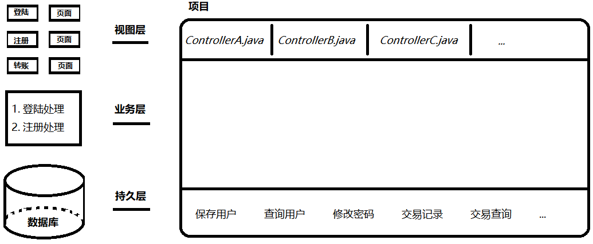
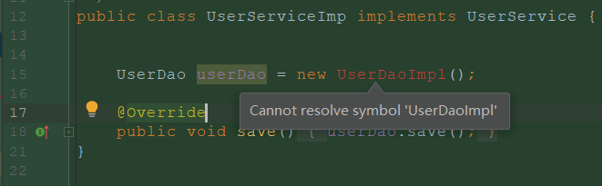
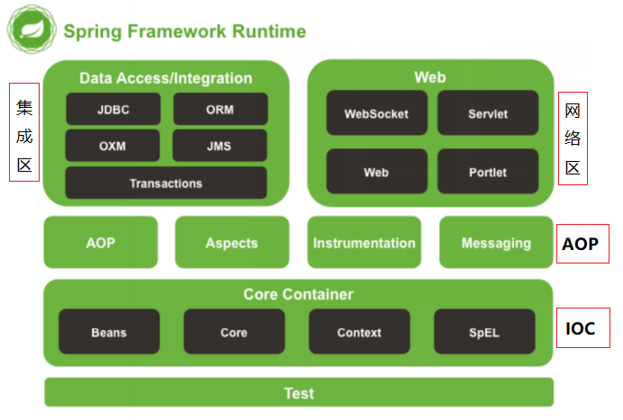
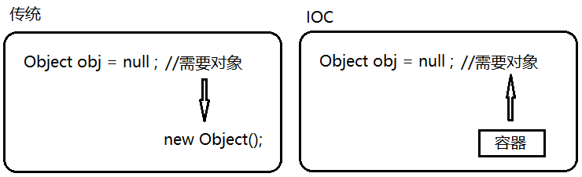
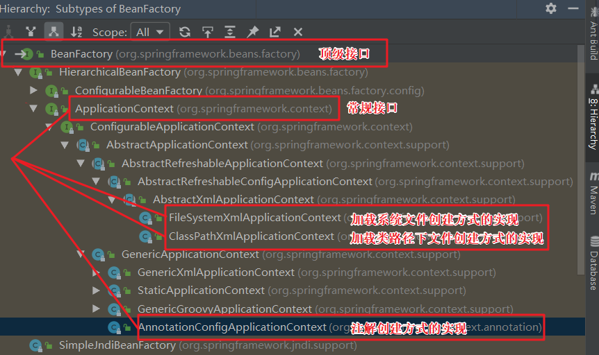
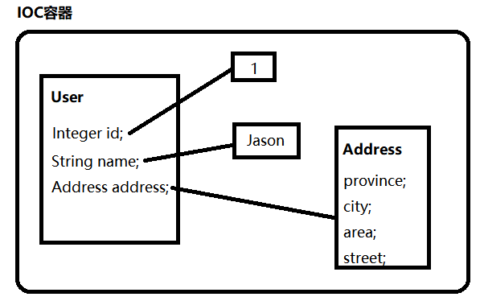

### 01复习

#### 目标

- 搭建 **三层架构** 的项目
- 理解 **分层架构** 的作用


#### 1. 搭建三层架构的项目

- 项目开发(3-tier architecture): 视图层 (**处理参数**), 业务层 (**处理业务**), 持久层 (**处理数据**)
- 分层架构(3-tier architecture): 其实就是将 **代码分类** , 按功能/职责划分为3类分别存放在web,service,dao包中



1. 创建项目: spring01_tier_01

2. 创建持久层: com.itheima.dao
   - com.itheima.tier.dao.UserDao

     ```java
     
     ```

   - com.itheima.tier.dao.impl.UserDaoImpl

     ```java
     
     ```

   

3. 创建业务层: com.itheima.service
   - com.itheima.tier.service.UserService

     ```java
     
     ```

   - com.itheima.tier.service.impl.UserServiceImpl

     ```java
     
     ```

4. 创建视图层: com.itheima.tier.controller.UserController

   ```java
   
   ```


#### 2. 理解分层架构的作用

1. 项目结构清晰 (提高代码可读性)

  |-- tier

  |---- **controller** // 处理页面信息

  |---- **service** // 处理业务逻辑

  |---- **dao** // 处理数据

2. 便于团队协同开发 (提高开发效率)

  > ​	职责分明后, 三个层的代码可以同步进行开发


#### 小结

- 三层架构分为哪三层?
  - 
  - 
  - 
- 为什么要分层架构呢?
  - 
  - 


### 02常见的依赖问题【了解】

#### 目标

- **了解依赖问题**


#### 1. 了解依赖问题

- 代码耦合度过高


##### 1.1 实现类丢失

- 如果编译时丢失UserDaoImpl.java文件将无法编译

 

##### 1.2 切换实现类

- 希望使用Oracle的实现类, 要改动代码重新编译

1. 创建实现类: com.itheima.tier.dao.impl.UserDaoOracleImpl

    ```java
    package com.itheima.tier.dao.impl;

    import com.itheima.tier.dao.UserDao;

    /**
     * Oracle用户数据库操作实现类.
     *
     * @author : Jason.lee
     */
    public class UserDaoOracleImpl implements UserDao {
        @Override
        public void save() {
            System.out.println("保存Oracle用户成功");
        }
    }
    ```
    
2. 需要改动代码: ~~com.itheima.tier.service.impl.UserServiceImp~~


#### 小结

- 三层架构中存在什么问题?
  - 
- 代码耦合度过高有哪些例子?
  - 
  - 


### 03解决高耦合问题【理解】

#### 目标

- 解决实现类丢失问题
- 解决实现类切换问题


#### 1. 解决实现类丢失

1. 【祸水东引】使UserService正常

    - com.itheima.tier.BeanFactory

    ```java
    package com.itheima.tier;

    import com.itheima.tier.dao.UserDao;
    import com.itheima.tier.dao.impl.UserDaoImpl;

    /**
     * 创建持久层接口实现类.
     */
    public class BeanFactory {
        /**
         * 祸水东引.
         * 将创建实现类对象的过程放置到BeanFactory.
         */
        public static UserDao getBean(){
            return new UserDaoImpl();
        }
    }
    ```

1. 【彻底解决】使项目编译正常

    > 学习Class.forName("com.mysql.jdbc.Driver")运行时再加载字节码文件

    ```java
    
    ```


#### 2. 解决实现类切换

- 【一劳永逸】希望切换实现类不用重新编译

1. 添加配置: beans.properties

    ```properties
    # 用户持久层实现类
    UserDao=com.itheima.tier.dao.impl.UserDaoImpl
    # 用户服务层实现类
    UserService=com.itheima.tier.service.impl.UserServiceImpl
    ```

2. 添加支持: com.itheima.tier.BeanFactory

    ```java
// 1. 创建Properties工具
    
    // 2. 加载properties文件
    
    // 3. 获取对象全限定类名
    
    // 4. 创建对象
    ```


#### 3. [扩展] 工厂模式

- 以上解决代码耦合度过高的方案应用广泛, 称之为 **工厂设计模式**
- 工厂设计模式的作用: 
  1. 创建对象
  2. 降低耦合
  3. 消除重复


#### 小结

- 依赖问题 ( 代码耦合度过高 ) 如何解决?
  - 
- 三层架构还有其他问题吗?
  - 


### 04Spring框架概述【了解】

#### 目标

- 了解Spring框架
- 了解Spring优点


#### 1. Spring框架

##### 1.1 官网

- 官网: https://spring.io/

- 官网文档地址: https://spring.io/projects/spring-framework#learn

- 依赖下载地址: https://repo.spring.io/libs-release-local/org/springframework/spring/


##### 1.2 介绍

- Spring是 **分层** 的轻量级开源框架 (重点)
- Spring核心是**IOC**(控制反转) 和 **AOP**(面向切面编程)
- Spring提供了对各种优秀框架的支持和 **整合**

- Spring框架采用分层架构，结构清晰, 根据不同的功能被划分成了多个模块



###### Data Access/Integration

- JDBC: 对各大数据库厂商进行抽象处理
- ORM: 集成orm框架支持对象关系映射处理
- OXM: 提供了对 Object/XML映射实现的抽象层
- JMS: 主要包含了一些制造和消费消息的特性
- Transactions: 支持编程和声明式事务管理


###### Web

- Websocket: 提供了WebSocket和SocketJS的实现
- Servlet: 利用MVC(model-view-controller)的实现分离代码
- Web: 提供了基础的面向 Web 的集成特性(如: 文件上传)
- Portlet: 提供了Portlet环境下的MVC实现


###### 中间层

- AOP: 提供了符合AOP要求的面向切面的编程实现

- Aspects: 提供了与AspectJ的集成功能

- Instrumentation: 提供了类植入（Instrumentation）的支持和类加载器的实现
- Messaging: 用于构建基于消息的应用程序


###### Core Container

- Beans: Bean工厂与bean的装配
- Core: 依赖注入IoC与DI的最基本实现
- Content: IOC容器的企业服务扩展
- SpEl: 用于在运行时查询和操纵对象的表达式

###### Test

- 支持使用 JUnit 和 TestNG 对 Spring 组件进行测试


#### 2. Spring优点

##### 2.1 IOC解耦

- 可以将对象间的依赖关系交由spring管理
- 避免硬编码造成的程序间过渡耦合

##### 2.2 支持AOP

- 可以使用切面编程思想对方法进行增强

##### 2.3 支持声明式事务

- 可以通过配置或者注解的方式管理事务
- 不需要硬编码管理事务

##### 2.4 方便测试

- 可以通过注解方便的测试Spring程序

##### 2.5 方便集成

- 其内部提供了对各种优秀框架的直接支持

##### 2.6 使用简单

- Spring对很多难用的API做了简单的封装

##### 2.7 设计精良

- Spring的源码设计精妙、结构清晰值得学习


#### 小结

- Spring是什么?

  - 

- 至少说出3个Spring的优点
  - 
  - 
  - 


### 05IOC容器概念【理解】

#### 目标

- 理解IOC是什么
- IOC有哪些作用


#### 1. IOC是什么

- IOC(Inversion Of Control): 将对象的创建(控制)转交给第三方(工厂)完成, 也叫 **控制反转**

 

#### 2. IOC的作用

1. **解耦**: 利用IOC的工厂模式解耦创建对象的过程
   - 解决代码耦合度过高问题
2. **存储对象**: 可以将创建好的对象 **存储** 起来重复使用 
   - 解决对象个数问题
3. **管理依赖关系**: 可以将依赖对象注入需要的对象当中
   - 解决依赖关系问题
4. **管理对象创建顺序**: 可以根据依赖关系先后创建对象
   - 解决创建顺序问题


#### 小结

- IOC是什么?
  - 
- IOC有什么作用?
  - 


### 06IOC入门案例【掌握】

#### 目标

- 了解IOC容器的依赖的jar包

- 掌握创建对象的Bean标签
- 掌握创建IOC容器的代码


#### 1. IOC容器依赖的jar包

1. 工程名称: spring01_ioc_02
2. 添加依赖: pom.xml

    ```xml

    ```


#### 2. IOC容器的Bean标签

1. 创建实体: com.itheima.ioc.User

    ```java
    
    ```

2. 定义对象: beans.xml

    ```xml
    
    ```


#### 3. IOC容器的创建案例

1. 单元测试: IocTests

    ```java
    
    ```


#### 小结

- 使用IOC容器需要添加哪些依赖?
  - 

- 在配置文件中使用什么标签定义对象?
  - 

- 如何创建IOC容器?
  - 


### 07Bean-标签属性【了解】

#### 目标

- 了解bean标签的属性


#### 1. bean标签的属性

1. 工程名称: spring01_xml_03

2. 添加依赖: pom.xml

   ```xml
   <!-- 1.Spring IOC依赖 -->
   
   <!-- 2.Junit 依赖 -->
   ```

3. 提供方法: com.itheima.xml.User

   ```java
   
   ```

4. 属性配置: beans.xml

   ```xml
   
   ```

5. 单元测试: XmlTests

   ```java
   
   ```

| 属性           | 说明                                                         |
| -------------- | ------------------------------------------------------------ |
| id             | 对象的引用名称;一定要唯一； 一次只能定义一个引用名称         |
| name           | 对象的引用名称; 与id区别是：name一次可以定义多个引用名称。   |
| class          | 类的全限定名称                                               |
| init-method    | 指定类中初始化方法的名称，在构造方法执行完毕后立即执行【了解】 |
| destroy-method | 指定类中销毁方法名称，在销毁spring容器前执行【了解】         |
| lazy-init      | 设置为true表示在第一次使用对象的时候才创建，只对单例对象有效。 |
| scope          | 设置bean的作用范围, 取值：<br/>singleton：单例, 默认值; <br/>prototype：多例 <br/>request：web项目中，将对象存入request域中【了解】<br/>session：web项目中，将对象存入session域中【了解】<br/>globalsession：web项目中，将对象应用于集群环境，没有集群相当于session【了解】 |


#### 小结

- 至少说出3个bean标签的属性?
  - 
  
- Bean默认在什么时候创建的?
  - 


### 08Bean-作用范围【理解】

#### 目标

- 理解Bean的作用范围


#### 1. Bean的作用范围

1. 配置范围: beans.xml

    ```xml
    
    ```

2. 单元测试: XmlTests

    ```java
    // 多次获取对象: 观察对象是否相同
    ```


#### 小结

- 单例与多例的区别?
  - 


### 09创建IOC的方式【理解】

#### 目标

- 了解创建IOC常用的3种方式


#### 1. 创建IOC常用的3种方式

- IOC容器接口结构图

 

##### 1.1 资源文件创建方式

```java
ClassPathXmlApplicationContext context = new ClassPathXmlApplicationContext("beans.xml");
```


##### 1.2 系统文件创建方式

```java
FileSystemXmlApplicationContext context = new FileSystemXmlApplicationContext("E:\\课堂\\Spring\\第1天\\04代码\\spring1\\spring-day01-ioc\\src\\main\\resources\\beans.xml");
```


##### 1.3 注解配置创建方式

```java
@Test
public void testAnnotation() {
    AnnotationConfigApplicationContext context = new AnnotationConfigApplicationContext(Config.class);
}

@Configuration
static class Config{

    @Bean("user")
    public User createUser(){
        return new User();
    }
}
```


##### 1.4 ~~BeanFactory~~创建方式

```java
Resource resource = new ClassPathResource("beans.xml");
XmlBeanFactory context = new XmlBeanFactory(resource);
```

- 【了解】BeanFactory与ApplicationContext的区别?
  - BeanFactory是Spring容器的顶层接口, 采用 **延迟创建** 对象的思想 
  - ApplicationContext是BeanFactory的子接口, 采用 **即时创建** 对象的思想 


#### 小结

- 创建IOC容器的常用方式有哪几种?

  - 
  - 

  - 


### 10创建对象的方式【理解】

#### 目标

- **构造方法创建** (默认:  调用构造方法)
- **静态方法创建** (调用工具类静态方法)
- **实例方法创建** (调用对象的实例方法)


#### 1. 构造方法创建

1. 构造方法: com.itheima.ioc.User

    ```java
    
    ```
    
2. 添加配置: beans.xml

    ```xml
    <!-- 调用构造方法创建对象 -->
    <bean id="user" class="com.itheima.ioc.User"/>
    ```

#### 2. 静态方法创建

1. 添加静态方法: com.itheima.ioc.UserFactory

    ```java
    // 1. 提供静态方法
    
    // 2. 提供实例方法
    ```
    
2. 配置静态方法: beans.xml

    ```java
    <!-- 调用静态方法创建对象 -->
    <bean id="user6" class="com.itheima.ioc.UserFactory" factory-method="create"/>
    ```


#### 3. 实例方法创建

1. 配置实例和方法: beans.xml

    ```xml
    <!-- 调用动态方法创建对象 -->
    <bean id="userFactory" class="com.itheima.ioc.UserFactory"/>
    <bean id="user7" factory-bean="userFactory" factory-method="get"/>
    ```


#### 小结

- 创建对象的方式有哪几种?
  - 
  - 
  - 


### 11依赖注入 - 概念【掌握】

#### 目标

- 理解什么是依赖注入


#### 1. 什么是依赖注入

- 如何在IOC创建对象后给对象赋值?
- IOC提供了这种赋值功能: 依赖注入( **DI** : Dependency Injection)

 

#### 小结

- 什么是依赖注入 ( **DI** )?
  - 


### 12DI - 注入方式【理解】

#### 目标

- 掌握依赖注入的两种方式


#### 1. 构造方法赋值

1. 创建实体: com.itheima.xml.Person

    ```java
    
    ```

2. 配置注入: beans.xml

    ```xml
    
    ```

#### 2. set方法赋值(常用)

```xml

```

#### 3. C标签代替构造方法

1. 引入C名称空间

    ```xml
    <?xml version="1.0" encoding="UTF-8"?>
    <beans xmlns="http://www.springframework.org/schema/beans"
           xmlns:xsi="http://www.w3.org/2001/XMLSchema-instance"
           <!-- c标签命名空间 -->
           xmlns:c="http://www.springframework.org/schema/c"
           xsi:schemaLocation="http://www.springframework.org/schema/beans
           http://www.springframework.org/schema/beans/spring-beans.xsd">
    ```

2. 使用c标签

    ```xml
    
    ```

#### 4. P标签代替set方法

1. 引入P名称空间

    ```xml
    <?xml version="1.0" encoding="UTF-8"?>
    <beans xmlns="http://www.springframework.org/schema/beans"
           xmlns:xsi="http://www.w3.org/2001/XMLSchema-instance"
           xmlns:c="http://www.springframework.org/schema/c"
           <!-- p标签命名空间 -->
           xmlns:p="http://www.springframework.org/schema/p"
           xsi:schemaLocation="http://www.springframework.org/schema/beans
           http://www.springframework.org/schema/beans/spring-beans.xsd">
    ```

2. 使用p标签

    ```xml
    
    ```


#### 小结

- 依赖注入有哪几种方式?
  - 
  - 


### 13DI - 注入对象【理解】

#### 目标

- 掌握注入bean的方式


#### 1. 注入对象属性

1. 配置需要注入的对象

    ```xml
    
    ```

2. 注入bean对象属性值

    ```xml
    
    ```


#### 小结

- ref标签属性的作用是什么?
  - 


### 14DI - 注入集合【理解】

#### 目标

- 理解注入集合的方式


#### 1. 注入集合属性

1. 创建实体: com.itheima.xml.Employee

    ```java
    
    ```

2. 演示注入: beans.xml

    ```xml
    
    ```


#### 小结

- 注入了那些集合属性?
  - 


### 15基于注解创建对象【掌握】

#### 目标

- 使用@Component注解创建对象


#### 1. 使用注解创建对象

1. 工程名称: spring01_anno_04

2. 添加依赖: pom.xml

   ```xml
   
   ```

3. 创建实体: com.itheima.anno.Account

   ```java
   
   ```

4. 添加配置: applicationContext.xml

   ```xml
   
   ```

5. 单元测试: AnnoTests

   ```java
   
   ```


#### 小结

- @Component的作用?
  - 

- 使用注解需要写什么配置?
  - 


### 16创建对象的注解【掌握】

#### 目标

- 创建对象的其他注解


#### 1. 创建对象的其他注解

- 为了在3层架构中识别不同层的对象延伸了3个注解

1. 注解演示: com.itheima.anno.Account

   ```java
   
   ```


#### 小结

- 在3层架构中延伸出了哪3个注解?
  - 


### 17依赖注入的注解【掌握】

#### 目标

- 了解依赖注入的前提
- 使用依赖注入的注解


#### 1. 依赖注入的前提

- 需要将对象交由IOC容器管理


#### 2. 使用注解注入值

1. 创建实体: com.itheima.anno.User

   ```java
   // 1. 使用@Autowired修饰username: 演示注入username对象
   
   // 2. 使用@Qualifier修饰username: 演示注入指定名称的对象
   
   // 3. 使用@Resource修饰address: 代替@Autowired+@Qualifier
   
   // 4. 使用@Value修饰sex: 注入基本数据类型参数值
   ```

2. 配置对象: applicationContext.xml

   ```xml
   <!-- 配置username对象 -->
   ```

3. 单元测试: AnnoTests

   ```java
   
   ```


#### 小结

- 使用依赖注入的前提是什么?
  - 
- 赋值(依赖注入)的注解有哪几个?
  - 
  - 
  - 
  - 


### 18生命周期的注解【了解】

#### 目标

- 了解生命周期的相关概念
- 了解生命周期的相关注解


#### 1. 生命周期的相关概念

- 生命周期: 对象的创建到销毁的过程
- 如: 创建、创建后、销毁前、销毁


#### 2. 生命周期的相关注解

1. 注解演示: com.itheima.anno.Account

   ```java
   
   ```

2. 单元测试: AnnoTests

   ```java
   
   ```


#### 小结

- 影响对象生命周期的注解有哪些?
  - 
  - 
  - 
  - 


### 19总结

1. Spring是什么?
   - 
2. 什么是IOC ?
   - 
3. 如何创建IOC容器 ?
   - 
   - 
   - 

4. 创建对象有哪几种方式?
   - 
   - 
   - 

5. IOC通过什么功能做到依赖关系管理?
   - 
6. 什么是DI ?
   - 
7. 创建对象的注解有哪些?
   - 
   - 
   - 
   - 
8. 依赖注入的注解有哪些?
   - 
   - 
   - 
   - 
9. 生命周期相关注解有哪些?
   - 
   - 
   - 
   - 
10. 注解与配置是什么关系?
    - 

