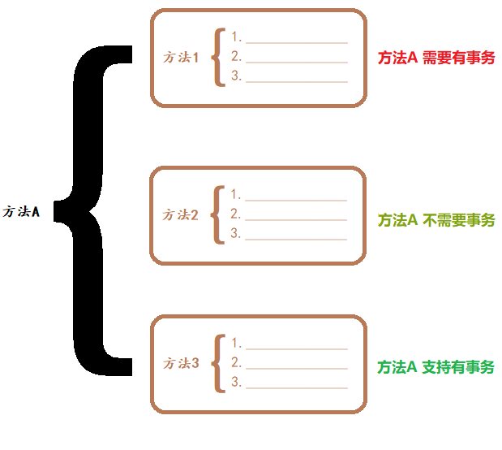

### 01复习

#### 目标

- 了解常见的面试题


#### 1. 常见的面试题

##### 1.1 什么是代理模式?

- 


##### 1.2 什么是OOP、AOP?

- OOP:  
- AOP: 


##### 1.3 jdk和cglib的区别?

|          | JDK  | CGLIB |
| -------- | ---- | ----- |
| 实现方式 |      |       |
| 性能高低 |      |       |
| 适用场景 |      |       |


#### 小结

- 请说出以下指示符的作用?
  - bean: 
  - within: 
  - execution: 
- 请说出一下注解的作用?
  - @Aspect: 
  - @Pointcut: 
  - @Before: 
  - @AfterReturning: 
  - @AfterThrowing: 
  - @After: 
  - @Around: 
- Spring的优点有哪些?
  - 
  - 


### 02事务的概念【了解】

#### 目标

- 了解事务的作用
- 理解事务的特性


#### 1. 事务的作用

- 在业务中 **保证数据安全**

  


#### 2. 事务的特性

- 事务的四大特性也叫事务的 **ACID原则**

##### 2.1 原子性（Atomicity）

- 

##### 2.2 一致性（Consistency）

- 

##### 2.3 隔离性（Isolation）

- 

##### 2.4 持久性（Durability）

- 


#### 小结

- 事务的作用是什么?
  - 
- 事务的ACID原则分别是什么?
  - 


### 03Spring声明式事务【了解】

#### 目标

- 理解什么是声明式事务?
- 理解Spring事务相关API


#### 1. 什么是声明式事务

- 通过 **面向切面编程思想** 来实现的事务管理方式
- Spring声明式事务的简写: TX

 

#### 2. Spring事务相关API

##### 2.1 PlatformTransactionManager

- 事务管理接口: 定义了提交事务、获取事务、回滚事务的方法。 

 

##### 2.2 TransactionStatus

- 事务状态接口: 定义了Spring内部的事务状态规范

 

- 存储点: 用于设置事务回滚的位置

 

##### 2.3 TransactionDefinition

- 事务信息接口: 定义了事务的隔离级别、传播行为、超时时间、是否只读等。

 

#### 小结

- 什么是声明式事务?
  - 
- 事务管理接口中有哪些方法?
  - 


### 04事务的隔离级别【理解】

#### 目标

- 理解事务的隔离级别


#### 1. 事务的隔离级别

- 事务的隔离级别表示的是: 多个事务之间的影响程度

 

##### 1.1 ISOLATION_DEFAULT

- 

##### 1.2 ISOLATION_READ_UNCOMMITTED

- 

| 时间 | 事务A                                                     | 事务B                                                        |
| ---- | --------------------------------------------------------- | ------------------------------------------------------------ |
| 1    | 开启事务                                                  |                                                              |
| 2    |                                                           | 开启事务                                                     |
| 3    | // 原来是小明<br/>update user set name="小白" where id=1; |                                                              |
| 5    |                                                           | <font color='red'>// 结果是小白</font><br/>select name from user where id=1; |
| 6    | 回滚事务                                                  |                                                              |

##### 1.3 ISOLATION_READ_COMMITTED

- 

| 时间 | 事务A                                                     | 事务B                                                        |
| ---- | --------------------------------------------------------- | ------------------------------------------------------------ |
| 1    | 开启事务                                                  |                                                              |
| 2    |                                                           | 开启事务                                                     |
| 3    |                                                           | // 结果是小明<br/>select name from user where id=1;          |
| 5    | // 原来是小明<br/>update user set name="小白" where id=1; |                                                              |
| 6    | 提交事务                                                  |                                                              |
| 7    |                                                           | <font color='red'>// 结果不一样</font><br/>select name from user where id=1; |

##### 1.4 ISOLATION_REPEATABLE_READ

- 

| 时间 | 事务A                                                        | 事务B                                               |
| ---- | ------------------------------------------------------------ | --------------------------------------------------- |
| 1    |                                                              | 开启事务                                            |
| 2    | 开启事务                                                     |                                                     |
| 3    | // 结果是小明<br/>select name from user where id=1;          | // 结果是小明<br/>select name from user where id=1; |
| 5    | <font color='red'>// 不能修改</font><br/>update user set name="小白" where id=1; | // 结果是一样<br/>select name from user where id=1; |
| 6    |                                                              | 提交事务                                            |
| 7    | // 可以修改<br/>update user set name="小白" where id=1;      |                                                     |

##### 1.5 ISOLATION_SERIALIZABLE

- 

| 时间 | 事务A    | 事务B                                                   |
| ---- | -------- | ------------------------------------------------------- |
| 1    |          | 开启事务                                                |
| 2    |          | // 结果是小明<br/>select name from user where id=1;     |
| 3    |          | // 可以修改<br/>update user set name="小白" where id=1; |
| 5    |          | 提交事务                                                |
| 6    | 开启事务 |                                                         |


#### 小结

- 什么是脏读?

  - 
- 什么是幻读?
  - 


### 05事务的传播行为【理解】

#### 目标

- 理解事务的传播行为


#### 1. 事务的传播行为

- 当前方法对事务的要求

 

##### 1.1 REQUIRED

- 需要: 

##### 1.2 SUPPORTS

- 支持: 

##### 1.3 MANDATORY

- **强制**: 

##### 1.4 REQUIRES_NEW

- 独立:

##### 1.5 NOT_SUPPORTED

- 不支持: 

##### 1.6 NEVER

- **决不**: 

##### 1.7 NESTED

- <font color='red'>嵌套</font>:  

------

- 【扩展】容易混淆的传播行为

 

| 传播行为                | 场景一                 | 场景二                 | 结论                                 |
| ----------------------- | ---------------------- | ---------------------- | ------------------------------------ |
| REQUIRED (**需要**)     | 方法A回滚, 方法B回滚   | 方法A回滚, 方法B回滚   | AB属于同一个事务                     |
| REQUIRES_NEW (**独立**) | 方法A回滚, 方法B不回滚 | 方法A不回滚, 方法B回滚 | B是独立的事务<br/>不影响外部事务     |
| NEVER (**嵌套**)        | 方法A回滚, 方法B回滚   | 方法A不回滚, 方法B回滚 | A优先级大于B<br/>B异常不影响外部事务 |


#### 小结

- SUPPORTS与NOT_SUPPORTS的区别?
  - SUPPORTS:
  - NOT_SUPPORTS: 
- 哪些传播行为不满足要求会抛出异常?
  - MANDATORY: 
  - NEVER:


### 06TX - XML案例【掌握】

#### 目标

- 使用XML实现声明式事务管理


#### 1. 实现声明式事务管理

##### 1.1 搭建环境

1. 工程名称: spring04_xml_01
2. 添加依赖: pom.xml

    ```xml
    <!-- Spring IOC 依赖 -->
    
    <!-- aspectJ 切面编程 依赖 -->
    
    <!-- Spring 事务 依赖 -->
    
    <!-- Spring  Jdbc 依赖 -->
    
    <!-- Druid 连接池 依赖 -->
    
    <!-- Mysql 依赖 -->
    
    <!-- Spring 测试 依赖 -->
    
    <!-- Junit 单元测试 依赖 -->
    ```

##### 1.2 业务代码

1. 实体类: com.itheima.xml.domain.Account

    ```java
    
    ```

2. 持久类: com.itheima.xml.dao.impl.AccountDaoImpl

    ```java
    
    ```

3. 业务类: com.itheima.xml.service.impl.AccountServiceImpl

    ```java
    
    ```


##### 1.3 事务配置

1. 添加配置文件: db.properties

    ```properties
    db.driver=com.mysql.jdbc.Driver
    # 针对Mysql 8.x数据库的参数
    #   serverTimezone: 指定时区(UTC)
    #   useSSL: 指定是否使用加密安全连接(false)
    #   allowPublicKeyRetrieval: 是否允许检索公钥(true)
    db.url=jdbc:mysql:///mybatisdb?serverTimezone=UTC&useSSL=false&allowPublicKeyRetrieval=true&characterEncoding=UTF-8
    db.username=root
    db.password=root
    ```

2. 配置事务管理: applicationContext.xml

    ```xml
    <!-- 1. 加载数据库参数配置文件 -->
    
    <!-- 2. 编写Spring组件扫描配置 -->
    
    <!-- 3. 创建数据源(连接池对象) -->
    
    <!-- 4. 创建数据库操作模板(JdbcTemplate) -->
    
    <!-- 5. 配置事务管理器 -->
    
    <!-- 6. 配置AOP(创建代理对象) -->
    
    <!-- 7. 配置事务管理规则(通知) -->
    ```


##### 1.4 单元测试

1. 单元测试: XmlTests.java

    ```java
    
    ```


#### 小结

- 声明式事务有什么好处?
  - 


### 07TX - 注解案例【掌握】

#### 目标

- 使用注解改造案例


#### 1. 使用注解改造案例

1. 工程名称: spring04_anno_02

2. 使用注解: com.itheima.xml.service.impl.AccountServiceImpl

   ```java
   
   ```

3. 添加配置: applicationContext.xml

   ```xml
   
   ```

4. 单元测试: XmlTests.java

   ```java
   
   ```


#### 小结

- @Transactional注解的作用是什么?
  - 


### 08TX - 纯注解案例【理解】

#### 目标

- 使用注解代替所有配置


#### 1. 使用注解代替所有配置

1. 创建配置类: com.itheima.xml.config.SpringConfig

   ```java
   
   ```

2. 创建数据库配置类: com.itheima.xml.config.JdbcConfig

    ```java
    
    ```

3. 单元测试: AnnoTests

   ```java
   
   ```


#### 小结

- @EnableTransactionManagement注解的作用?
  - 


### 09Spring编程式事务【了解】

#### 目标

- 了解编程式事务概念
- 实现编程式事务案例


#### 1. 编程式事务概念

- 通过 **编码** 来实现的事务管理方式
- 以下是Spring封装的API

##### 1.1 TransactionTemplate

- 

##### 1.2 TransactionCallback

- 


#### 2.编程式事务案例

##### 2.1 环境改造

1. 工程名称: spring04_code_03

##### 2.2 业务改造

1. 事务编码: com.itheima.xml.service.impl.AccountServiceImpl

    ```java
    
    ```


##### 2.3 配置支持

1. 添加配置: applicationContext.xml

    ```xml
    <!-- 配置事务管理模板对象 -->
    
    ```


##### 2.4 单元测试

1. 单元测试: XmlTests

    ```java
    
    ```


#### 小结

- 编程式事务有什么好处?
  - 


### 10总结

1. 什么是ACID原则?
  - Atomicity:
  - Consistency: 
  - Isolation: 
  - Durability:
2. 以下隔离级别分别解决了什么问题?
  - ISOLATION_READ_UNCOMMITTED:
  - ISOLATION_READ_COMMITTED: 
  - ISOLATION_REPEATABLE_READ:
  - ISOLATION_SERIALIZABLE: 
3. 请说出以下传播行为的含义
  - REQUIRED:
  - SUPPORTS:
  - MANDATORY:
  - REQUIRES_NEW:
  - NOT_SUPPORTED:
  - NEVER:
  - NESTED:
4. 声明式事务的好处有哪些?
  - 
5. 请描述以下注解的作用?
  - @EnableTransactionManagement:
  - @Transactional: 
6. Spring的优点有哪些?
  - 
  - 
  - 


