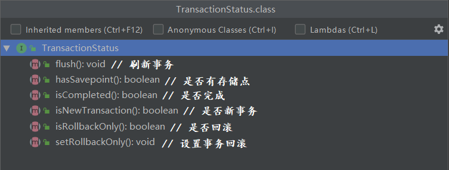

### 01复习

#### 目标

- 了解常见的面试题


#### 1. 常见的面试题

##### 1.1 什么是AOP?

- AOP是面向切面编程的简写是一种主流的编程思想
- Spring AOP的底层是动态代理技术
- AOP的主要作用是做非侵入式的业务增强


##### 1.2 jdk和cglib的区别?

|          | JDK                                           | CGLIB                                |
| -------- | --------------------------------------------- | ------------------------------------ |
| 实现方式 | 利用 **实现** 接口方法来拦截目标方法          | 利用 **继承** 覆写方法来拦截目标方法 |
| 实现前提 | 目标对象 **需要实现接口**                     | 需要目标方法未使用final/static修饰   |
| 实现效率 | JDK1.6以前较Cglib慢; 1.6以及1.7大量调用时较慢 | 1.8时被JDK代理超越                   |


##### 1.3 什么是切面?

- 切面是由切入点和通知组成

- 切入点是需要进行增强的方法
- 通知是需要增加的内容和增加时机(前后异常始终)


#### 小结

- 请说出以下指示符的作用?
  - bean: 
  - within:
  - execution: 
- 请说出一下注解的作用?
  - @Aspect: 
  - @Pointcut: 
  - @Before:
  - @AfterReturning:
  - @AfterThrowing:
  - @After: 
- Spring的优点有哪些?
  - IOC解耦、AOP支持.. 等
  - 


### 02事务的概念【了解】

#### 目标

- 了解事务的作用
- 理解事务的特性


#### 1. 事务的作用

- 可以在业务进行中保证最终的数据安全


#### 2. 事务的特性

- 事务的四大特性也叫事务的 **ACID原则**

##### 2.1 原子性（Atomicity）

- 

##### 2.2 一致性（Consistency）

- 

##### 2.3 隔离性（Isolation）

- 

##### 2.4 持久性（Durability）

- 


#### 小结

- 事务的作用是什么?
  - 
- 事务的ACID原则分别是什么?
  - 


### 03Spring声明式事务【了解】

#### 目标

- 理解什么是声明式事务?
- 理解Spring事务相关API


#### 1. 什么是声明式事务

- 通过 **面向切面编程思想** 来实现事务管理的1种方式


#### 2. Spring事务相关API

##### 2.1 TransactionDefinition

- 


 

##### 2.2 TransactionStatus

- 


 

##### 2.3 PlatformTransactionManager

- 


 

#### 小结

- 什么是声明式事务?
  - 
- 事务管理接口中有哪些方法?
  - 


### 04事务的隔离级别【理解】

#### 目标

- 理解事务的隔离级别


#### 1. 事务的隔离级别

##### 1.1 ISOLATION_DEFAULT

- 

##### 1.2 ISOLATION_READ_UNCOMMITTED

- 

| 时间 | 事务A                                                     | 事务B                                                        |
| ---- | --------------------------------------------------------- | ------------------------------------------------------------ |
| 1    | 开启事务                                                  |                                                              |
| 2    |                                                           | 开启事务                                                     |
| 3    | // 原来是小明<br/>update user set name="小白" where id=1; |                                                              |
| 5    |                                                           | <font color='red'>// 结果是小白</font><br/>select name from user where id=1; |
| 6    | 回滚事务                                                  |                                                              |

##### 1.3 ISOLATION_READ_COMMITTED

- 

| 时间 | 事务A                                                     | 事务B                                                        |
| ---- | --------------------------------------------------------- | ------------------------------------------------------------ |
| 1    | 开启事务                                                  |                                                              |
| 2    |                                                           | 开启事务                                                     |
| 3    |                                                           | // 结果是小明<br/>select name from user where id=1;          |
| 5    | // 原来是小明<br/>update user set name="小白" where id=1; |                                                              |
| 6    | 提交事务                                                  |                                                              |
| 7    |                                                           | <font color='red'>// 结果不一样</font><br/>select name from user where id=1; |

##### 1.4 ISOLATION_REPEATABLE_READ

- 

| 时间 | 事务A                                                   | 事务B                                                        |
| ---- | ------------------------------------------------------- | ------------------------------------------------------------ |
| 1    |                                                         | 开启事务                                                     |
| 2    | 开启事务                                                |                                                              |
| 3    | // 结果是小明<br/>select name from user where id=1;     | // 结果是小明<br/>select name from user where id=1;          |
| 5    | // 不能修改<br/>update user set name="小白" where id=1; | <font color='red'>// 结果是一样</font><br/>select name from user where id=1; |
| 6    |                                                         | 提交事务                                                     |
| 7    | // 可以修改<br/>update user set name="小白" where id=1; |                                                              |

##### 1.5 ISOLATION_SERIALIZABLE

- 

| 时间 | 事务A    | 事务B                                                   |
| ---- | -------- | ------------------------------------------------------- |
| 1    |          | 开启事务                                                |
| 2    |          | // 结果是小明<br/>select name from user where id=1;     |
| 3    |          | // 可以修改<br/>update user set name="小白" where id=1; |
| 5    |          | 提交事务                                                |
| 6    | 开启事务 |                                                         |


#### 小结

- 什么是脏读?

  - 
- 什么是幻读?
  - 


### 05事务的传播行为【理解】

#### 目标

- 理解事务的传播行为


#### 1. 事务的传播行为

- 当前方法对外部事务的要求

 

##### 1.1 REQUIRED

- 必需: 

##### 1.2 SUPPORTS

- 支持: 

##### 1.3 MANDATORY

- **强制**: 

##### 1.4 REQUIRES_NEW

- 独立:

##### 1.5 NOT_SUPPORTED

- 不支持: 

##### 1.6 NEVER

- **决不**: 

##### 1.7 NESTED

- <font color='red'>嵌套</font>:  


#### 小结

- SUPPORTS与NOT_SUPPORTS的区别?
  - SUPPORTS:
  - NOT_SUPPORTS: 
- 哪些传播行为不满足要求会抛出异常?
  - MANDATORY: 
  - NEVER:


### 06XML案例【掌握】

#### 目标

- 使用XML实现声明式事务管理


#### 1. 实现声明式事务管理

##### 1.1 搭建环境

- 工程名称: spring-day04-xml
- 添加依赖: pom.xml

```xml
<!-- Spring IOC 依赖 -->

<!-- aspectJ 切面编程 依赖 -->

<!-- Spring 事务 依赖 -->

<!-- Spring  Jdbc 依赖 -->

<!-- Druid 连接池 依赖 -->

<!-- Mysql 依赖 -->

<!-- Spring 测试 依赖 -->

<!-- Junit 单元测试 依赖 -->
```

##### 1.2 业务代码

- 实体类: com.itheima.xml.domain.Account.java

```java

```

- 持久类: com.itheima.xml.dao.impl.AccountDaoImpl.java

```java

```

- 业务类: com.itheima.xml.service.impl.AccountServiceImpl.java

```java

```


##### 1.3 事务配置

- db.properties

```properties

```

- applicationContext.xml

```xml

```


##### 1.4 单元测试

- XmlTests.java

```java

```


#### 小结

- 声明式事务有什么好处?
  - 


### 07注解改造案例【掌握】

#### 目标

- 使用注解改造案例


#### 1. 使用注解改造案例

##### 1.1 改造环境

- 工程名称: spring-day04-anno

##### 1.2 注解代码

- com.itheima.xml.service.impl.AccountServiceImpl.java

```java

```

##### 1.3 配置支持

- applicationContext.xml

```xml

```

##### 1.4 单元测试

- AnnoTests.java

```java

```


#### 小结

- @Transactional注解的作用是什么?
  - 
- `<tx:annotation-driven/>`的作用是什么?
  - 


### 08纯注解改造案例【理解】

#### 目标

- 使用注解代替所有配置


#### 1. 使用注解代替所有配置

##### 1.1 配置类

- SpringConfig.java

```java

```

- JdbcConfig.java

```java

```

##### 1.2 单元测试

- AnnoTests.java

```java

```


#### 小结

- @EnableTransactionManagement注解的作用?
  - 


### 09Spring编程式事务【了解】

#### 目标

- 了解编程式事务概念
- 实现编程式事务案例


#### 1. 编程式事务概念

- 通过 **编码** 来实现事务管理的1种方式

#### 2.编程式事务案例

##### 2.1 环境改造

- 工程名称: spring-day04-code

##### 2.2 业务改造

- com.itheima.xml.service.impl.AccountServiceImpl.java

```java

```


##### 2.3 配置支持

- applicationContext.xml

```xml
<!-- 配置事务管理模板对象 -->

```


##### 2.4 单元测试

- XmlTests.java

```java

```


#### 小结

- 编程式事务有什么好处?
  - 


### 10两种方式的区别【了解】

#### 目标

- 两种事务管理方式的区别?


#### 1. 两种事务管理方式的区别

##### 1.1 应用场景

- 

##### 1.2 应用市场

- 

##### 1.3 应用难度

- 


#### 小结

- 


### 11总结

- 什么是ACID原则?
  - Atomicity:
  - Consistency: 
  - Isolation: 
  - Durability:
- 以下隔离级别分别解决了什么问题?
  - ISOLATION_READ_UNCOMMITTED:
  - ISOLATION_READ_COMMITTED: 
  - ISOLATION_REPEATABLE_READ:
  - ISOLATION_SERIALIZABLE: 
- 请说出以下传播行为的含义
  - REQUIRED:
  - SUPPORTS:
  - MANDATORY:
  - REQUIRES_NEW:
  - NOT_SUPPORTED:
  - NEVER:
  - NESTED:
- 声明式事务的好处有哪些?
  - 
- 请描述以下注解的作用?
  - @EnableTransactionManagement:
  - @Transactional: 


