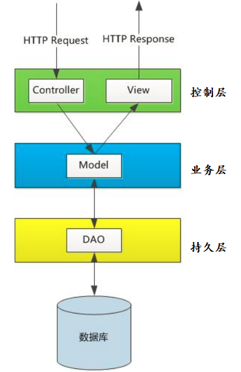
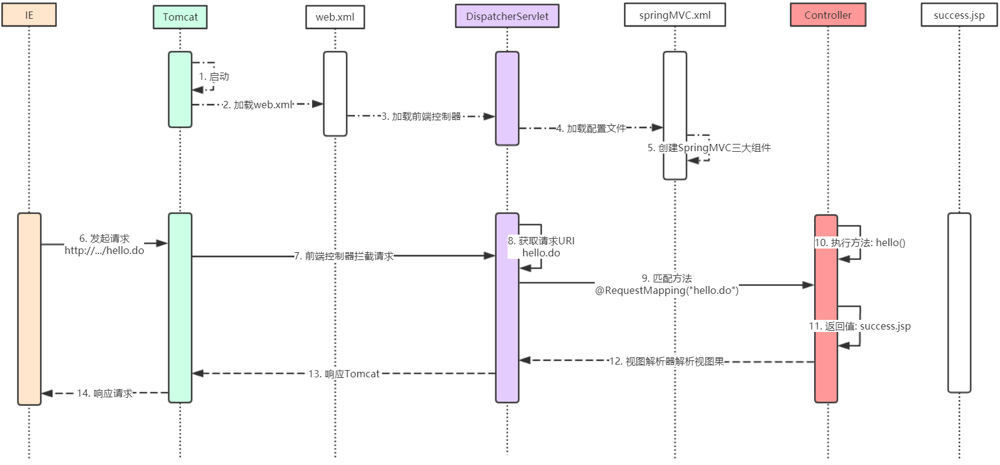
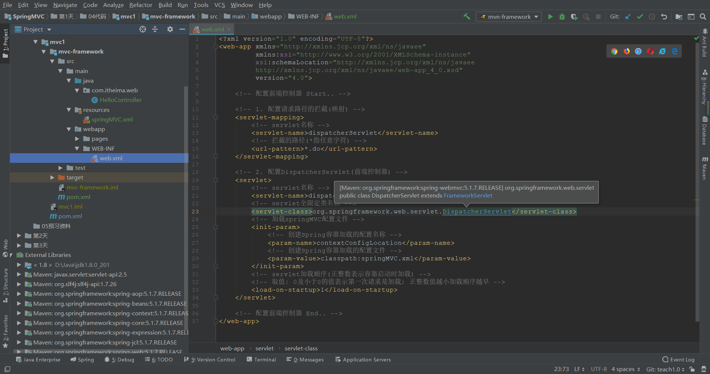
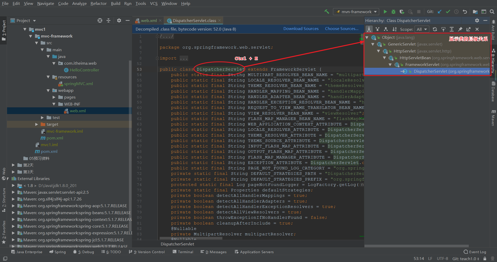

### 01复习

#### 目标

- 理解三层架构和MVC模式
- 理解MVC与3层架构的关系


#### 1. 三层架构和MVC模式

##### 1.1 三层架构

- 三层架构(3-tier architecture): **视图层**, **业务层**, **持久层**


##### 1.2 MVC模式

- MVC(Model, View, Controller)是视图层的一种设计模式

- M: 
- V:
- C:


#### 2. MVC与3层架构的关系

 


#### 小结

- 什么是MVC ?
  - 
- MVC与三层架构是什么关系?
  - 


### 02SpringMVC概诉【了解】

#### 目标

- 了解SpringMVC概念
- 了解SpringMVC优点


#### 1. SpringMVC概念

- SpringMVC是为web应用的一个Java平台的开源框架
- SpringMVC是Spring基于MVC设计模式实现的轻量级框架

#### 2. SpringMVC优点

| 序号 | 优点                     | 详情                                                         |
| ---- | ------------------------ | :----------------------------------------------------------- |
| 1    | 清晰的角色划分           | 前端控制器（ DispatcherServlet） <br/>处理器映射器（ HandlerMapping） <br/>处理器适配器（ HandlerAdapter） <br/>视图解析器（ ViewResolver） <br/>处理器或页面控制器（ Controller） <br/>验证器（ Validator） <br/>命令对象（ Command 请求参数绑定到的对象就叫命令对象）<br/>表单对象（ Form Object 提供给表单展示和表单提交的对象） |
| 2    | 可扩展性好               | 可以很容易扩展，虽然几乎不需要                               |
| 3    | 与Spring 框架无缝集成    | 这是其它web框架不具备的                                      |
| 4    | 可适配性好               | 通过 HandlerAdapter 可以支持任意的类作为处理器               |
| 5    | 可定制性好               | 提供从最简单的URL映射，到复杂的、专用的定制策略              |
| 6    | 单元测试方便             | 利用 Spring 提供的 Mock 对象能够非常简单的进行 Web 层单元测试 |
| 7    | 本地化、主题的解析的支持 | 支持包括诸如数据绑定和主题(theme)之类的许多功能              |
| 8    | jsp标签库                | 强大的 JSP 标签库，使 JSP 编写更容易                         |


#### 小结

- SpringMVC是什么?
  - 
- 至少说出SpringMVC的3个角色划分?
  - 
  - 
  - 


### 03SpringMVC案例【掌握】

#### 目标

- 搭建SpringMVC工程环境
- 掌握SpringMVC入门案例


#### 1. SpringMVC环境搭建

- 工程名称: mvc-day01-case
- WEB工程: 添加web支持或者使用插件转换
- 添加依赖: pom.xml

```xml

```


#### 2. SpringMVC入门案例

- web.xml

```xml

```

- springMVC.xml

```xml
<!-- 1. 配置Spring注解扫描 -->

<!-- 2. 配置SpringMVC注解驱动 -->

<!-- 3. 配置SpringMVC视图解析器 -->
```

- com.itheima.case.HelloController

```java

```

- pages/success.jsp

```jsp

```


#### 小结

- 如何创建SpringMVC的处理器?
  - 
- hello方法的返回值代表什么?
  - 


### 04案例的执行流程【掌握】

#### 目标

- 掌握SpringMVC的工作流程


#### 1. SpringMVC的工作流程

 


#### 小结

- 案例中哪个是前端控制器?
  - 
- 案例中哪个是处理器?
  - 


### 05SpringMVC组件【理解】

#### 目标

- 理解SpringMVC的基本组件
- 掌握SpringMVC的三大组件


#### 1. 基本组件

##### 1.1 前端控制器

- DispatcherServlet/前端控制器/核心控制器

- 作用: 用于接收并分发从浏览器发起的请求


##### 1.2 后端控制器

- Controller/处理器/后端控制器
- 作用: 表现层处理用户请求的对象


##### 1.3 视图

- View/视图
- 作用: 描述响应内容的对象


#### 2. 三大组件

##### 2.1 处理器映射器

- HandlerMapping/处理器映射器

- 作用: 匹配处理器的执行方法


##### 2.2 处理器适配器

- HandlerAdapter/处理器适配器
- 作用: 适配调用处理器的方法


##### 2.3 视图解析器

- ViewResolver/视图解析器
- 作用: 根据名称解析出视图对象


#### 小结

- SpringMVC的三大组件有哪些?
  - 
  - 
  - 
- 如何配置SpringMVC三大组件?
  - 


### 06源码分析【理解】

#### 目标

- 分析SpringMVC执行流程的源码


#### 1. 执行流程的源码

- SpringMVC源码版本: 5.1.7.RELEASE

##### 1.1 入口分析

###### 1.1.1 web.xml

 

###### 1.1.2 Servlet

```java
public interface Servlet {
    // 初始化方法,构造方法后执行
    void init(ServletConfig var1);
    
	// 每次访问servlet时候执行
    void service(ServletRequest var1, ServletResponse var2);
    
	// 停止服务器时候执行
    void destroy();
}
```

###### 1.1.3 DispatcherServlet

 

###### 1.1.4 FrameworkServlet

 

##### 1.2 调度源码

###### 1.2.1 FrameworkServlet

```java
protected void service(HttpServletRequest request, HttpServletResponse response) throws ServletException, IOException {
    HttpMethod httpMethod = HttpMethod.resolve(request.getMethod());
    if (httpMethod != HttpMethod.PATCH && httpMethod != null) {
        super.service(request, response);
    } else {
        // 最终都会执行处理请求的方法
        this.processRequest(request, response);
    }
}
```

```java
protected final void processRequest(HttpServletRequest request, HttpServletResponse response) throws ServletException, IOException {
    long startTime = System.currentTimeMillis();
    Throwable failureCause = null;
    LocaleContext previousLocaleContext = LocaleContextHolder.getLocaleContext();
    LocaleContext localeContext = this.buildLocaleContext(request);
    RequestAttributes previousAttributes = RequestContextHolder.getRequestAttributes();
    ServletRequestAttributes requestAttributes = this.buildRequestAttributes(request, response, previousAttributes);
    WebAsyncManager asyncManager = WebAsyncUtils.getAsyncManager(request);
    asyncManager.registerCallableInterceptor(FrameworkServlet.class.getName(), new FrameworkServlet.RequestBindingInterceptor());
    this.initContextHolders(request, localeContext, requestAttributes);

    try {
        // 最终会调用doService方法; 该方法被DispatcherServlet重写了
        this.doService(request, response);
    } catch (IOException | ServletException var16) {
        failureCause = var16;
        throw var16;
    } catch (Throwable var17) {
        failureCause = var17;
        throw new NestedServletException("Request processing failed", var17);
    } finally {
        this.resetContextHolders(request, previousLocaleContext, previousAttributes);
        if (requestAttributes != null) {
            requestAttributes.requestCompleted();
        }

        this.logResult(request, response, (Throwable)failureCause, asyncManager);
        this.publishRequestHandledEvent(request, response, startTime, (Throwable)failureCause);
    }

}
```

###### 1.2.3 DispatcherServlet

```java
protected void doService(HttpServletRequest request, HttpServletResponse response) throws Exception {
    this.logRequest(request);
    Map<String, Object> attributesSnapshot = null;
    if (WebUtils.isIncludeRequest(request)) {
        attributesSnapshot = new HashMap();
        Enumeration attrNames = request.getAttributeNames();

        label95:
        while(true) {
            String attrName;
            do {
                if (!attrNames.hasMoreElements()) {
                    break label95;
                }

                attrName = (String)attrNames.nextElement();
            } while(!this.cleanupAfterInclude && !attrName.startsWith("org.springframework.web.servlet"));

            attributesSnapshot.put(attrName, request.getAttribute(attrName));
        }
    }

    request.setAttribute(WEB_APPLICATION_CONTEXT_ATTRIBUTE, this.getWebApplicationContext());
    request.setAttribute(LOCALE_RESOLVER_ATTRIBUTE, this.localeResolver);
    request.setAttribute(THEME_RESOLVER_ATTRIBUTE, this.themeResolver);
    request.setAttribute(THEME_SOURCE_ATTRIBUTE, this.getThemeSource());
    if (this.flashMapManager != null) {
        FlashMap inputFlashMap = this.flashMapManager.retrieveAndUpdate(request, response);
        if (inputFlashMap != null) {
            request.setAttribute(INPUT_FLASH_MAP_ATTRIBUTE, Collections.unmodifiableMap(inputFlashMap));
        }

        request.setAttribute(OUTPUT_FLASH_MAP_ATTRIBUTE, new FlashMap());
        request.setAttribute(FLASH_MAP_MANAGER_ATTRIBUTE, this.flashMapManager);
    }

    try {
        // 最终都会执行doDispatch方法
        this.doDispatch(request, response);
    } finally {
        if (!WebAsyncUtils.getAsyncManager(request).isConcurrentHandlingStarted() && attributesSnapshot != null) {
            this.restoreAttributesAfterInclude(request, attributesSnapshot);
        }

    }

}
```

```java
protected void doDispatch(HttpServletRequest request, HttpServletResponse response) throws Exception {
    HttpServletRequest processedRequest = request;
    HandlerExecutionChain mappedHandler = null;
    boolean multipartRequestParsed = false;
    WebAsyncManager asyncManager = WebAsyncUtils.getAsyncManager(request);

    try {
        try {
            ModelAndView mv = null;
            Object dispatchException = null;

            try {
                processedRequest = this.checkMultipart(request);
                multipartRequestParsed = processedRequest != request;
                // 根据URI获取到具体的处理器方法 (三大组件之一: 处理器映射器)
                mappedHandler = this.getHandler(processedRequest);
                if (mappedHandler == null) {
                    this.noHandlerFound(processedRequest, response);
                    return;
                }
				// 获取到处理器适配器 (三大组件之一: 处理器适配器)
                HandlerAdapter ha = this.getHandlerAdapter(mappedHandler.getHandler());
                String method = request.getMethod();
                boolean isGet = "GET".equals(method);
                if (isGet || "HEAD".equals(method)) {
                    long lastModified = ha.getLastModified(request, mappedHandler.getHandler());
                    if ((new ServletWebRequest(request, response)).checkNotModified(lastModified) && isGet) {
                        return;
                    }
                }

                if (!mappedHandler.applyPreHandle(processedRequest, response)) {
                    return;
                }
				// 适配器通过反射调用处理器方法
                // 并返回视图和模型
                mv = ha.handle(processedRequest, response, mappedHandler.getHandler());
                if (asyncManager.isConcurrentHandlingStarted()) {
                    return;
                }
				// 如果视图是空采用默认视图
                this.applyDefaultViewName(processedRequest, mv);
                // 拦截器处理
                mappedHandler.applyPostHandle(processedRequest, response, mv);
            } catch (Exception var20) {
                dispatchException = var20;
            } catch (Throwable var21) {
                dispatchException = new NestedServletException("Handler dispatch failed", var21);
            }
			// 调用视图解析器处理结果 (三大组件之一: 视图解析器)
            this.processDispatchResult(processedRequest, response, mappedHandler, mv, (Exception)dispatchException);
        } catch (Exception var22) {
            this.triggerAfterCompletion(processedRequest, response, mappedHandler, var22);
        } catch (Throwable var23) {
            this.triggerAfterCompletion(processedRequest, response, mappedHandler, new NestedServletException("Handler processing failed", var23));
        }

    } finally {
        if (asyncManager.isConcurrentHandlingStarted()) {
            if (mappedHandler != null) {
                mappedHandler.applyAfterConcurrentHandlingStarted(processedRequest, response);
            }
        } else if (multipartRequestParsed) {
            this.cleanupMultipart(processedRequest);
        }

    }
}
```

##### 1.3 组件源码

###### 1.3.1 处理器映射器

```java
@Nullable
protected HandlerExecutionChain getHandler(HttpServletRequest request) throws Exception {
    if (this.handlerMappings != null) {
        // handlerMappings: 处理器映射器集合
        Iterator var2 = this.handlerMappings.iterator();

        while(var2.hasNext()) {
            HandlerMapping mapping = (HandlerMapping)var2.next();
            HandlerExecutionChain handler = mapping.getHandler(request);
            if (handler != null) {
                return handler;
            }
        }
    }

    return null;
}
```

###### 1.3.2 处理器适配器

```java
protected HandlerAdapter getHandlerAdapter(Object handler) throws ServletException {
    if (this.handlerAdapters != null) {
        // handlerAdapters: 处理器适配器集合
        Iterator var2 = this.handlerAdapters.iterator();

        while(var2.hasNext()) {
            HandlerAdapter adapter = (HandlerAdapter)var2.next();
            if (adapter.supports(handler)) {
                return adapter;
            }
        }
    }

    throw new ServletException("No adapter for handler [" + handler + "]: The DispatcherServlet configuration needs to include a HandlerAdapter that supports this handler");
}
```

###### 1.3.3 视图解析器

```java
@Nullable
protected View resolveViewName(String viewName, @Nullable Map<String, Object> model, Locale locale, HttpServletRequest request) throws Exception {
    if (this.viewResolvers != null) {
        Iterator var5 = this.viewResolvers.iterator();

        while(var5.hasNext()) {
            ViewResolver viewResolver = (ViewResolver)var5.next();
            View view = viewResolver.resolveViewName(viewName, locale);
            if (view != null) {
                return view;
            }
        }
    }

    return null;
}
```

##### 1.4 视图源码

###### 1.4.1 视图处理: DispatcherServlet

```java
private void processDispatchResult(HttpServletRequest request, HttpServletResponse response, @Nullable HandlerExecutionChain mappedHandler, @Nullable ModelAndView mv, @Nullable Exception exception) throws Exception {
    boolean errorView = false;
    if (exception != null) {
        if (exception instanceof ModelAndViewDefiningException) {
            this.logger.debug("ModelAndViewDefiningException encountered", exception);
            mv = ((ModelAndViewDefiningException)exception).getModelAndView();
        } else {
            Object handler = mappedHandler != null ? mappedHandler.getHandler() : null;
            mv = this.processHandlerException(request, response, handler, exception);
            errorView = mv != null;
        }
    }

    if (mv != null && !mv.wasCleared()) {
        // 渲染视图
        this.render(mv, request, response);
        if (errorView) {
            WebUtils.clearErrorRequestAttributes(request);
        }
    } else if (this.logger.isTraceEnabled()) {
        this.logger.trace("No view rendering, null ModelAndView returned.");
    }

    if (!WebAsyncUtils.getAsyncManager(request).isConcurrentHandlingStarted()) {
        if (mappedHandler != null) {
            mappedHandler.triggerAfterCompletion(request, response, (Exception)null);
        }

    }
}
```

###### 1.4.2 视图渲染: DispatcherServlet

```java
protected void render(ModelAndView mv, HttpServletRequest request, HttpServletResponse response) throws Exception {
    Locale locale = this.localeResolver != null ? this.localeResolver.resolveLocale(request) : request.getLocale();
    response.setLocale(locale);
    String viewName = mv.getViewName();
    View view;
    if (viewName != null) {
        // 根据视图解析器创建视图对象
        view = this.resolveViewName(viewName, mv.getModelInternal(), locale, request);
        if (view == null) {
            throw new ServletException("Could not resolve view with name '" + mv.getViewName() + "' in servlet with name '" + this.getServletName() + "'");
        }
    } else {
        view = mv.getView();
        if (view == null) {
            throw new ServletException("ModelAndView [" + mv + "] neither contains a view name nor a View object in servlet with name '" + this.getServletName() + "'");
        }
    }

    if (this.logger.isTraceEnabled()) {
        this.logger.trace("Rendering view [" + view + "] ");
    }

    try {
        if (mv.getStatus() != null) {
            response.setStatus(mv.getStatus().value());
        }
		// 视图渲染: AbstractView
        view.render(mv.getModelInternal(), request, response);
    } catch (Exception var8) {
        if (this.logger.isDebugEnabled()) {
            this.logger.debug("Error rendering view [" + view + "]", var8);
        }

        throw var8;
    }
}
```

###### 1.4.3 合并视图: AbstractView

```java
public void render(@Nullable Map<String, ?> model, HttpServletRequest request, HttpServletResponse response) throws Exception {
    if (this.logger.isDebugEnabled()) {
        this.logger.debug("View " + this.formatViewName() + ", model " + (model != null ? model : Collections.emptyMap()) + (this.staticAttributes.isEmpty() ? "" : ", static attributes " + this.staticAttributes));
    }

    Map<String, Object> mergedModel = this.createMergedOutputModel(model, request, response);
    this.prepareResponse(request, response);
    // 合并视图与数据模型: InternalResourceView
    this.renderMergedOutputModel(mergedModel, this.getRequestToExpose(request), response);
}
```

##### 1.5 响应源码

###### 1.5.1 InternalResourceView

```java
protected void renderMergedOutputModel(Map<String, Object> model, HttpServletRequest request, HttpServletResponse response) throws Exception {
    this.exposeModelAsRequestAttributes(model, request);
    this.exposeHelpers(request);
    String dispatcherPath = this.prepareForRendering(request, response);
    RequestDispatcher rd = this.getRequestDispatcher(request, dispatcherPath);
    if (rd == null) {
        throw new ServletException("Could not get RequestDispatcher for [" + this.getUrl() + "]: Check that the corresponding file exists within your web application archive!");
    } else {
        if (this.useInclude(request, response)) {
            response.setContentType(this.getContentType());
            if (this.logger.isDebugEnabled()) {
                this.logger.debug("Including [" + this.getUrl() + "]");
            }

            rd.include(request, response);
        } else {
            if (this.logger.isDebugEnabled()) {
                this.logger.debug("Forwarding to [" + this.getUrl() + "]");
            }
			// 转发页面
            rd.forward(request, response);
        }

    }
}
```

###### 1.5.2 RedirectView

```java
protected void renderMergedOutputModel(Map<String, Object> model, HttpServletRequest request, HttpServletResponse response) throws IOException {
    String targetUrl = this.createTargetUrl(model, request);
    targetUrl = this.updateTargetUrl(targetUrl, model, request, response);
    RequestContextUtils.saveOutputFlashMap(targetUrl, request, response);
    // 重定向地址
    this.sendRedirect(request, response, targetUrl, this.http10Compatible);
}
```

```java
protected void sendRedirect(HttpServletRequest request, HttpServletResponse response, String targetUrl, boolean http10Compatible) throws IOException {
    String encodedURL = this.isRemoteHost(targetUrl) ? targetUrl : response.encodeRedirectURL(targetUrl);
    HttpStatus attributeStatusCode;
    if (http10Compatible) {
        attributeStatusCode = (HttpStatus)request.getAttribute(View.RESPONSE_STATUS_ATTRIBUTE);
        if (this.statusCode != null) {
            response.setStatus(this.statusCode.value());
            response.setHeader("Location", encodedURL);
        } else if (attributeStatusCode != null) {
            response.setStatus(attributeStatusCode.value());
            response.setHeader("Location", encodedURL);
        } else {
            // 重定向地址
            response.sendRedirect(encodedURL);
        }
    } else {
        attributeStatusCode = this.getHttp11StatusCode(request, response, targetUrl);
        response.setStatus(attributeStatusCode.value());
        response.setHeader("Location", encodedURL);
    }

}
```

##### 1.6 源码说明

1. 用户发送请求至前端控制器DispatcherServlet 
2. DispatcherServlet收到请求调用HandlerMapping处理器映射器。 
3. HandlerMapping根据请求URI找到具体的处理器， 生成处理器对象及处理器拦
   截器(如果有则生成)一并返回给DispatcherServlet。 
4. DispatcherServlet通过HandlerAdapter处理器适配器调用处理器 
5. 执行处理器(Controller， 也叫后端控制器)。 
6. Controller执行完成返回ModelAndView 
7. HandlerAdapter将controller执行结果ModelAndView返回给
   DispatcherServlet 
8. DispatcherServlet将ModelAndView传给ViewReslover视图解析器 
9. ViewReslover解析后返回具体View
10. DispatcherServlet对View进行渲染视图（ 即将模型数据填充至视图中） 。
11. DispatcherServlet响应用户 (实际上是视图做的跳转(转发,重定向等..))


#### 小结

- 项目中最早被加载的配置文件?
  - 
- SpringMVC的入口类是哪个?
  - 

- 最终的页面跳转由什么组件完成?
  - 


### 07@RequestMapping【理解】

#### 目标

- 理解@RequestMapping的作用


#### 1. 注解的作用

- <font color='green'>映射与限制请求</font>
- com.itheima.case.RequestMappingController

##### 1.1 映射请求地址

```java

```


##### 1.2 限制请求方法

```java

```


##### 1.3 根路径映射限制

```java

```


#### 小结

- @RequestMapping的作用是什么?
  - 


### 08参数绑定-默认支持【了解】

#### 目标

- 了解默认支持的参数类型


#### 1. 默认支持的参数类型

- com.itheima.case.ParamController

```java

```


#### 小结

- 直接获得ServletAPI对象有什么好处?
  - 
- Model的作用是什么?
  - 


### 09参数绑定-基本类型【理解】

#### 目标

- 理解基本类型的参数绑定
- 解决参数的中文乱码问题


#### 1. 基本类型的参数绑定

- com.itheima.case.ParamController

```java

```

- pages/commit.jsp

```jsp

```


#### 2. 解决参数的中文乱码

- web.xml

```xml

```


#### 小结

- 为什么不建议使用int(基本类型)接收参数?
  - 
- SpringMVC是如何解决参数乱码的问题?
  - 


### 10参数绑定-对象类型【掌握】

#### 目标

- 掌握对象类型的参数绑定
- 理解嵌套类型的参数绑定


#### 1. 对象类型的参数绑定


#### 2. 嵌套类型的参数绑定


#### 小结

- 使用对象接收参数的好处?
  - 


### 11自定义参数转换器【理解】

#### 目标

- 理解SpringMVC的参数转换器


#### 1. 自定义参数转换器

- com.itheima.case.DateConverter

```java

```

- springMVC.xml

```xml

```


#### 小结

- 
- 自定义的转换器需要做什么配置?
  - 


### 12请求参数相关注解【了解】

#### 目标

- 了解@RequestParam作用
- 了解@RequestBody作用
- 了解@RequestHeader作用
- 了解@CookieValue作用


#### 1. @RequestParam

- com.itheima.web.AnnoController

```java

```


#### 2. @RequestBody

- com.itheima.web.AnnoController

```java

```


#### 3. @RequestHeader

- com.itheima.web.AnnoController

```java

```


#### 4. @CookieValue

- com.itheima.web.AnnoController

```java

```


#### 小结

- 请求头参数相关的注解有哪些?
  - 
  - 


### 13总结

- 什么是SpringMVC?
  - 
- 入门案例中的处理器是哪个类?
  - 
- SpringMVC的三大组件是哪些?
  - 
  - 
  - 
- `<mvc:annotation-driven/>`的作用?
  - 
- SpringMVC的入口类是哪个?
  - 
- @RequestMapping的作用?
  - 
- 至少说出3个默认支持的参数类型?
  - 
  - 
  - 
- 请求头相关的注解有哪些?
  - 

