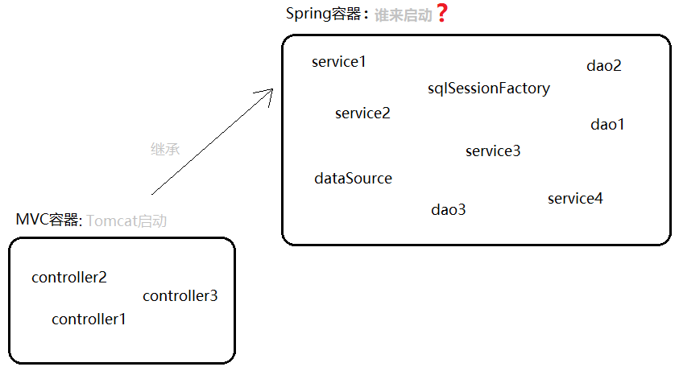

### 01复习

#### 目标

- 了解常见的SSM项目


#### 1. 了解SSM项目

1. SSM项目指的是项目在技术的选择上采取了 SpringMVC+Spring+Mybatis 等框架
2. 在三层架构中, SSM架构比较主流, 且各框架分工明确:
   - SpringMVC: 
   - Spring: 
   - Mybatis: 


#### 小结

- 什么是SSM项目?
  
  - 


### 02SSM - 框架整合【掌握】

#### 目标

- 了解整合目的
- 整合步骤分析


#### 1. 了解整合目的

- 为什么要整合?

  >  在3层架构项目中, 各层都需要相应的解决方案, 所以SSM需要配合使用。


#### 2. 整合步骤分析

- 在3层架构中, 哪些对象需要创建?
  - 
- 在3层架构中, 哪层需要Spring框架?
  - 

1. 使Spring环境能够独立运行
2. 使SpringMVC能够独立运行
3. 使Spring+SpringMVC共同运行
4. 使Mybatis能够独立运行
5. 使SSM共同运行
6. 整体测试


#### 小结

- 三层架构中哪层需要用到Spring?
  - 


### 03SSM - 环境准备【理解】

#### 目标

- 准备数据环境
- 准备项目环境


#### 1. 准备数据环境

1. 数据库: mybatisdb

2. 表名称: account

   ```sql
   DROP TABLE IF EXISTS `account`;
   CREATE TABLE `account` (
     `id` int(11) NOT NULL AUTO_INCREMENT COMMENT '主键',
     `uid` int(11) DEFAULT '1' COMMENT '用户编号',
     `money` decimal(10,2) DEFAULT '0.00' COMMENT '余额',
     PRIMARY KEY (`id`)
   ) ENGINE=InnoDB AUTO_INCREMENT=111 DEFAULT CHARSET=utf8;
   
   -- ----------------------------
   -- Records of account
   -- ----------------------------
   INSERT INTO `account` VALUES ('1', '1', '10.00');
   INSERT INTO `account` VALUES ('2', '10', '0.00');
   INSERT INTO `account` VALUES ('3', '24', '99.00');
   ```

#### 2. 准备项目环境

1. 工程名称: mvc03_ssm_02

2. 添加依赖: pom.xml

   ```xml
   <!-- 1. 添加Spring 依赖 -->
   <!-- 2. 添加SpringMVC 依赖 -->
   <!-- 3. 添加Mybatis 依赖 -->
   <!-- 4. 添加单元测试 依赖 -->
   <!-- 5. 添加日志打印 依赖 -->
   <!-- 6. 添加Servlet相关 依赖 -->
   ```

3. 实体类: com.itheima.ssm.domain.Account

   ```java
   
   ```

4. 数据库配置: db.properties

5. 日志配置: log4j.properties


#### 小结

- 非必需的依赖有哪些?
  - 


### 04SSM - Spring【理解】

#### 目标

- 搭建Spring独立环境


#### 1. 搭建Spring独立环境

1. 业务类: com.itheima.ssm.service.AccountService

   ```java
   
   ```

2. applicationContext.xml

   ```xml
   <!-- 1. Spring组件注解扫描 -->
   <!-- 2. 开启AOP自动代理 -->
   <!-- 3. 开启TX事务注解支持 -->
   <!-- 4. 注册事务管理器【包括数据源】 -->
   ```

3. 单元测试: SsmTests

   ```java
   
   ```

   

#### 小结

- @RunWith的作用是什么?
  - 


### 05SSM - SpringMVC【理解】

#### 目标

- 搭建SpringMVC独立环境


#### 1. 搭建SpringMVC环境

1. 升级工程: war

2. 配置前端控制器: web.xml

   ```xml
   <!-- 1. 配置资源处理路径 -->
   <!-- 2. 配置处理器(前端控制器) -->
   ```

3. 添加配置: springMVC.xml

   ```xml
   <!-- 1. Spring组件注解扫描 -->
   <!-- 2. 注册三大组件 -->
   ```

4. 控制器: com.itheima.ssm.controller.AccountController

   ```java
   
   ```

5. 添加页面

   - pages/account/list.jsp

     ```jsp
     <%@ page contentType="text/html;charset=UTF-8" language="java" %>
     <html>
     <head>
         <title>账户列表</title>
     </head>
     <body>
         <h3>账户列表</h3>
         ${list}
     </body>
     </html>
     ```

   - pages/account/add.jsp

     ```jsp
     <%@ page contentType="text/html;charset=UTF-8" language="java" %>
     <html>
     <head>
         <title>账户注册</title>
     </head>
     <body>
         <h3>账户注册</h3>
         ...
     </body>
     </html>
     ```

6. 单元测试: http://localhost:8080/list


#### 小结

- MVC容器是谁启动的?
  - 


### 06SSM - 整合SS【理解】

#### 目标

- 整合Spring+SpringMVC框架


#### 1. 整合SS框架

​	 

1. 启动 **IOC** 容器: web.xml

   ```xml

   ```
   
2. 注入业务对象: com.itheima.ssm.controller.AccountController

   ```java
   
   ```

   


#### 小结

- ContextLoaderListener的作用?
  - 

- 父子容器启动的顺序是怎样的?
  - 


### 07SSM - Mybatis【理解】

#### 目标

- 搭建Mybatis独立环境


#### 1. 搭建Mybatis环境

1. 持久类: com.itheima.ssm.dao.AccountMapper

   ```java
   
   ```

2. sqlMapConfig.xml

   ```xml
   <!-- 1. 引入数据库配置文件 -->
   
   <!-- 2. 配置Mybatis环境 -->
   
   <!-- 3. 配置Mybatis映射器 -->
   ```

3. 单元测试: SsmTests

   ```java
   // 1. 加载配置文件
   // 2. 创建会话工厂
   // 3. 创建代理对象
   // 4. 操作数据库
   ```


#### 小结

- 启动Mybatis框架需要做什么?
  - 
  - 


### 08SSM - 整合SM【理解】

#### 目标

- 整合Spring+Mybatis框架


#### 1. 整合SM框架

> ​	启动Mybatis框架只需要做两件事
>
> 1. 创建会话工厂 
> 2. 创建代理对象

1. 创建会话工厂: applicationContext.xml

   ```xml
   <!-- 1. 注入 数据源 -->
   <!-- 2. 注入 主配置文件 -->
   <!-- 3. 注入 映射配置文件 -->
   ```

2. 创建代理对象: applicationContext.xml

   ```xml
   
   ```

3. 注入持久对象: com.itheima.ssm.service.AccountService

   ```java
   
   ```


#### 小结

- Mybatis是谁启动的?
  - 


### 09SSM - 整体测试【了解】

#### 目标

- 改造前后端代码进行整体测试


#### 1. 项目改造

1. pages/account/list.jsp

   ```jsp
   
   ```

2. pages/account/add.jsp

   ```jsp
   
   ```


#### 小结

- mybatis-spring依赖的作用?
  
  - 


### 10总结

1. 什么是SSM ?

   - 

2. 整合Spring+SpringMVC需要额外添加依赖吗?

   - 

3. 整合Spring+Mybatis需要额外添加依赖吗?

   - 

4. SpringMVC是谁启动的?

   - 

5. Spring是谁启动的?

   - 

6. Mybatis是谁启动的?

   - 

7. SpringMVC的三大组件有哪些?

   - 

   - 
   - 

8. SpringMVC的工作原理?

   - 