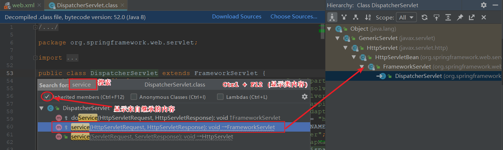

### 01复习

#### 目标

- 理解三层架构和MVC模式
- 理解MVC与3层架构的关系


#### 1. 三层架构和MVC模式

##### 1.1 三层架构

- 项目开发(3-tier architecture): 视图层 (**处理参数**), 业务层 (**处理业务**), 持久层 (**处理数据**)
- 分层架构(3-tier architecture): 其实就是将 **代码分类** , 按功能/职责划分为3类分别存放在web,service,dao包中


##### 1.2 MVC模式

- MVC(Model, View, Controller)是视图层的一种设计模式

- M:  Model: 模型: 数据模型: 专门封装数据库数据的实体类
- V: View: 视图: 页面: json数据: 用户需要的页面+数据
- C: controller: 控制器: Servlet, Controller: 接收用户请求


#### 2. MVC与3层架构的关系

 


#### 小结

- 什么是MVC ?
  - SpringMVC在控制层的一种设计模式
- MVC与三层架构是什么关系?
  - 3层架构包含MVC


### 02SpringMVC概诉【了解】

#### 目标

- 了解SpringMVC概念
- 了解SpringMVC优点


#### 1. SpringMVC概念

- SpringMVC是 **web应用** 的一个Java平台的 **开源框架**
- SpringMVC是Spring **基于MVC设计模式** 实现的 **轻量级** 框架

#### 2. SpringMVC优点

| 序号 | 优点                     | 详情                                                         |
| ---- | ------------------------ | :----------------------------------------------------------- |
| 1    | 清晰的角色划分           | 前端控制器（ DispatcherServlet） <br/>处理器映射器（ HandlerMapping） <br/>处理器适配器（ HandlerAdapter） <br/>视图解析器（ ViewResolver） <br/>处理器或页面控制器（ Controller） <br/>验证器（ Validator） <br/>命令对象（ Command 请求参数绑定到的对象就叫命令对象）<br/>表单对象（ Form Object 提供给表单展示和表单提交的对象） |
| 2    | 可扩展性好               | 可以很容易扩展，虽然几乎不需要                               |
| 3    | 与Spring 框架无缝集成    | 这是其它web框架不具备的                                      |
| 4    | 可适配性好               | 通过 HandlerAdapter 可以支持任意的类作为处理器               |
| 5    | 可定制性好               | 提供从最简单的URL映射，到复杂的、专用的定制策略              |
| 6    | 单元测试方便             | 利用 Spring 提供的 Mock 对象能够非常简单的进行 Web 层单元测试 |
| 7    | 本地化、主题的解析的支持 | 支持包括诸如数据绑定和主题(theme)之类的许多功能              |
| 8    | jsp标签库                | 强大的 JSP 标签库，使 JSP 编写更容易                         |


#### 小结

- SpringMVC是什么?
  - SpringMVC是应用于web工程的基于MVC设计模式的轻量级开源框架
- 至少说出SpringMVC的3个角色划分?
  - 前端控制器
  - 处理器适配器
  - 处理器映射器


### 03SpringMVC案例【掌握】

#### 目标

- 搭建SpringMVC工程环境
- 掌握SpringMVC入门案例


#### 1. SpringMVC环境搭建

- 工程名称: mvc01_demo_01
- WEB工程: 添加web支持或者使用插件转换
- 添加依赖: pom.xml

```xml
<?xml version="1.0" encoding="UTF-8"?>

<project xmlns="http://maven.apache.org/POM/4.0.0" xmlns:xsi="http://www.w3.org/2001/XMLSchema-instance" xsi:schemaLocation="http://maven.apache.org/POM/4.0.0 http://maven.apache.org/xsd/maven-4.0.0.xsd">  
  <modelVersion>4.0.0</modelVersion>  
  <groupId>com.itheima</groupId>  
  <artifactId>mvc01_demo_01</artifactId>  
  <version>1.0-SNAPSHOT</version>

  <!--  WEB应用必须的打包类型 -->
  <packaging>war</packaging>


  <dependencies>
    <!-- 1. 添加SpringMVC框架依赖 -->
    <dependency>
      <groupId>org.springframework</groupId>
      <artifactId>spring-webmvc</artifactId>
      <version>5.0.2.RELEASE</version>
    </dependency>
  </dependencies>
</project>

```


#### 2. SpringMVC入门案例

- web.xml

```xml
<?xml version="1.0" encoding="UTF-8"?>
<web-app xmlns:xsi="http://www.w3.org/2001/XMLSchema-instance"
	xmlns="http://java.sun.com/xml/ns/javaee"
	xsi:schemaLocation="http://java.sun.com/xml/ns/javaee http://java.sun.com/xml/ns/javaee/web-app_2_5.xsd"
	version="2.5">

	<!-- 1. 通知容器(Tomcat)启动SpringMVC框架 -->

	<!-- 用什么来处理(接收)用户请求 -->
	<servlet-mapping>
		<servlet-name>mvc</servlet-name>
		<!-- 需要处理所有.do结尾的请求: http://localhost:8080/...do -->
		<url-pattern>*.do</url-pattern>
	</servlet-mapping>
	
	
	<servlet>
		<servlet-name>mvc</servlet-name>
		<!-- 前端控制器: 统一处理(分发)用户请求 -->
		<!-- 部分同学编译报错: 但是不用管, 照样部署运行 -->
		<servlet-class>org.springframework.web.servlet.DispatcherServlet</servlet-class>
		<init-param>
			<param-name>contextConfigLocation</param-name>
			<param-value>classpath:springMVC.xml</param-value>
		</init-param>
		<!-- Servlet默认在第一次请求时创建, 对第一个用户不公平 0-6 -->
		<load-on-startup>1</load-on-startup>
	</servlet>
</web-app>
```

- springMVC.xml

```xml
<?xml version="1.0" encoding="UTF-8"?>
<beans xmlns="http://www.springframework.org/schema/beans"
       xmlns:xsi="http://www.w3.org/2001/XMLSchema-instance"
       xmlns:context="http://www.springframework.org/schema/context"
       xmlns:mvc="http://www.springframework.org/schema/mvc"
       xsi:schemaLocation="http://www.springframework.org/schema/beans http://www.springframework.org/schema/beans/spring-beans.xsd http://www.springframework.org/schema/context http://www.springframework.org/schema/context/spring-context.xsd http://www.springframework.org/schema/mvc http://www.springframework.org/schema/mvc/spring-mvc.xsd">


    <!-- 1. 添加Spring组件扫描配置 -->
    <!-- 配置控制器所在的包名 -->
    <context:component-scan base-package="com.itheima.demo"/>
    <!-- 2. 创建处理器映射器 -->
    <!--<bean class="org.springframework.web.servlet.mvc.method.annotation.RequestMappingHandlerMapping"/>-->
    <!-- 3. 创建处理器适配器 -->
<!--    <bean class="org.springframework.web.servlet.mvc.method.annotation.RequestMappingHandlerAdapter"/>-->


    <!-- 配置SpringMVC注解支持: 其中包括: 注册处理器映射器和处理器是配置 -->
    <mvc:annotation-driven />


    <!-- 4. 创建视图解析器 -->
    <bean id="viewResolver" class="org.springframework.web.servlet.view.InternalResourceViewResolver">
        <property name="prefix" value="/pages/"/>
        <property name="suffix" value=".jsp"/>
    </bean>
</beans>
```

- com.itheima.demo.HelloController

```java
package com.itheima.demo;

import org.springframework.stereotype.Component;
import org.springframework.stereotype.Controller;
import org.springframework.stereotype.Repository;
import org.springframework.stereotype.Service;
import org.springframework.ui.Model;
import org.springframework.web.bind.annotation.RequestMapping;

/**
 * @Controller: 修饰类 .
 *  作用: 创建控制器对象并添加到容器中.
 *
 * @author : Jason.lee
 * @version : 1.0
 */
@Controller // 不能用其他创建对象的注解创建控制器对象: @Repository @Service @Component
public class HelloController {


    /**
     * http://localhost:8080/hello.do
     * @param model 模型
     * @return 视图名称
     */
    @RequestMapping("hello.do")
    public String hello(Model model){
        System.out.println("执行了hello方法...");
        // 如果没有配置视图解析器的前缀和后缀
//        return "/pages/success.jsp";
        return "success";
    }

}

```

- pages/success.jsp

```jsp
<%--
  Created by IntelliJ IDEA.
  User: Jason
  Date: 2020/2/29
  Time: 9:53
  To change this template use File | Settings | File Templates.
--%>
<%@ page contentType="text/html;charset=UTF-8" language="java" %>
<html>
<head>
    <title>OK</title>
</head>
<body>
    操作成功! ${msg}
</body>
</html>

```


#### 小结

- 如何创建SpringMVC的控制器?
  - @Controller修饰类
- hello方法的返回值代表什么?
  - 视图


### 04案例的执行流程【掌握】

#### 目标

- 掌握SpringMVC的工作流程


#### 1. SpringMVC的工作流程

 


#### 小结

- 案例中哪个是前端控制器?
  - DispatcherServlet
- 案例中哪个是处理器?
  - HelloController


### 05SpringMVC组件【理解】

#### 目标

- 理解SpringMVC的基本组件
- 掌握SpringMVC的三大组件


#### 1. 基本组件

##### 1.1 前端控制器

- DispatcherServlet/前端控制器/核心控制器

- 作用: 用于接收并分发从浏览器发起的请求


##### 1.2 后端控制器

- Controller/处理器/后端控制器
- 作用: 表现层处理用户请求的对象


##### 1.3 视图

- View/视图
- 作用: 描述响应内容的对象


#### 2. 三大组件

##### 2.1 处理器映射器

- HandlerMapping/处理器映射器

- 作用: 匹配处理器的执行方法


##### 2.2 处理器适配器

- HandlerAdapter/处理器适配器
- 作用: 适配调用处理器的方法


##### 2.3 视图解析器

- ViewResolver/视图解析器
- 作用: 根据名称解析出视图对象


#### 小结

- SpringMVC的三大组件有哪些?
  - 处理器映射器
  - 处理器适配器
  - 视图解析器
- 如何配置SpringMVC三大组件?
  - <mv:annotation-driver ...
  - <bean class...


### 06源码分析【理解】

#### 目标

- 分析SpringMVC执行流程的源码


#### 1. 执行流程的源码

- SpringMVC源码版本: 5.1.7.RELEASE

##### 1.1 入口分析

###### 1.1.1 web.xml

 

###### 1.1.2 Servlet

```java
public interface Servlet {
    // 初始化方法,构造方法后执行
    void init(ServletConfig var1);
    
	// 每次访问servlet时候执行
    void service(ServletRequest var1, ServletResponse var2);
    
	// 停止服务器时候执行
    void destroy();
}
```

###### 1.1.3 DispatcherServlet

 

###### 1.1.4 FrameworkServlet

 

##### 1.2 调度源码

###### 1.2.1 FrameworkServlet

```java
protected void service(HttpServletRequest request, HttpServletResponse response) throws ServletException, IOException {
    HttpMethod httpMethod = HttpMethod.resolve(request.getMethod());
    if (httpMethod != HttpMethod.PATCH && httpMethod != null) {
        super.service(request, response);
    } else {
        // 最终都会执行处理请求的方法
        this.processRequest(request, response);
    }
}
```

```java
protected final void processRequest(HttpServletRequest request, HttpServletResponse response) throws ServletException, IOException {
    long startTime = System.currentTimeMillis();
    Throwable failureCause = null;
    LocaleContext previousLocaleContext = LocaleContextHolder.getLocaleContext();
    LocaleContext localeContext = this.buildLocaleContext(request);
    RequestAttributes previousAttributes = RequestContextHolder.getRequestAttributes();
    ServletRequestAttributes requestAttributes = this.buildRequestAttributes(request, response, previousAttributes);
    WebAsyncManager asyncManager = WebAsyncUtils.getAsyncManager(request);
    asyncManager.registerCallableInterceptor(FrameworkServlet.class.getName(), new FrameworkServlet.RequestBindingInterceptor());
    this.initContextHolders(request, localeContext, requestAttributes);

    try {
        // 最终会调用doService方法; 该方法被DispatcherServlet重写了
        this.doService(request, response);
    } catch (IOException | ServletException var16) {
        failureCause = var16;
        throw var16;
    } catch (Throwable var17) {
        failureCause = var17;
        throw new NestedServletException("Request processing failed", var17);
    } finally {
        this.resetContextHolders(request, previousLocaleContext, previousAttributes);
        if (requestAttributes != null) {
            requestAttributes.requestCompleted();
        }

        this.logResult(request, response, (Throwable)failureCause, asyncManager);
        this.publishRequestHandledEvent(request, response, startTime, (Throwable)failureCause);
    }

}
```

###### 1.2.3 DispatcherServlet

```java
protected void doService(HttpServletRequest request, HttpServletResponse response) throws Exception {
    this.logRequest(request);
    Map<String, Object> attributesSnapshot = null;
    if (WebUtils.isIncludeRequest(request)) {
        attributesSnapshot = new HashMap();
        Enumeration attrNames = request.getAttributeNames();

        label95:
        while(true) {
            String attrName;
            do {
                if (!attrNames.hasMoreElements()) {
                    break label95;
                }

                attrName = (String)attrNames.nextElement();
            } while(!this.cleanupAfterInclude && !attrName.startsWith("org.springframework.web.servlet"));

            attributesSnapshot.put(attrName, request.getAttribute(attrName));
        }
    }

    request.setAttribute(WEB_APPLICATION_CONTEXT_ATTRIBUTE, this.getWebApplicationContext());
    request.setAttribute(LOCALE_RESOLVER_ATTRIBUTE, this.localeResolver);
    request.setAttribute(THEME_RESOLVER_ATTRIBUTE, this.themeResolver);
    request.setAttribute(THEME_SOURCE_ATTRIBUTE, this.getThemeSource());
    if (this.flashMapManager != null) {
        FlashMap inputFlashMap = this.flashMapManager.retrieveAndUpdate(request, response);
        if (inputFlashMap != null) {
            request.setAttribute(INPUT_FLASH_MAP_ATTRIBUTE, Collections.unmodifiableMap(inputFlashMap));
        }

        request.setAttribute(OUTPUT_FLASH_MAP_ATTRIBUTE, new FlashMap());
        request.setAttribute(FLASH_MAP_MANAGER_ATTRIBUTE, this.flashMapManager);
    }

    try {
        // 最终都会执行doDispatch方法
        this.doDispatch(request, response);
    } finally {
        if (!WebAsyncUtils.getAsyncManager(request).isConcurrentHandlingStarted() && attributesSnapshot != null) {
            this.restoreAttributesAfterInclude(request, attributesSnapshot);
        }

    }

}
```

```java
protected void doDispatch(HttpServletRequest request, HttpServletResponse response) throws Exception {
    HttpServletRequest processedRequest = request;
    HandlerExecutionChain mappedHandler = null;
    boolean multipartRequestParsed = false;
    WebAsyncManager asyncManager = WebAsyncUtils.getAsyncManager(request);

    try {
        try {
            ModelAndView mv = null;
            Object dispatchException = null;

            try {
                processedRequest = this.checkMultipart(request);
                multipartRequestParsed = processedRequest != request;
                // 根据URI获取到具体的处理器方法 (三大组件之一: 处理器映射器)
                mappedHandler = this.getHandler(processedRequest);
                if (mappedHandler == null) {
                    this.noHandlerFound(processedRequest, response);
                    return;
                }
				// 获取到处理器适配器 (三大组件之一: 处理器适配器)
                HandlerAdapter ha = this.getHandlerAdapter(mappedHandler.getHandler());
                String method = request.getMethod();
                boolean isGet = "GET".equals(method);
                if (isGet || "HEAD".equals(method)) {
                    long lastModified = ha.getLastModified(request, mappedHandler.getHandler());
                    if ((new ServletWebRequest(request, response)).checkNotModified(lastModified) && isGet) {
                        return;
                    }
                }

                if (!mappedHandler.applyPreHandle(processedRequest, response)) {
                    return;
                }
				// 适配器通过反射调用处理器方法
                // 并返回视图和模型
                mv = ha.handle(processedRequest, response, mappedHandler.getHandler());
                if (asyncManager.isConcurrentHandlingStarted()) {
                    return;
                }
				// 如果视图是空采用默认视图
                this.applyDefaultViewName(processedRequest, mv);
                // 拦截器处理
                mappedHandler.applyPostHandle(processedRequest, response, mv);
            } catch (Exception var20) {
                dispatchException = var20;
            } catch (Throwable var21) {
                dispatchException = new NestedServletException("Handler dispatch failed", var21);
            }
			// 调用视图解析器处理结果 (三大组件之一: 视图解析器)
            this.processDispatchResult(processedRequest, response, mappedHandler, mv, (Exception)dispatchException);
        } catch (Exception var22) {
            this.triggerAfterCompletion(processedRequest, response, mappedHandler, var22);
        } catch (Throwable var23) {
            this.triggerAfterCompletion(processedRequest, response, mappedHandler, new NestedServletException("Handler processing failed", var23));
        }

    } finally {
        if (asyncManager.isConcurrentHandlingStarted()) {
            if (mappedHandler != null) {
                mappedHandler.applyAfterConcurrentHandlingStarted(processedRequest, response);
            }
        } else if (multipartRequestParsed) {
            this.cleanupMultipart(processedRequest);
        }

    }
}
```

##### 1.3 组件源码

###### 1.3.1 处理器映射器

```java
@Nullable
protected HandlerExecutionChain getHandler(HttpServletRequest request) throws Exception {
    if (this.handlerMappings != null) {
        // handlerMappings: 处理器映射器集合
        Iterator var2 = this.handlerMappings.iterator();

        while(var2.hasNext()) {
            HandlerMapping mapping = (HandlerMapping)var2.next();
            HandlerExecutionChain handler = mapping.getHandler(request);
            if (handler != null) {
                return handler;
            }
        }
    }

    return null;
}
```

###### 1.3.2 处理器适配器

```java
protected HandlerAdapter getHandlerAdapter(Object handler) throws ServletException {
    if (this.handlerAdapters != null) {
        // handlerAdapters: 处理器适配器集合
        Iterator var2 = this.handlerAdapters.iterator();

        while(var2.hasNext()) {
            HandlerAdapter adapter = (HandlerAdapter)var2.next();
            if (adapter.supports(handler)) {
                return adapter;
            }
        }
    }

    throw new ServletException("No adapter for handler [" + handler + "]: The DispatcherServlet configuration needs to include a HandlerAdapter that supports this handler");
}
```

###### 1.3.3 视图解析器

```java
@Nullable
protected View resolveViewName(String viewName, @Nullable Map<String, Object> model, Locale locale, HttpServletRequest request) throws Exception {
    if (this.viewResolvers != null) {
        Iterator var5 = this.viewResolvers.iterator();

        while(var5.hasNext()) {
            ViewResolver viewResolver = (ViewResolver)var5.next();
            View view = viewResolver.resolveViewName(viewName, locale);
            if (view != null) {
                return view;
            }
        }
    }

    return null;
}
```

##### 1.4 视图源码

###### 1.4.1 视图处理: DispatcherServlet

```java
private void processDispatchResult(HttpServletRequest request, HttpServletResponse response, @Nullable HandlerExecutionChain mappedHandler, @Nullable ModelAndView mv, @Nullable Exception exception) throws Exception {
    boolean errorView = false;
    if (exception != null) {
        if (exception instanceof ModelAndViewDefiningException) {
            this.logger.debug("ModelAndViewDefiningException encountered", exception);
            mv = ((ModelAndViewDefiningException)exception).getModelAndView();
        } else {
            Object handler = mappedHandler != null ? mappedHandler.getHandler() : null;
            mv = this.processHandlerException(request, response, handler, exception);
            errorView = mv != null;
        }
    }

    if (mv != null && !mv.wasCleared()) {
        // 渲染视图
        this.render(mv, request, response);
        if (errorView) {
            WebUtils.clearErrorRequestAttributes(request);
        }
    } else if (this.logger.isTraceEnabled()) {
        this.logger.trace("No view rendering, null ModelAndView returned.");
    }

    if (!WebAsyncUtils.getAsyncManager(request).isConcurrentHandlingStarted()) {
        if (mappedHandler != null) {
            mappedHandler.triggerAfterCompletion(request, response, (Exception)null);
        }

    }
}
```

###### 1.4.2 视图渲染: DispatcherServlet

```java
protected void render(ModelAndView mv, HttpServletRequest request, HttpServletResponse response) throws Exception {
    Locale locale = this.localeResolver != null ? this.localeResolver.resolveLocale(request) : request.getLocale();
    response.setLocale(locale);
    String viewName = mv.getViewName();
    View view;
    if (viewName != null) {
        // 根据视图解析器创建视图对象
        view = this.resolveViewName(viewName, mv.getModelInternal(), locale, request);
        if (view == null) {
            throw new ServletException("Could not resolve view with name '" + mv.getViewName() + "' in servlet with name '" + this.getServletName() + "'");
        }
    } else {
        view = mv.getView();
        if (view == null) {
            throw new ServletException("ModelAndView [" + mv + "] neither contains a view name nor a View object in servlet with name '" + this.getServletName() + "'");
        }
    }

    if (this.logger.isTraceEnabled()) {
        this.logger.trace("Rendering view [" + view + "] ");
    }

    try {
        if (mv.getStatus() != null) {
            response.setStatus(mv.getStatus().value());
        }
		// 视图渲染: AbstractView
        view.render(mv.getModelInternal(), request, response);
    } catch (Exception var8) {
        if (this.logger.isDebugEnabled()) {
            this.logger.debug("Error rendering view [" + view + "]", var8);
        }

        throw var8;
    }
}
```

###### 1.4.3 合并视图: AbstractView

```java
public void render(@Nullable Map<String, ?> model, HttpServletRequest request, HttpServletResponse response) throws Exception {
    if (this.logger.isDebugEnabled()) {
        this.logger.debug("View " + this.formatViewName() + ", model " + (model != null ? model : Collections.emptyMap()) + (this.staticAttributes.isEmpty() ? "" : ", static attributes " + this.staticAttributes));
    }

    Map<String, Object> mergedModel = this.createMergedOutputModel(model, request, response);
    this.prepareResponse(request, response);
    // 合并视图与数据模型: InternalResourceView
    this.renderMergedOutputModel(mergedModel, this.getRequestToExpose(request), response);
}
```

##### 1.5 响应源码

###### 1.5.1 InternalResourceView

```java
protected void renderMergedOutputModel(Map<String, Object> model, HttpServletRequest request, HttpServletResponse response) throws Exception {
    this.exposeModelAsRequestAttributes(model, request);
    this.exposeHelpers(request);
    String dispatcherPath = this.prepareForRendering(request, response);
    RequestDispatcher rd = this.getRequestDispatcher(request, dispatcherPath);
    if (rd == null) {
        throw new ServletException("Could not get RequestDispatcher for [" + this.getUrl() + "]: Check that the corresponding file exists within your web application archive!");
    } else {
        if (this.useInclude(request, response)) {
            response.setContentType(this.getContentType());
            if (this.logger.isDebugEnabled()) {
                this.logger.debug("Including [" + this.getUrl() + "]");
            }

            rd.include(request, response);
        } else {
            if (this.logger.isDebugEnabled()) {
                this.logger.debug("Forwarding to [" + this.getUrl() + "]");
            }
			// 转发页面
            rd.forward(request, response);
        }

    }
}
```

###### 1.5.2 RedirectView

```java
protected void renderMergedOutputModel(Map<String, Object> model, HttpServletRequest request, HttpServletResponse response) throws IOException {
    String targetUrl = this.createTargetUrl(model, request);
    targetUrl = this.updateTargetUrl(targetUrl, model, request, response);
    RequestContextUtils.saveOutputFlashMap(targetUrl, request, response);
    // 重定向地址
    this.sendRedirect(request, response, targetUrl, this.http10Compatible);
}
```

```java
protected void sendRedirect(HttpServletRequest request, HttpServletResponse response, String targetUrl, boolean http10Compatible) throws IOException {
    String encodedURL = this.isRemoteHost(targetUrl) ? targetUrl : response.encodeRedirectURL(targetUrl);
    HttpStatus attributeStatusCode;
    if (http10Compatible) {
        attributeStatusCode = (HttpStatus)request.getAttribute(View.RESPONSE_STATUS_ATTRIBUTE);
        if (this.statusCode != null) {
            response.setStatus(this.statusCode.value());
            response.setHeader("Location", encodedURL);
        } else if (attributeStatusCode != null) {
            response.setStatus(attributeStatusCode.value());
            response.setHeader("Location", encodedURL);
        } else {
            // 重定向地址
            response.sendRedirect(encodedURL);
        }
    } else {
        attributeStatusCode = this.getHttp11StatusCode(request, response, targetUrl);
        response.setStatus(attributeStatusCode.value());
        response.setHeader("Location", encodedURL);
    }

}
```

##### 1.6 源码说明

1. 用户发起请求: service() -> doDispatch()
2. DispatcherServlet处理请求获取URI: hello.do
3. DispatcherServlet调用处理器映射器匹配处理器方法: hello()
4. DispatcherServlet获取处理器适配器: ha
5. DispatcherServlet调用处理器适配器执行处理器方法: hello()
6. DispatcherServlet获取执行方法的返回值: mv
7. DispatcherServlet根据mv中的视图名称解析View对象: view
9. ViewReslover解析后返回具体View
10. DispatcherServlet调用view对象的渲染方法: (合并数据+模型)
11. 响应用户请求 (实际上是视图做的跳转(转发,重定向等..))


#### 小结

- 项目中最早被加载的配置文件?
  - web.xml
- SpringMVC的入口类是哪个?
  - DispatcherServlet

- 最终的页面跳转由什么组件完成?
  - View


### 07@RequestMapping【理解】

#### 目标

- 理解@RequestMapping的作用


#### 1. 注解的作用

- 映射请求
- 限制请求


##### 1.1 映射请求

1. com.itheima.demo.RequestMappingController

   ```java
   package com.itheima.demo;
   
   import org.springframework.stereotype.Controller;
   import org.springframework.web.bind.annotation.RequestMapping;
   
   /**
    * RequestMappingController.
    *
    * @author : Jason.lee
    * @version : 1.0
    */
   @Controller
   /**
    * 修饰类: 表示映射(限制)根路径
    */
   // @RequestMapping("user"): http://localhost:8080/user/list.do
   @RequestMapping("user")
   public class RequestMappingController {
   
   
       /**
        * http://localhost:8080/list.do
        * @RequestMapping: 修饰方法, 类
        *  作用: 映射请求地址
        *  举例: value: list.do, 那么访问地址就应该是http://localhost:8080/list.do
        * @return
        */
       @RequestMapping("list") // 访问后缀可以省略
   //    @RequestMapping("list.do")
   //    @RequestMapping("/list.do") // 一般/开头
       public String list(){
           System.out.println("执行了list方法...");
           return "success";
       }
   }
   
   ```

##### 1.2 限制请求

1. 控制器: com.itheima.demo.RequestMappingController

   ```java
   
   
       /**
        * method: 限制请求的方法 (不写method表示不限制任何方式的请求)
        * params: 限制请求的参数 (不写不限制)
        * @return
        */
       @RequestMapping(value = "list2", method = {RequestMethod.GET, RequestMethod.POST},
               params = {"id!=1", "name=Jason1"},
               headers = {"Host=localhost:8080", "Cookie=JSESSIONID=1A1053F6C113A25FE9C66217113F7615"}
       )
       public String list2() {
           System.out.println("执行了list2方法...");
           return "success";
       }
   ```

2. 页面演示: index.jsp

   ```jsp
   <%--
     Created by IntelliJ IDEA.
     User: Jason
     Date: 2020/2/29
     Time: 14:20
     To change this template use File | Settings | File Templates.
   --%>
   <%@ page contentType="text/html;charset=UTF-8" language="java" %>
   <html>
   <head>
       <title>首页|欢迎光临</title>
   </head>
   <body>
       <h3>演示: 限制请求</h3>
       <form method="post" action="/list2.do">
           <input type="text" name="id" value="1">
           <input type="text" name="name" value="Jason1">
           <input type="submit"/>
       </form>
   </body>
   </html>
   
   ```


#### 小结

- @RequestMapping的作用是什么?
  - 映射和限制请求


### 08参数绑定-基本类型【理解】

#### 目标

- 理解基本类型的参数绑定
- 解决参数的中文乱码问题


#### 1. 基本类型的参数绑定

1. 接收基本类型: com.itheima.demo.ParamController

   ```java
   package com.itheima.demo;
   
   import org.springframework.stereotype.Controller;
   import org.springframework.web.bind.annotation.RequestMapping;
   
   import javax.servlet.http.HttpServletRequest;
   
   /**
    * 演示参数绑定.
    *
    * @author : Jason.lee
    * @version : 1.0
    */
   @Controller
   public class ParamController {
   
   
       /**
        * 资源: 控制器方法
        *
        * @param id   参数名
        * @param name 参数名, 如果是中文, 可能乱码
        *             1. tomcat比较老的版本, GET方法就会乱码
        *             2. 哪怕是比较新的版本, POST方法就会乱码
        *
        *             参数列表中:
        *             不建议使用基本数据类型, 比如int, long...,
        *             建议同意使用包装类型(支持null: 可以不传)
        * @return 视图
        */
       @RequestMapping("list3")
       public String list3(int id, String name){
           System.out.println(id);
           System.out.println(name);
           return "success";
       }
   }
   
   ```

2. 演示提交中文: index.jsp

   ```jsp
   
       <h3>演示: POST乱码</h3>
       <form method="post" action="/list3.do">
           <input type="text" name="id" value="3">
           <input type="text" name="name" value="小李3">
           <input type="submit"/>
       </form>
   ```


#### 2. 解决参数的中文乱码

- web.xml

  ```xml
  
  
	<!-- 2. 定义字符集过滤器 -->
  	<filter-mapping>
  		<filter-name>code</filter-name>
  		<!-- /*: 表示所有的请求 -->
  		<url-pattern>/*</url-pattern>
  	</filter-mapping>
  	
  	
  	<filter>
  		<filter-name>code</filter-name>
  		<filter-class>org.springframework.web.filter.CharacterEncodingFilter</filter-class>
  		<init-param>
  			<param-name>encoding</param-name>
  			<param-value>UTF-8</param-value>
  		</init-param>
  	</filter>
  ```
  
  

#### 小结

- 为什么不建议使用int(基本类型)接收参数?
  - int不支持传null值, 所以导致必须传参
- SpringMVC是如何解决参数乱码的问题?
  - 在web.xml中配置SpringMVC字符集编码过滤器


### 09参数绑定-对象类型【掌握】

#### 目标

- 掌握对象类型的参数绑定
- 理解嵌套类型的参数绑定


#### 1. 对象类型的参数绑定

- 创建实体: com.itheima.demo.Account

```java
package com.itheima.demo;

/**
 * Account.
 *
 * @author : Jason.lee
 * @version : 1.0
 */
public class Account {


    private Integer id;
    private Integer uid;
    private Double money;

    public Integer getId() {
        return id;
    }

    public void setId(Integer id) {
        this.id = id;
    }

    public Integer getUid() {
        return uid;
    }

    public void setUid(Integer uid) {
        this.uid = uid;
    }

    public Double getMoney() {
        return money;
    }

    public void setMoney(Double money) {
        this.money = money;
    }

    @Override
    public String toString() {
        return "Account{" +
                "id=" + id +
                ", uid=" + uid +
                ", money=" + money +
                '}';
    }
}

```

- 接收对象: com.itheima.demo.ParamController

```java

    /**
     * 将参数列表封装成对象后, 请求的参数不会改变
     * @param account 对象
     * @return
     */
    @RequestMapping("list4")
    public String list4(Account account){
        System.out.println(account);
        return "success";
    }
```


#### 2. 嵌套类型的参数绑定

- 创建实体: com.itheima.demo.domain.User

```java
package com.itheima.demo.domain;

import java.util.Date;

/**
 * User.
 *
 * @author : Jason.lee
 * @version : 1.0
 */
public class User {
    private Integer id;
    private String username;
    private Date birthday;
    private String sex;
    private String address;

    public Integer getId() {
        return id;
    }

    public void setId(Integer id) {
        this.id = id;
    }

    public String getUsername() {
        return username;
    }

    public void setUsername(String username) {
        this.username = username;
    }

    public Date getBirthday() {
        return birthday;
    }

    public void setBirthday(Date birthday) {
        this.birthday = birthday;
    }

    public String getSex() {
        return sex;
    }

    public void setSex(String sex) {
        this.sex = sex;
    }

    public String getAddress() {
        return address;
    }

    public void setAddress(String address) {
        this.address = address;
    }

    @Override
    public String toString() {
        return "User{" +
                "id=" + id +
                ", username='" + username + '\'' +
                ", birthday=" + birthday +
                ", sex='" + sex + '\'' +
                ", address='" + address + '\'' +
                '}';
    }
}

```

- 嵌套实体: com.itheima.demo.domain.Account

```java
package com.itheima.demo;

import com.itheima.demo.domain.User;

/**
 * Account.
 *
 * @author : Jason.lee
 * @version : 1.0
 */
public class Account {


    private Integer id;
    private Integer uid;
    private Double money;
    private User user;

    public Integer getId() {
        return id;
    }

    public void setId(Integer id) {
        this.id = id;
    }

    public Integer getUid() {
        return uid;
    }

    public void setUid(Integer uid) {
        this.uid = uid;
    }

    public Double getMoney() {
        return money;
    }

    public void setMoney(Double money) {
        this.money = money;
    }

    public User getUser() {
        return user;
    }

    public void setUser(User user) {
        this.user = user;
    }

    @Override
    public String toString() {
        return "Account{" +
                "id=" + id +
                ", uid=" + uid +
                ", money=" + money +
                ", user=" + user +
                '}';
    }
}

```

```jsp

    <h3>演示: 嵌套对象</h3>
    <form method="post" action="/list4.do">
        <input type="text" name="id" value="4">
        <input type="text" name="money" value="10.0">
        <input type="text" name="user.id" value="4">
        <input type="text" name="user.username" value="Jason4">
<%--        <input type="text" name="user.birthday" value="2020-02-29">--%>
        <input type="submit"/>
    </form>
```


#### 小结

- 使用对象接收参数的好处?
  - 可以简化参数列表


