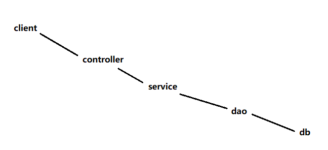

### 04文件上传-传统【了解】

#### 目标

- 回顾传统的文件上传


#### 1. 传统的文件上传

1. 添加依赖: pom.xml

   ```xml
   <!-- 基于commons-fileupload组件完成文件解析 -->
   
   ```

2. 前端页面: index.jsp

   ```jsp
   
   ```

3. com.itheima.json.UploadController

   ```java
   // 1. 获取上传目录
   
   // 2. 创建Servlet文件上传工具
   
   // 3. 解析请求
   
   // 4. 遍历参数字段
   
   // 5. 响应资源
   ```


#### 小结

- 传统方式需要解析文件吗?
  - 


### 05SpringMVC上传【了解】

#### 目标

- 使用SpringMVC上传文件


#### 1. SpringMVC上传文件

1. springMVC.xml

   ```xml
   <!-- 注册多媒体(文件)解析器: CommonsMultipartResolver --> 
   ```

2. com.itheima.json.UploadController

   ```java
   // 1. 获取上传目录
   
   // 2. 转移到( 磁盘文件 )
   ```


#### 小结

- multipartResolver的作用是什么?
  - 


### 06异常处理方案【理解】

#### 目标

- 理解3层架构的代码调用关系
- 分析3层架构的异常处理方案


#### 1. 代码调用关系



#### 2. 异常处理方案

1. 模拟视图层异常: com.itheima.json.ExceptionController

   ```java
   
   ```

2. 提供成功页面: pages/success.jsp

   ```jsp
   <%@ page contentType="text/html;charset=UTF-8" language="java" %>
   <html>
   <head>
       <title>OK</title>
   </head>
   <body>
       操作成功 !
   </body>
   </html>
   ```

3. 提供错误页面: pages/error.jsp

   ```jsp
   <%@ page contentType="text/html;charset=UTF-8" language="java" %>
   <html>
   <head>
       <title>Fail</title>
   </head>
   <body>
       操作失败 !${msg}
   </body>
   </html>
   ```

   

##### 2.1 代码处理

```java
@RequestMapping("list")
public String list(Model model) {
    try {
        int i = 1 / 0;
        // service.method();
    } catch (Exception e) {
        model.addAttribute("msg", e.getMessage());
        return "error";
    }
    return "success";
}
```

##### 2.2 过滤器处理

1. 创建过滤器: com.itheima.json.filter.ExceptionFilter

  ```java
  @Override
  public void doFilter(ServletRequest request,
                       ServletResponse response,
                       FilterChain chain) throws ServletException, IOException {
      try {
          // 放行: 交给下一个过滤器或者Servlet处理
          chain.doFilter(request, response);
      } catch (Exception e) {
          RequestDispatcher rd = request
              .getRequestDispatcher("/pages/error.jsp");
          request.setAttribute("msg", e.getMessage());
          rd.forward(request, response);
      }
  }
  ```

2. 配置过滤器: web.xml

  ```xml
  <filter>
      <filter-name>ex</filter-name>
      <filter-class>com.itheima.ex.filter.ExceptionFilter</filter-class>
  </filter>
  <filter-mapping>
      <filter-name>ex</filter-name>
      <url-pattern>/*</url-pattern>
  </filter-mapping>
  ```

##### 1.3 框架处理

- 欲知框架如何, 请看下回分解 !


#### 小结

- 3层架构中的代码调用关系？
  - 
- 代码捕捉方式有什么缺点?
  - 


### 07统一异常处理【掌握】

#### 目标

- SpringMVC的异常源码分析
- SpringMVC的统一异常处理


#### 1. 框架处理分析

- 【源码】org.springframework.web.servlet.DispatcherServlet

  ```java
  private void processDispatchResult(HttpServletRequest request, HttpServletResponse response, @Nullable HandlerExecutionChain mappedHandler, @Nullable ModelAndView mv, @Nullable Exception exception) throws Exception {
      boolean errorView = false;
      if (exception != null) {
          if (exception instanceof ModelAndViewDefiningException) {
              this.logger.debug("ModelAndViewDefiningException encountered", exception);
              mv = ((ModelAndViewDefiningException)exception).getModelAndView();
          } else {
              Object handler = mappedHandler != null ? mappedHandler.getHandler() : null;
              // 异常处理方法【执行出现异常将获取异常解析器处理异常】
              mv = this.processHandlerException(request, response, handler, exception);
              errorView = mv != null;
          }
      }
  
      if (mv != null && !mv.wasCleared()) {
          this.render(mv, request, response);
          if (errorView) {
              WebUtils.clearErrorRequestAttributes(request);
          }
      } else if (this.logger.isTraceEnabled()) {
          this.logger.trace("No view rendering, null ModelAndView returned.");
      }
  
      if (!WebAsyncUtils.getAsyncManager(request).isConcurrentHandlingStarted()) {
          if (mappedHandler != null) {
              mappedHandler.triggerAfterCompletion(request, response, (Exception)null);
          }
  
      }
  }
  ```

- 【源码】org.springframework.web.servlet.HandlerExceptionResolver

  ```java
  @Nullable
  ModelAndView resolveException(HttpServletRequest var1, HttpServletResponse var2, @Nullable Object var3, Exception var4);
  ```

#### 2. 统一异常处理

- 创建异常处理器: com.itheima.json.ex.ExceptionHandler

  ```java
  
  ```


#### 小结

- 定义多个异常处理类都会生效吗?
  - 
- SpringMVC异常处理的底层原理?
  - 


### 08自定义拦截器【理解】

#### 目标

- 自定义SpringMVC拦截器
- 拦截器与过滤器的区别


#### 1.  自定义拦截器

1. 创建拦截器: com.itheima.json.interceptor.CustomInterceptor

   ```java
   
   ```

2. 配置拦截器: springMVC.xml

   ```xml
   
   ```


#### 2. 拦截器与过滤器

| 组件名称 | 组件来源       | 应用范围              |
| -------- | -------------- | --------------------- |
| 拦截器   | SpringMVC      | Controller方法        |
| 过滤器   | Servlet2.3规范 | 所有WEB资源 ( **/** ) |


#### 小结

- 拦截器与过滤器的区别?
  - 


### 09总结

1. 使用Json交互需要什么依赖?
   - 
2. @RequestBody的作用?
   - 
3. @ResponseBody的作用?
   - 
4. @PathVariable的作用?
   - 
5. multipartResolver的作用?
   - 
6. 如何对SSM项目做统一异常处理?
   - 
7. 过滤器与拦截器的区别是什么?
   - 


1. - 