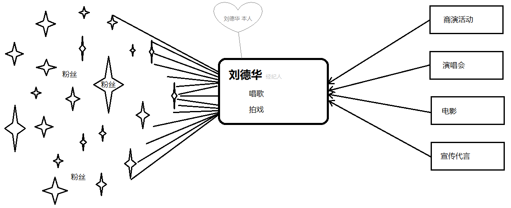

### 01代理模式【了解】

#### 目标

- 了解什么是代理模式
- 实现静态代理的案例


#### 1. 什么是代理模式

- 提供代理类 **控制(拦截)外部对目标对象的访问** 的一种代码设计

 


#### 2. 静态代理的案例

1. 工程名称: spring02_proxy_04

2. 添加依赖: pom.xml

   ```xml
   <!-- 添加Spring依赖 (Cglib备用) -->
   <!-- 添加Junit依赖 -->
   ```

3. 定义明星接口: com.itheima.proxy.Star

   ```java
   
   ```

4. 创建目标类: com.itheima.proxy.LiuStar

   ```java
   
   ```

5. 创建代理类: com.itheima.proxy.LiuStarProxy

   ```java
   
   ```

6. 单元测试: LiuStarProxyTests.java

   ```java
   // 【静态代理的特点】
   // 1. 代理类需要在代码运行前创建
   // 2. 代理类内部需要维护目标对象
   // 3. 代理类要实现目标对象的接口
   ```


#### 小结

- 什么是代理模式?
  - 
- 目标对象是哪个?
  - 
- 代理对象是哪个?
  - 
- 静态代理的特点?
  - 
  - 
  - 


### 02动态代理-jdk【理解】

#### 目标

- 了解动态代理的特点
- 实现jdk动态代理案例


#### 1. 动态代理的特点

- 代理类在代码运行时创建


#### 2. jdk动态代理案例

1. 官网API (Proxy)

   ```java
   public static Object newProxyInstance(
      						// 1. 类加载器
                           ClassLoader loader,
       					// 2. 代理对象需要实现的接口数组
                           Class<?>[] interfaces,
       					// 3. 代理对象方法调用时的处理器
                           InvocationHandler h
   ) throws IllegalArgumentException
   ```

2. 单元测试: LiuStarProxyTests.java

   ```java
   // 1. 创建目标对象
   
   // 2. 创建代理对象
   
   // 3. 使用代理对象
   ```


#### 小结

- 动态代理有什么特点?
  - 
- 使用jdk动态代理对目标对象有什么要求?
  - 


### 03动态代理-cglib【理解】

#### 目标

- cglib动态代理的案例
- 两种动态代理的区别


#### 1. cglib动态代理的案例

1. 添加依赖: pom.xml

   ```xml
   <!-- 添加Cglib实现 (Spring已整合) -->
   <dependency>
       <groupId>org.springframework</groupId>
       <artifactId>spring-context</artifactId>
       <version>5.0.2.RELEASE</version>
   </dependency>
   ```

2. 官网API (Enhancer)

   ```java
   public static Object create(
       					// 1. 代理对象需要继承的类
                           java.lang.Class superclass,
   						// 2. 代理对象需要实现的接口
                           java.lang.Class[] interfaces,
   						// 3. 代理对象方法调用时的处理器 InvocationHandler
                           Callback[] callbacks
   )
   ```

3. 单元测试: LiuStarProxyTests.java

   ```java
   
   ```


#### 2. 两种动态代理的区别

|          | JDK                                           | CGLIB                                    |
| -------- | --------------------------------------------- | ---------------------------------------- |
| 实现方式 | 利用 **实现** 接口方法来拦截目标方法          | 利用 **继承** 覆写方法来拦截目标方法     |
| 性能高低 | JDK1.6以前较Cglib慢; 1.6以及1.7大量调用时较慢 | 1.8时被JDK代理超越                       |
| 适用场景 | 目标对象必须实现接口                          | 目标方法需要允许覆写(不能用final/static) |


#### 小结

- 常见的动态代理有哪些?
  - 

- 两种动态代理有什么区别?
  - 
  - 


### 04复习

#### 目标

- 了解Spring中的设计模式


#### 1. 了解Spring中的设计模式

1. IOC的底层/原理是什么?
   - 
2. IOC中的Bean都是单例的吗?
   - 
3.  JdbcTeamplate用了什么设计模式
   - 
4. AOP的底层/原理是什么?
   - 


#### 小结

- Spring中学习了哪些设计模式?
  - 
  - 
  - 
  - 


### 05AOP的概念【理解】

#### 目标

- 理解AOP相关的概念
- 理解AOP相关的术语


#### 1. 相关的概念

##### 1.1 AOP是什么

- 面向切面编程: AOP (Aspect Oriented Programming) 的简写
- 面向切面编程: 是一种代码设计思想

##### 1.2 AOP的作用

- 在不修改目标对象的情况下添加新的业务逻辑 (增强)

 


##### 1.3 AOP的原理

- **底层使用了动态代理技术**实现的AOP切面编程思想

  ```java
  // 代理方法
  public void sing(Integer money){
      if(money > 10000){ // 新增的业务逻辑 (增强)
          targer.method(money); // 调用目标方法
      }
  }
  ```

  


#### 2. 相关的术语

##### 2.1 连接点

- 目标对象中的所有方法

##### 2.2 切入点

- 目标对象中需要增强的方法

##### 2.3 通知

- 目标对象需要增强的内容 (和位置)

##### 2.4 切面

- 切面是由**切入点** 和 **通知**组成的


#### 小结

- Spring AOP 的原理是什么?
  - 
- 请描述下列术语的含义:
  - 连接点: 
  - 切入点: 
  - 通知: 
  - 切面: 


### 06AOP的XML案例【掌握】

#### 目标

- 使用AOP自动记录日志
- 掌握AOP动态代理细节


#### 1. AOP自动记录日志

1. 工程名称: spring03_aop_01

2. 添加依赖: pom.xml

    ```xml
    <!-- 1. 添加Spring IOC和AOP依赖 -->
    
    <!-- 2. 添加AspectJ(第三方框架: 支持AOP切入点表达式语法)依赖 -->
    
    <!-- 3. 添加SpringTest依赖 -->
    ```

3. 业务处理: com.itheima.xml.impl.AccountServiceImpl

    ```java
    
    ```
    
4. 记录日志: com.itheima.xml.advice.LogAdvice

    ```java
    
    ```

5. 配置AOP: applicationContext.xml

    ```xml
    
    ```

6. 单元测试: XmlTests

    ```java
    // 查看: AccountServiceImpl的字节码类型 (是代理对象)
    ```


#### 2. AOP动态代理细节

##### 2.1 动态代理的类型

1. 定义业务接口: com.itheima.xml.AccountService

    ```java
    
    ```

2. 实现业务接口: com.itheima.xml.impl.AccountServiceImpl

    ```java
    
    ```
    
3. 单元测试: XmlTests

    ```java
    // 报错: 必须使用接口接收代理对象
    ```

    

##### 2.2 固定使用Cglib

- applicationContext.xml

    ```xml
<!-- 
    	<aop:config: 配置AOP
    		proxy-target-class: 配置是否强制使用cglib动态代理
    -->
    <aop:config proxy-target-class="true">
    ```


#### 小结

- 自动记录日志的原理是什么?
  - 

- 两种动态代理Spring是如何选择的?
  - 


### 07切入点表达式【理解】

#### 目标

- 理解什么是切入点表达式
- 了解切入点表达式指示符


#### 1. 什么是切入点表达式

- 定位切入点的1种语法规则


#### 2. 切入点表达式指示符

- 切入点表达式常见的 指示符 (PCD)有以下三种

| 指示符        | 示例                                                    | 作用(细粒度)        |
| ------------- | ------------------------------------------------------- | ------------------- |
| bean          | bean(accountService)                                    | 精确到IOC容器的bean |
| within        | within(com.itheima.xml.service.impl.AccountServiceImpl) | 精确到类            |
| **execution** | execution(public void com.itheima..save(..))            | **精确到方法**      |

##### 2.1 bean

1. 演示: pointcut.xml

    ```xml
    
    ```
    
2. 测试: XmlTests

    ```java
    
    ```

##### 2.2 within

1. 演示: pointcut.xml

    ```xml
    
    ```

##### 2.3 execution

1. 演示: pointcut.xml

    ```xml
    
    ```

`execution(modififiers-pattern? ret-type-pattern declaring-type-pattern?name-pattern(param-pattern) throws-pattern?) `

- **modififiers-pattern**: 权限访问修饰符 (可填) 
- **ret-type-pattern**: 返回值类型 (必填) 
- **declaring-type-pattern**: 全限定类名 (可填) 
- **name-pattern**: 方法名 (必填) 
- **param-pattern**: 参数名 (必填) 
- **throws-pattern**: 异常类型 (可填) 


#### 小结

- 什么是切入点表达式?
  - 
- 常用的指示符有什么区别?
  - bean: 
  - within: 
  - execution: 


### 08AOP的通知类型【了解】

#### 目标

- 理解AOP的通知类型
- 理解四种通知的配置


#### 1. AOP的通知类型

- SpringAOP的通知类型有以下4种: 

    ```java
    try{
        [前置通知]
        // 执行目标对象方法..
        targer.method(..);
        [后置通知]
    } catch (Exception e){
        [异常通知]
    } finally {
        [最终通知]
    }
    ```

#### 2. 四种通知的配置

1. 通知类型分类: 前置通知、后置通知、异常通知、最终通知

2. 提供通知方法: com.itheima.xml.advice.LogAdvice

    ```java
    
    ```

3. 配置通知类型: advice.xml

    ```xml
    
    ```
    
4. 测试通知类型: XmlTests

    ```java
    
    ```

    

#### 小结

- 通知分为哪几类?
  - 


### 09AOP的环绕通知【掌握】

#### 目标

- 掌握通用通知的使用
- 掌握环绕通知的优点


#### 1. 环绕通知

1. com.itheima.xml.advice.LogAdvice

    ```java

    ```

1. advice.xml

   ```xml
   
   ```

   

#### 小结

- 环绕通知的优点?
  - 


### 10AOP的注解案例【理解】

#### 目标

- 使用AOP相关注解改造XML案例


#### 1. 注解改造XML案例

##### 1.1 改造工程

- 工程名称: spring03_anno_02

##### 1.2 改造通知

- com.itheima.xml.advice.LogAdvice

    ```java

    ```

##### 1.3 改造配置

- advice.xml

    ```xml

    ```


#### 小结

- 请描述以下注解的作用?
  - @Aspect: 
  - @Pointcut: 
  - @Around: 


### 11总结

1. 什么是代理模式?
   - 
2. 静态代理和动态代理的区别?
   - 
5. 动态代理JDK和CGLIB的区别?

   - jdk: 
   - cglib: 

6. Spring AOP的底层是什么?

   - 

7. 切入点、通知、切面是什么?

   - 切入点: 
   - 通知: 
   - 切面: 

8. 通知类型有哪些?

   - 

   - 

   - 

   - 

   - 

9. AOP相关的注解有哪些?

   - 

   - 

   - 

   - 

   - 

