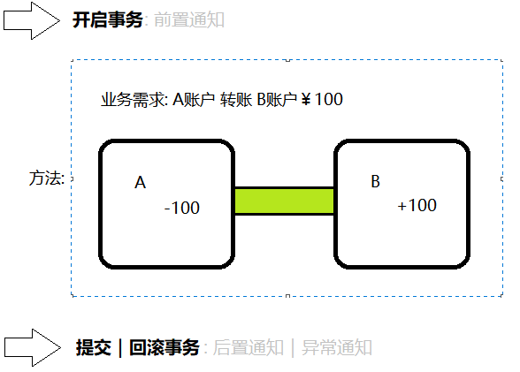

### 01事务的概念【了解】

#### 目标

- 了解事务的作用
- 理解事务的特性


#### 1. 事务的作用

- 在业务中 **保证数据安全**

  


#### 2. 事务的特性

- 事务的四大特性也叫事务的 **ACID原则**

##### 2.1 原子性（Atomicity）

- 

##### 2.2 一致性（Consistency）

- 

##### 2.3 隔离性（Isolation）

- 

##### 2.4 持久性（Durability）

- 


#### 小结

- 事务的作用是什么?
  - 
- 事务的ACID原则分别是什么?
  - 


### 02Spring声明式事务【了解】

#### 目标

- 理解什么是声明式事务?
- 理解Spring事务相关API


#### 1. 什么是声明式事务

- 通过 **面向切面编程思想** 来实现的事务管理方式
- Spring声明式事务的简写: TX

 

#### 2. Spring事务相关API

##### 2.1 PlatformTransactionManager

- 事务管理接口: 定义了提交事务、获取事务、回滚事务的方法。 

 

##### 2.2 TransactionStatus

- 事务状态接口: 定义了Spring内部的事务状态规范

 

- 存储点: 用于设置事务回滚的位置

```java
// 创建存储点
Object savepoint = TransactionAspectSupport.currentTransactionStatus().createSavepoint();
// 执行数据库操作
userService.save();
// 回滚到存储点
TransactionAspectSupport.currentTransactionStatus().rollbackToSavepoint(savepoint);
```

 


##### 2.3 TransactionDefinition

- 事务信息接口: 定义了事务的隔离级别、传播行为、超时时间、是否只读等。

 

#### 小结

- 什么是声明式事务?
  - 
- 事务管理接口中有哪些方法?
  - 


### 03事务的隔离级别【理解】

#### 目标

- 理解事务的隔离级别


#### 1. 事务的隔离级别

- 事务的隔离级别表示的是: 多个事务之间的影响程度

 

##### 1.1 ISOLATION_DEFAULT

- 

##### 1.2 ISOLATION_READ_UNCOMMITTED

- 

| 时间 | 事务A                                                     | 事务B                                                        |
| ---- | --------------------------------------------------------- | ------------------------------------------------------------ |
| 1    | 开启事务                                                  |                                                              |
| 2    |                                                           | 开启事务                                                     |
| 3    | // 原来是小明<br/>update user set name="小白" where id=1; |                                                              |
| 5    |                                                           | <font color='red'>// 结果是小白</font><br/>select name from user where id=1; |
| 6    | 回滚事务                                                  |                                                              |

##### 1.3 ISOLATION_READ_COMMITTED

- 

| 时间 | 事务A                                                     | 事务B                                                        |
| ---- | --------------------------------------------------------- | ------------------------------------------------------------ |
| 1    | 开启事务                                                  |                                                              |
| 2    |                                                           | 开启事务                                                     |
| 3    |                                                           | // 结果是小明<br/>select name from user where id=1;          |
| 5    | // 原来是小明<br/>update user set name="小白" where id=1; |                                                              |
| 6    | 提交事务                                                  |                                                              |
| 7    |                                                           | <font color='red'>// 结果不一样</font><br/>select name from user where id=1; |

##### 1.4 ISOLATION_REPEATABLE_READ

- 

| 时间 | 事务A                                                        | 事务B                                               |
| ---- | ------------------------------------------------------------ | --------------------------------------------------- |
| 1    |                                                              | 开启事务                                            |
| 2    | 开启事务                                                     |                                                     |
| 3    | // 结果是小明<br/>select name from user where id=1;          | // 结果是小明<br/>select name from user where id=1; |
| 5    | <font color='red'>// 不能修改</font><br/>update user set name="小白" where id=1; | // 结果是一样<br/>select name from user where id=1; |
| 6    |                                                              | 提交事务                                            |
| 7    | // 可以修改<br/>update user set name="小白" where id=1;      |                                                     |

##### 1.5 ISOLATION_SERIALIZABLE

- 

| 时间 | 事务A    | 事务B                                                   |
| ---- | -------- | ------------------------------------------------------- |
| 1    |          | 开启事务                                                |
| 2    |          | // 结果是小明<br/>select name from user where id=1;     |
| 3    |          | // 可以修改<br/>update user set name="小白" where id=1; |
| 5    |          | 提交事务                                                |
| 6    | 开启事务 |                                                         |


#### 小结

- 什么是脏读?

  - 
- 什么是幻读?
  - 


### 04事务的传播行为【理解】

#### 目标

- 理解事务的传播行为


#### 1. 事务的传播行为

- 传播行为可以理解为: 被调用方法 **对事务的要求**

 

##### 1.1 REQUIRED

- 需要: 

##### 1.2 SUPPORTS

- 支持: 

##### 1.3 MANDATORY

- **强制**: 

##### 1.4 REQUIRES_NEW

- 新:

##### 1.5 NOT_SUPPORTED

- 不支持: 

##### 1.6 NEVER

- **决不**: 

##### 1.7 NESTED

- <font color='red'>嵌套</font>:  


#### 小结

- SUPPORTS与NOT_SUPPORTS的区别?
  - SUPPORTS:
  - NOT_SUPPORTS: 
- 哪些传播行为不满足要求会抛出异常?
  - MANDATORY: 
  - NEVER:


### 05TX - XML案例【掌握】

#### 目标

- 使用XML实现声明式事务管理


#### 1. 实现声明式事务管理

##### 1.1 搭建环境

1. 工程名称: spring03_xml_03

2. 添加依赖: pom.xml

   ```xml
   <!-- Spring IOC 依赖 -->
   
   <!-- aspectJ 切面编程 依赖 -->
   
   <!-- Spring 事务 依赖 -->
   
   <!-- Spring  Jdbc 依赖 -->
   
   <!-- Druid 连接池 依赖 -->
   
   <!-- Mysql 依赖 -->
   
   <!-- Spring 测试 依赖 -->
   
   <!-- Junit 单元测试 依赖 -->
   ```

##### 1.2 业务代码

1. 实体类: com.itheima.xml.domain.Account

   ```java
   
   ```

2. 持久类: com.itheima.xml.dao.impl.AccountDaoImpl

   ```java
   
   ```

3. 业务类: com.itheima.xml.service.impl.AccountServiceImpl

   ```java
   
   ```


##### 1.3 事务配置

1. 添加配置文件: db.properties

   ```properties
   db.driver=com.mysql.jdbc.Driver
   # 针对Mysql 8.x数据库的参数
   #   serverTimezone: 指定时区(UTC)
   #   useSSL: 指定是否使用加密安全连接(false)
   #   allowPublicKeyRetrieval: 是否允许检索公钥(true)
   db.url=jdbc:mysql:///mybatisdb?serverTimezone=UTC&useSSL=false&allowPublicKeyRetrieval=true&characterEncoding=UTF-8
   db.username=root
   db.password=root
   ```

2. 配置事务管理: applicationContext.xml

   ```xml
   <!-- 1. 加载数据库参数配置文件 -->
   
   <!-- 2. 编写Spring组件扫描配置 -->
   
   <!-- 3. 创建数据源(连接池对象) -->
   
   <!-- 4. 创建数据库操作模板(JdbcTemplate) -->
   
   <!-- 5. 创建持久层,业务层对象 -->
   
   <!-- 6. 配置事务管理器 -->
   
   <!-- 7. 配置AOP(创建代理对象) -->
   
   <!-- 8. 配置事务管理规则(通知) -->
   ```


##### 1.4 单元测试

1. 单元测试: XmlTests.java

   ```java
   
   ```


#### 小结

- 声明式事务有什么好处?
  - 


### 06TX - 注解案例【掌握】

#### 目标

- 使用注解改造案例


#### 1. 使用注解改造案例

1. 改造工程: spring03_anno_04

2. 使用注解: com.itheima.xml.dao.impl.AccountDaoImpl

   ```java
   
   ```

3. 使用注解: com.itheima.xml.service.impl.AccountServiceImpl

   ```java
   
   ```

4. 添加配置: applicationContext.xml

   ```xml
   
   ```

5. 单元测试: XmlTests.java

   ```java
   
   ```


#### 小结

- @Transactional注解的作用是什么?
  - 


### 07TX - 纯注解案例【理解】

#### 目标

- 使用注解代替所有配置


#### 1. 使用注解代替所有配置

1. 创建配置类: com.itheima.xml.config.SpringConfig

   ```java
   
   ```

2. 创建数据库配置类: com.itheima.xml.config.JdbcConfig

   ```java
   
   ```

3. 单元测试: AnnoTests

   ```java
   
   ```


#### 小结

- @EnableTransactionManagement注解的作用?
  - 


### 08Spring编程式事务【了解】

#### 目标

- 了解编程式事务概念
- 实现编程式事务案例


#### 1. 编程式事务概念

- 通过 **编码** 来实现的事务管理方式
- 以下是Spring封装的API

##### 1.1 TransactionTemplate

- 

##### 1.2 TransactionCallback

- 


#### 2.编程式事务案例

##### 2.1 改造代码

1. 改造工程: spring03_code_05

2. 事务编码: com.itheima.xml.service.impl.AccountServiceImpl

   ```java
   
   ```


##### 2.2 添加配置

1. 添加配置: applicationContext.xml

   ```xml
   <!-- 配置事务管理模板对象 -->
   
   ```


##### 2.3 单元测试

1. 单元测试: XmlTests

   ```java
   
   ```


#### 小结

- 编程式事务有什么好处?
  - 


### 09总结

1. 什么是代理模式?

   - 

2. 动态代理JDK和CGLIB的区别?

   - jdk: 
   - cglib: 

3. Spring AOP的底层是什么?

   - 

4. 切面和切入点以及通知是什么?

   - 
   - 
   - 

5. 通知类型有哪些?

   - 

   - 

   - 

   - 

   - 

6. AOP相关的注解有哪些?

   - 

   - 

   - 

   - 

   - 

7. 事务的作用是什么?

   - 

8. 什么是ACID原则?

   - Atomicity:

   - Consistency: 

   - Isolation: 

   - Durability:

9. 以下隔离级别分别解决了什么问题?

   - ISOLATION_READ_UNCOMMITTED:

   - ISOLATION_READ_COMMITTED: 

   - ISOLATION_REPEATABLE_READ:

   - ISOLATION_SERIALIZABLE: 

10. 请说出以下传播行为的含义:

    - REQUIRED:

    - SUPPORTS:

    - MANDATORY:

    - REQUIRES_NEW:

    - NOT_SUPPORTED:

    - NEVER:

    - NESTED:

11. 声明式事务的好处是什么?

    - 

12. 请描述以下注解的作用?

    - @EnableTransactionManagement:

    - @Transactional: 

13. Spring的优点有哪些?

    - 
    - 
    - 