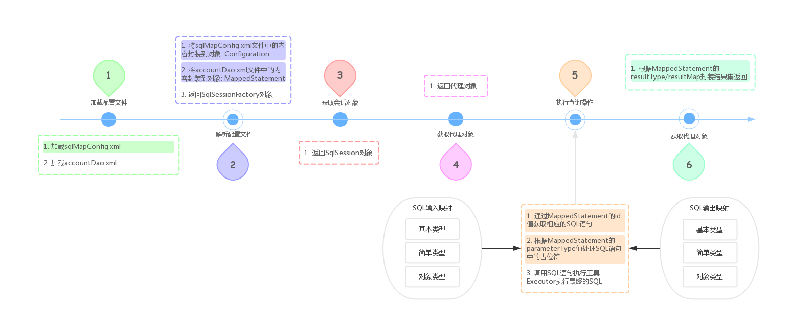
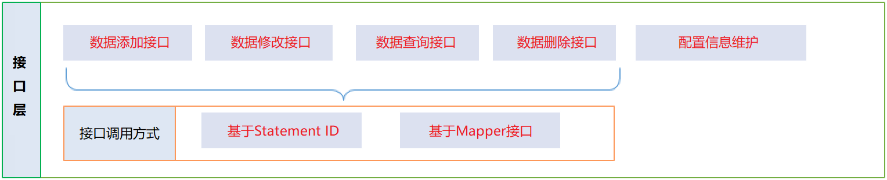
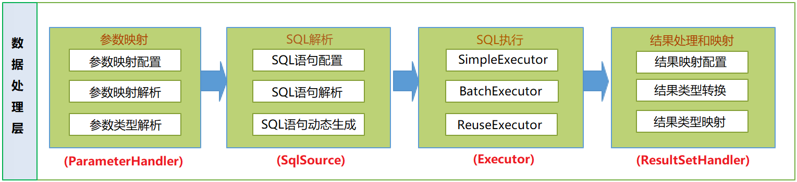
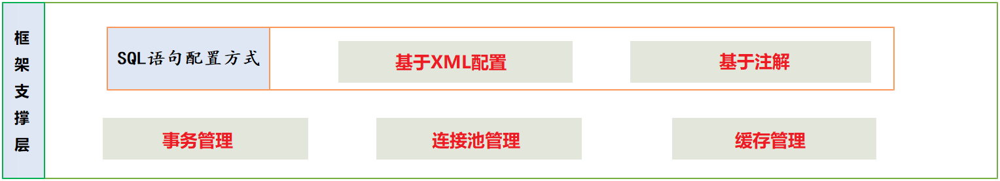
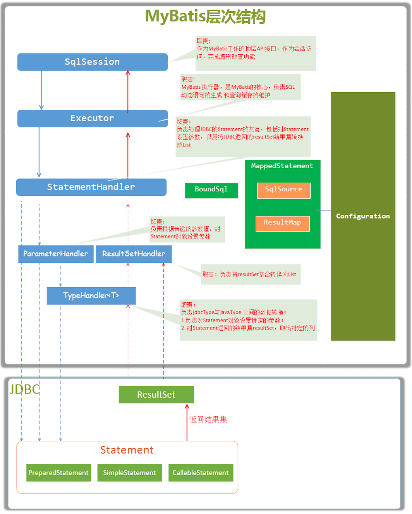
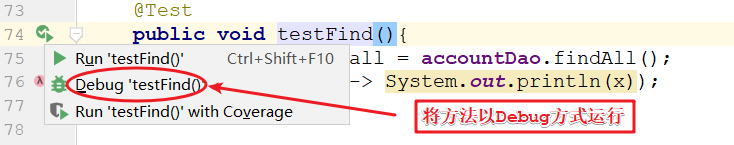
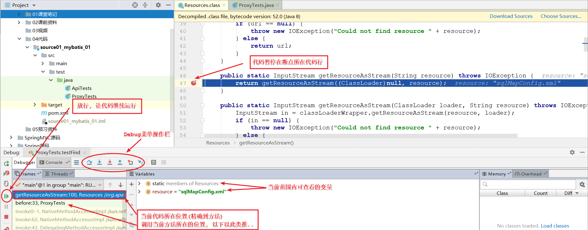
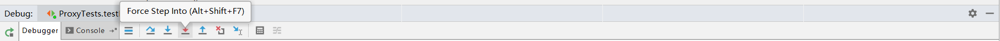
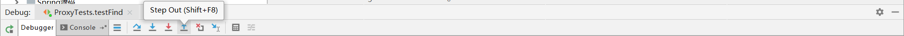

## 第1天: Mybatis 源码分析

### 一、目标

1. 理解Mybatis框架 **执行流程**
2. 理解Mybatis框架 **架构设计**
3. 熟悉Mybatis框架 **核心组件**
4. 掌握通过debug **跟踪学习** (源码分析)
5. 掌握Mybatis框架 **常见问题 **(常见面试题)


### 二、Mybatis 应用案例

#### 2.1 需求

1. 完成账户的 **新增** 操作
2. 完成账户的 **修改** 操作
3. 完成账户的 **删除** 操作
4. 完成账户的 **查询** 操作


#### 2.2 环境准备

1. 数据库: mybatisdb

   ```sql
   create database mybatisdb;
   ```

2. 数据库表: account

   ```sql
   SET FOREIGN_KEY_CHECKS=0;
   
   -- ----------------------------
   -- Table structure for account
   -- ----------------------------
   DROP TABLE IF EXISTS `account`;
   CREATE TABLE `account` (
     `id` int(11) NOT NULL AUTO_INCREMENT COMMENT '主键',
     `uid` int(11) DEFAULT '1' COMMENT '用户编号',
     `money` decimal(10,2) DEFAULT '0.00' COMMENT '余额',
     PRIMARY KEY (`id`)
   ) ENGINE=InnoDB AUTO_INCREMENT=147 DEFAULT CHARSET=utf8;
   
   -- ----------------------------
   -- Records of account
   -- ----------------------------
   INSERT INTO `account` VALUES ('1', '1', '10.00');
   INSERT INTO `account` VALUES ('2', '10', '0.00');
   INSERT INTO `account` VALUES ('3', '24', '99.00');
   ```

#### 2.3 代码环境

1. 创建工程: mybatis01_source_01

2. 添加依赖: pom.xml

   ```xml
   <!-- 1. 添加Mybatis框架依赖 -->
   <dependency>
       <groupId>org.mybatis</groupId>
       <artifactId>mybatis</artifactId>
       <version>3.5.0</version>
   </dependency>
   <!-- 2. 添加Mysql驱动依赖 -->
   <dependency>
       <groupId>mysql</groupId>
       <artifactId>mysql-connector-java</artifactId>
       <version>8.0.18</version>
   </dependency>
   <!-- 3. 添加Junit框架依赖 -->
   <dependency>
       <groupId>junit</groupId>
       <artifactId>junit</artifactId>
       <version>4.12</version>
   </dependency>
   <!-- 4. 添加Log4j工具依赖-->
   <dependency>
       <groupId>log4j</groupId>
       <artifactId>log4j</artifactId>
       <version>1.2.17</version>
   </dependency>
   ```

3. 实体设计: com.itheima.mybatis.domain.Account

   ```java
   package com.itheima.mybatis.domain;
   
   /**
    * 账户类.
    *  - 数据模型
    * @author : Jason.lee
    * @version : 1.0
    */
   public class Account {
       private Integer id;
       private Integer uid;
       private Double money;
   
       public Integer getId() {
           return id;
       }
   
       public void setId(Integer id) {
           this.id = id;
       }
   
       public Integer getUid() {
           return uid;
       }
   
       public void setUid(Integer uid) {
           this.uid = uid;
       }
   
       public Double getMoney() {
           return money;
       }
   
       public void setMoney(Double money) {
           this.money = money;
       }
   
       @Override
       public String toString() {
           return "Account{" +
                   "id=" + id +
                   ", uid=" + uid +
                   ", money=" + money +
                   '}';
       }
   }
   ```

#### 2.4 代码开发

1. 接口设计: com.itheima.mybatis.dao.AccountDao

   ```java
   package com.itheima.mybatis.dao;
   
   import com.itheima.mybatis.domain.Account;
   
   import java.util.List;
   
   /**
    * 账户持久层接口.
    * - Mybatis操作类
    *
    * @author : Jason.lee
    * @version : 1.0
    */
   public interface AccountDao {
   
   
       /**
        * 保存账户.
        *
        * @param account 账户信息
        */
       void save(Account account);
   
       /**
        * 修改账户.
        *
        * @param account 账户信息
        */
       void update(Account account);
   
       /**
        * 删除账户.
        *
        * @param account 账户信息
        */
       void del(Account account);
   
       /**
        * 查询所有账户.
        *
        * @return 查询结果
        */
       List<Account> findAll();
   
   }
   ```

2. 实现类: com.itheima.mybatis.dao.impl.AccountDaoImpl

   ```java
   package com.itheima.mybatis.dao.impl;
   
   import com.itheima.mybatis.dao.AccountDao;
   import com.itheima.mybatis.domain.Account;
   import org.apache.ibatis.session.SqlSession;
   import org.apache.ibatis.session.SqlSessionFactory;
   
   import java.util.List;
   
   /**
    * Mybatis传统开发.
    *  - 手动调用API操作数据库
    * @author : Jason.lee
    * @version : 1.0
    */
   public class AccountDaoImpl implements AccountDao {
   
       private SqlSessionFactory sqlSessionFactory;
   
       public AccountDaoImpl(SqlSessionFactory sqlSessionFactory) {
           this.sqlSessionFactory = sqlSessionFactory;
       }
   
       @Override
       public void save(Account account) {
           // 1. 获取连接
           SqlSession sqlSession = sqlSessionFactory.openSession();
           // 2. 执行操作
           sqlSession.insert("com.itheima.mybatis.dao.AccountDao.save", account);
           // 3. 提交事务
           sqlSession.commit();
           sqlSession.close();
       }
   
       @Override
       public void update(Account account) {
           // 1. 获取连接
           SqlSession sqlSession = sqlSessionFactory.openSession();
           // 2. 执行操作
           sqlSession.insert("com.itheima.mybatis.dao.AccountDao.update", account);
           // 3. 提交事务
           sqlSession.commit();
           sqlSession.close();
       }
   
       @Override
       public void del(Account account) {
           // 1. 获取连接
           SqlSession sqlSession = sqlSessionFactory.openSession();
           // 2. 执行操作
           sqlSession.insert("com.itheima.mybatis.dao.AccountDao.del", account);
           // 3. 提交事务
           sqlSession.commit();
           sqlSession.close();
       }
   
       @Override
       public List<Account> findAll() {
           // 1. 获取连接
           SqlSession sqlSession = sqlSessionFactory.openSession();
           // 2. 执行操作
           // 3. 返回结果
           return sqlSession.selectList("com.itheima.mybatis.dao.AccountDao.findAll");
       }
   }
   ```

3. 映射文件: com/itheima/mybatis/dao/AccountDao.xml

   ```xml
   <?xml version="1.0" encoding="UTF-8"?>
   <!DOCTYPE mapper PUBLIC "-//mybatis.org//DTD Mapper 3.0//EN"
           "http://mybatis.org/dtd/mybatis-3-mapper.dtd">
   <mapper namespace="com.itheima.mybatis.dao.AccountDao">
   
       <!-- 保存账户 -->
       <select id="save" parameterType="account">
           insert into account values(#{id}, #{uid}, #{money})
       </select>
       <!-- 修改账户 -->
       <select id="update" parameterType="account">
           update account set money = #{money} where id = #{id}
       </select>
       <!-- 删除账户 -->
       <select id="del" parameterType="account">
           delete from account where id = #{id}
       </select>
       <!-- 查询账户 -->
       <select id="findAll" resultType="account">
           select * from account
       </select>
   
   </mapper>
   ```

4. 配置文件: sqlMapConfig.xml

   ```xml
   <?xml version="1.0" encoding="UTF-8"?>
   <!DOCTYPE configuration PUBLIC "-//mybatis.org//DTD Config 3.0//EN"
           "http://mybatis.org/dtd/mybatis-3-config.dtd">
   <configuration>
       <!-- 1. 导入外部配置文件 -->
       <properties resource="db.properties"/>
       <!-- 2. 配置实体类别名 -->
       <typeAliases>
           <package name="com.itheima.mybatis.domain"/>
       </typeAliases>
       <!-- 3. 配置Mybatis环境 -->
       <environments default="test">
           <environment id="test">
               <transactionManager type="JDBC"></transactionManager>
               <dataSource type="POOLED">
                   <property name="driver" value="${db.driver}"/>
                   <property name="url" value="${db.url}"/>
                   <property name="username" value="${db.username}"/>
                   <property name="password" value="${db.password}"/>
               </dataSource>
           </environment>
       </environments>
       <!-- 4. 扫描映射配置文件 -->
       <mappers>
           <package name="com.itheima.mybatis.dao"/>
       </mappers>
   </configuration>
   ```

#### 2.5 单元测试

##### 2.5.1 传统方式

- ApiTests: 需要提供实现类

  ```java
  import com.itheima.mybatis.dao.AccountDao;
  import com.itheima.mybatis.dao.impl.AccountDaoImpl;
  import com.itheima.mybatis.domain.Account;
  import org.apache.ibatis.io.Resources;
  import org.apache.ibatis.session.SqlSessionFactory;
  import org.apache.ibatis.session.SqlSessionFactoryBuilder;
  import org.junit.Before;
  import org.junit.Test;
  
  import java.io.IOException;
  import java.io.InputStream;
  import java.util.List;
  
  /**
   * Mybatis传统方式开发测试.
   *  传统方式开发的特点:
   *      1. 需要提供持久层实现类
   *      2. 手动调用Api操作数据库
   *
   * @author : Jason.lee
   * @version : 1.0
   */
  public class ApiTests {
  
      AccountDao accountDao;
  
  
      @Before
      public void before() throws Exception {
          // 1. 加载配置文件
          InputStream in = Resources.getResourceAsStream("sqlMapConfig.xml");
          // 2. 构建会话工厂
          SqlSessionFactory sqlSessionFactory = new SqlSessionFactoryBuilder().build(in);
          // 3. 创建持久层实现类
          accountDao = new AccountDaoImpl(sqlSessionFactory);
      }
  
      @Test
      public void testSave(){
          Account account = new Account();
          account.setId(10);
          account.setUid(10);
          account.setMoney(10D);
          accountDao.save(account);
      }
  
      @Test
      public void testUpdate(){
          Account account = new Account();
          account.setId(10);
          account.setMoney(11D);
          accountDao.update(account);
      }
  
      @Test
      public void testDel(){
          Account account = new Account();
          account.setId(10);
          accountDao.del(account);
      }
  
      @Test
      public void testFind(){
          List<Account> all = accountDao.findAll();
          all.forEach(x -> System.out.println(x));
      }
  
  }
  ```

##### 2.5.2 代理方式

- ProxyTests: 不需要实现类 (namespace,id必须与interface,method完全一致)

  ```java
  import com.itheima.mybatis.dao.AccountDao;
  import com.itheima.mybatis.dao.impl.AccountDaoImpl;
  import com.itheima.mybatis.domain.Account;
  import org.apache.ibatis.io.Resources;
  import org.apache.ibatis.session.SqlSession;
  import org.apache.ibatis.session.SqlSessionFactory;
  import org.apache.ibatis.session.SqlSessionFactoryBuilder;
  import org.junit.After;
  import org.junit.Before;
  import org.junit.Test;
  
  import java.io.InputStream;
  import java.util.List;
  
  /**
   * Mybatis代理方式开发测试.
   *  代理方式开发的特点:
   *      1. 不需要提供持久层实现类
   *      2. 根据会话对象自动生成代理类
   *
   * @author : Jason.lee
   * @version : 1.0
   */
  public class ProxyTests {
  
      SqlSession sqlSession;
      AccountDao accountDao;
  
  
      @Before
      public void before() throws Exception {
          // 1. 加载配置文件
          InputStream in = Resources.getResourceAsStream("sqlMapConfig.xml");
          // 2. 构建会话工厂
          SqlSessionFactory sqlSessionFactory = new SqlSessionFactoryBuilder().build(in);
          // 3. 获取会话对象
          sqlSession = sqlSessionFactory.openSession();
          // 4. 生成代理对象
          accountDao = sqlSession.getMapper(AccountDao.class);
      }
  
      @After
      public void after(){
          // 5. 最后提交事务
          sqlSession.commit();
          sqlSession.close();
      }
  
      @Test
      public void testSave(){
          Account account = new Account();
          account.setId(10);
          account.setUid(10);
          account.setMoney(10D);
          accountDao.save(account);
      }
  
      @Test
      public void testUpdate(){
          Account account = new Account();
          account.setId(10);
          account.setMoney(11D);
          accountDao.update(account);
      }
  
      @Test
      public void testDel(){
          Account account = new Account();
          account.setId(10);
          accountDao.del(account);
      }
  
      @Test
      public void testFind(){
          List<Account> all = accountDao.findAll();
          all.forEach(x -> System.out.println(x));
      }
  
  }
  
  ```


### 三、框架的执行流程

#### 3.1 代码回顾: ProxyTests

```java
@Before
public void before() throws Exception {
    // 1. 加载配置文件
    InputStream in = Resources.getResourceAsStream("sqlMapConfig.xml");
    // 2. 构建会话工厂
    SqlSessionFactory sqlSessionFactory = new SqlSessionFactoryBuilder().build(in);
    // 3. 获取会话对象
    sqlSession = sqlSessionFactory.openSession();
    // 4. 生成代理对象
    accountDao = sqlSession.getMapper(AccountDao.class);
}
```


#### 3.2 流程分析



1. 加载配置文件: sqlMapConfig.xml
   - 加载映射文件: accountDao.xml
2. 解析配置文件 *
   - 将sqlMapConfig.xml文件中的内容封装到对象: Configuration
   - 将accountDao.xml文件中的内容封装到对象: MappedStatement
   - 返回SqlSessionFactory对象
3. 获取会话对象
   - 返回SqlSession对象
4. 获取代理对象
   - 返回代理对象
5. 执行查询操作 *
   - 通过MappedStatement的id值获取相应的SQL语句
   - 根据MappedStatement的parameterType值处理SQL语句中的占位符
   - 调用SQL语句执行工具Executor执行最终的SQL
6. 返回结果映射 *
   - 根据MappedStatement的resultType/resultMap封装结果集返回


### 四、Mybatis 架构设计



 



   


#### 4.1 接口层 *

> ​	提供给外部使用的接口API，开发人员通过这些本地API来操纵数据库。接口层一接收到调用请求就会调用数据处理层来完成具体的数据处理。 例: AccountDao

####  4.2 数据处理层

> ​	负责具体的SQL查找、SQL解析、SQL执行和执行结果映射处理等。它主要的目的是根据调用的请求完成一次数据库操作。例: SqlSource, ParameterHandler, Executor, ResultSetHandler

1. 通过Statement ID和参数，构建出动态sql语句
2. 通过sql语句，执行数据库操作
3. 通过sql语句执行结果，完成结果集数据的封装

#### 4.3 框架支撑层

> ​	负责最基础的功能支撑，包括连接管理、事务管理、配置加载和缓存处理，这些都是共用的东西，将他们抽取出来作为最基础的组件。为上层的数据处理层提供最基础的支撑。 例: Cache, Transaction

1. 作为持久层ORM框架，事务管理机制是必备的
2. 作为持久层的ORM框架，连接池管理是必备的
3. 为了提高数据利用率、和系统性能，mybatis框架提供了一级缓存(会话级)和二级缓存(Mapper级)。
4. 在应用层面，mybatis框架提供了基于xml的配置方式，和更加面向接口的注解配置方式

#### 4.4 引导层 *

> ​	提供框架引导的API, 也就是启动框架的代码。 以下例子皆来源于官网。

##### 例1: XML方式

```java
String resource = "org/mybatis/example/mybatis-config.xml";

InputStream inputStream = Resources.getResourceAsStream(resource);

SqlSessionFactory sqlSessionFactory = new SqlSessionFactoryBuilder().build(inputStream);
```

##### 例2: Java Api方式

```java
DataSource dataSource = BlogDataSourceFactory.getBlogDataSource();

TransactionFactory transactionFactory = new JdbcTransactionFactory();

Environment environment = new Environment("development", transactionFactory, dataSource);

Configuration configuration = new Configuration(environment);

configuration.addMapper(BlogMapper.class);

SqlSessionFactory sqlSessionFactory = new SqlSessionFactoryBuilder().build(configuration);
```


### 五、Mybatis 核心组件

#### 5.1 Mybatis核心组件表

| 序号 | 组件名称                 | 组件描述                                                     |
| ---- | ------------------------ | ------------------------------------------------------------ |
| 1    | Configuration            | 用于封装、维护Mybatis框架的所有配置信息                      |
| 2    | MappedStatement          | 每个MappedStatement，封装维护了一个<select\|update\|delete\|insert>节点 |
| 3    | SqlSessionFactoryBuilder | 构建器，用于解析封装主配置文件内容，构建SqlSessionFactory核心对象 |
| 4    | SqlSessionFactory        | 工厂类接口，通过工厂方法openSession创建SqlSession对象        |
| 5    | SqlSession               | Mybatis框架的顶层API，表示和数据库交互的会话，提供了完成数据库增删改查操作的接口方法 |
| 6    | Executor                 | Mybatis框架执行器，是框架的调度核心，负责sql语句的生成和查询缓存维护 |
| 7    | StatementHandler         | 封装Jdbc Statement操作，比如设置参数、将Statement结果集转换成List |
| 8    | ParameterHandler         | 将用户传递的参数，转换成Jdbc Statement 所需要的参数          |
| 9    | SqlSource                | 根据用户传递的ParameterObject，动态生成sql语句，将信息封装到BoundSql对象中 |
| 10   | BoundSql                 | 动态生成的sql语句、和参数信息                                |
| 11   | ResultSetHandler         | 将jdbc返回的ResultSet结果集对象，进行结果集封装，转换成List类型的集合 |
| 12   | TypeHandler              | 类型处理器，完成java数据类型和jdbc数据类型之间的映射和转换   |

#### 5.2 Mybatis核心组件结构




### 六、Mybatis 源码分析

#### 6.1 学习目标

1. 熟练debug工具的使用
2. 跟踪配置文件(sqlMapConfig.xml)的加载


#### 6.2 Debug使用

1. 在入口方法中调用源代码: 如下第4行

    ```java
    @Before
    public void before() throws Exception {
        // 1. 加载配置文件
        InputStream in = Resources.getResourceAsStream("sqlMapConfig.xml");
        // 2. 构建会话工厂
        SqlSessionFactory sqlSessionFactory = new SqlSessionFactoryBuilder().build(in);
        // 3. 获取会话对象
        sqlSession = sqlSessionFactory.openSession();
        // 4. 生成代理对象
        accountDao = sqlSession.getMapper(AccountDao.class);
    }
    ```

1. 进入源代码所在位置, 在需要调试的位置打下断点

     

1. 以Debug方式运行代码, 图示如下

    

1. Debug模式界面示例

     

1. 步入: 进入方法内部

    

1. 强入: 强迫进入方法内部, 暴力提取源代码

     

1. 下一步: 进行下一行代码的调试

     

1. 步出: 返回上一层调用方法内部

     

1. 放行: 调试完毕 或 进入下一个断点位置


#### 6.3 跟踪: 配置文件的加载

> ​	跟踪技巧: 盯着传进去 **参数** 不放, 直到得到正确的 **返回值** 为止

##### 6.3.1 研究方向

1. 配置文件最终是由Mybatis框架加载, 还是调用了JDK API完成
2. 配置文件是从哪个目录加载的


##### 6.3.2 牛刀小试

1. 进入Mybatis框架加载文件的位置

   ```java
   InputStream getResourceAsStream(String resource, ClassLoader[] classLoader) {
       ClassLoader[] var3 = classLoader;
       int var4 = classLoader.length;
   
       for(int var5 = 0; var5 < var4; ++var5) {
           ClassLoader cl = var3[var5];
           if (null != cl) {
               // 源代码54行: org.apache.ibatis.io.ClassLoaderWrapper
               InputStream returnValue = cl.getResourceAsStream(resource);
               if (null == returnValue) {
                   returnValue = cl.getResourceAsStream("/" + resource);
               }
   
               if (null != returnValue) {
                   return returnValue;
               }
           }
       }
   
       return null;
   }
   ```

2. 进入JDK加载文件的位置

   ```java
   public URL findResource(final String name) {
       // 源代码569行: java.net.URLClassLoader
       URL url = AccessController.doPrivileged(
           new PrivilegedAction<URL>() {
               public URL run() {
                   // 【提示】: 进入该行需要暴力提取源码: 即点击【强入】按钮
                   return ucp.findResource(name, true);
               }
           }, acc);
   
       return url != null ? ucp.checkURL(url) : null;
   }
   ```

   ```java
   public URL findResource(String var1, boolean var2) {
       int[] var4 = this.getLookupCache(var1);
   
       URLClassPath.Loader var3;
       for(int var5 = 0; (var3 = this.getNextLoader(var4, var5)) != null; ++var5) {
           // 源代码155行: sun.misc.URLClassPath
           // 【提示】: 当var5遍历第27时可以找到文件
           URL var6 = var3.findResource(var1, var2);
           if (var6 != null) {
               return var6;
           }
       }
   
       return null;
   }
   ```


##### 6.3.3 研究成果

1. 发现JDK默认从targer目录查找配置文件
2. 源码中有对文件名编码, 所以文件名的字符集问题已解决

    ```java
    Resource getResource(final String var1, boolean var2) {
        try {
            // 源代码533行: sun.misc.URLClassPath
            // 【提示】: this = UrlClassPath$FileLoader
            // 【提示】: this.getBaseURL() = target/classes
            // 【成果】: 现JDK默认从targer目录查找配置文件
            URL var4 = new URL(this.getBaseURL(), ".");
            // 【成果】: 对文件名编码
            final URL var3 = new URL(this.getBaseURL(), ParseUtil.encodePath(var1, false));
            if (!var3.getFile().startsWith(var4.getFile())) {
                return null;
            } else {
    ```


> ​	温馨提示: 如果发现配置文件没有找到的问题, 应确保target/classes包下是否存在 !!!


#### 6.4 跟踪: 配置文件的封装

##### 6.4.1 研究方向

1. 配置文件的解析使用什么技术实现的
2. 映射文件什么时候加载的
3. 映射文件如何封装的
4. 配置文件和映射文件封装后保存在哪里


##### 6.4.2 牛刀小试

1. 进入SqlSessionFactoryBuilder.build方法

   ```java
   public SqlSessionFactory build(InputStream inputStream, String environment, Properties properties) {
       try {
           // 【成果】: 在配置文件解析前创建Configuration对象
         XMLConfigBuilder parser = new XMLConfigBuilder(inputStream, environment, properties);
         // 源代码106: org.apache.ibatis.session.SqlSessionFactoryBuilder
         // 【成果】: 最终构建的对象是 DefaultSqlSessionFactory
         return build(parser.parse());
       } catch (Exception e) {
         throw ExceptionFactory.wrapException("Error building SqlSession.", e);
       } finally {
         ErrorContext.instance().reset();
         try {
           inputStream.close();
         } catch (IOException e) {
           // Intentionally ignore. Prefer previous error.
         }
       }
     }
   ```

   

2. 进入配置文件解析流程: XMLConfigBuilder.parse

   ```java
   public Configuration parse() {
       if (parsed) {
           throw new BuilderException("Each XMLConfigBuilder can only be used once.");
       }
       parsed = true;
       // 【成果】: 框架只解析configuration标签中的内容
       parseConfiguration(parser.evalNode("/configuration"));
       return configuration;
   }
   ```

   

3. 进入根标签的解析: XMLConfigBuilder.parseConfiguration

   ```java
   private void parseConfiguration(XNode root) {
       try {
           //issue #117 read properties first
           propertiesElement(root.evalNode("properties"));
           Properties settings = settingsAsProperties(root.evalNode("settings"));
           loadCustomVfs(settings);
           loadCustomLogImpl(settings);
           // 【成果】: 所有的标签内容都封装好存储在了Configuration对象中
           typeAliasesElement(root.evalNode("typeAliases"));
           pluginElement(root.evalNode("plugins"));
           objectFactoryElement(root.evalNode("objectFactory"));
           objectWrapperFactoryElement(root.evalNode("objectWrapperFactory"));
           reflectorFactoryElement(root.evalNode("reflectorFactory"));
           settingsElement(settings);
           // read it after objectFactory and objectWrapperFactory issue #631
           environmentsElement(root.evalNode("environments"));
           databaseIdProviderElement(root.evalNode("databaseIdProvider"));
           typeHandlerElement(root.evalNode("typeHandlers"));
           // 源代码146: org.apache.ibatis.builder.xml.XMLConfigBuilder 
           // 【成果】: 配置文件中标签的解析顺序: 最后解析mappers标签
           mapperElement(root.evalNode("mappers"));
       } catch (Exception e) {
           throw new BuilderException("Error parsing SQL Mapper Configuration. Cause: " + e, e);
       }
   }
   ```

   

4. 进入mapper标签的解析: XMLConfigBuilder.mapperElement

   ```java
   private void mapperElement(XNode parent) throws Exception {
       if (parent != null) {
           for (XNode child : parent.getChildren()) {
               // 【成果】: 批量加载根据package标签解析 <package name="com.itheima.mybatis.dao"/>
               // 【成果】: 加载映射配置的方式有
               //            1. 批量加载: package
               //            2. 单独加载本地文件: <mapper resource 或 class
               //            3. 单独加载远程文件: <mapper url
               // 源代码412: org.apache.ibatis.builder.xml.XMLConfigBuilder
               if ("package".equals(child.getName())) {
                   String mapperPackage = child.getStringAttribute("name");
                   configuration.addMappers(mapperPackage);
               } else {
                   String resource = child.getStringAttribute("resource");
                   String url = child.getStringAttribute("url");
                   String mapperClass = child.getStringAttribute("class");
                   if (resource != null && url == null && mapperClass == null) {
                       ErrorContext.instance().resource(resource);
                       InputStream inputStream = Resources.getResourceAsStream(resource);
                       XMLMapperBuilder mapperParser = new XMLMapperBuilder(inputStream, configuration, resource, configuration.getSqlFragments());
                       mapperParser.parse();
                   } else if (resource == null && url != null && mapperClass == null) {
                       ErrorContext.instance().resource(url);
                       InputStream inputStream = Resources.getUrlAsStream(url);
                       XMLMapperBuilder mapperParser = new XMLMapperBuilder(inputStream, configuration, url, configuration.getSqlFragments());
                       mapperParser.parse();
                   } else if (resource == null && url == null && mapperClass != null) {
                       Class<?> mapperInterface = Resources.classForName(mapperClass);
                       configuration.addMapper(mapperInterface);
                   } else {
                       throw new BuilderException("A mapper element may only specify a url, resource or class, but not more than one.");
                   }
               }
           }
       }
   }
   ```

5. 进入package标签解析: Configuration.addMappers -> MapperRegistry.addMappers

   ```java
   public void addMappers(String packageName, Class<?> superType) {
       ResolverUtil<Class<?>> resolverUtil = new ResolverUtil<>();
       // 【成果】: 查找包路径下所有的字节码并保存
       resolverUtil.find(new ResolverUtil.IsA(superType), packageName);
       Set<Class<? extends Class<?>>> mapperSet = resolverUtil.getClasses();
       for (Class<?> mapperClass : mapperSet) {
           // 源代码128行: org.apache.ibatis.binding.MapperRegistry
           addMapper(mapperClass);
       }
   }
   ```

   

6. 进入代理方法调用处理器的保存 以及 映射文件的解析: MapperRegistry.addMappers

   ```java
   public <T> void addMapper(Class<T> type) {
       if (type.isInterface()) {
         if (hasMapper(type)) {
           throw new BindingException("Type " + type + " is already known to the MapperRegistry.");
         }
         boolean loadCompleted = false;
         try {
           // 【成果】: 保存代理对象的工厂(创建代理对象的对象)
           knownMappers.put(type, new MapperProxyFactory<>(type));
           // It's important that the type is added before the parser is run
           // otherwise the binding may automatically be attempted by the
           // mapper parser. If the type is already known, it won't try.
           MapperAnnotationBuilder parser = new MapperAnnotationBuilder(config, type);
           // 源代码94: org.apache.ibatis.binding.MapperRegistry
           // 【提示】: 处理完代理对象方法处理器之后解析映射文件内容
           parser.parse();
           loadCompleted = true;
         } finally {
           if (!loadCompleted) {
             knownMappers.remove(type);
           }
         }
       }
     }
   ```

7. 进入映射文件的解析: MapperAnnotationBuilder.parse -> MapperAnnotationBuilder.loadXmlResource

   ```java
   public void parse() {
       String resource = type.toString();
       // 【成果】: 映射文件和映射注解可以一起使用, 但是
       //              由于MappedStatementId值为 (namespace+id),
       //              所以方法不能重载, 也不能注解和配置作用在一个方法上
       if (!configuration.isResourceLoaded(resource)) {
         // 源代码146: org.apache.ibatis.builder.annotation.MapperAnnotationBuilder
         loadXmlResource();
         configuration.addLoadedResource(resource);
         assistant.setCurrentNamespace(type.getName());
         parseCache();
         parseCacheRef();
         Method[] methods = type.getMethods();
         for (Method method : methods) {
           try {
             // issue #237
             if (!method.isBridge()) {
               parseStatement(method);
             }
           } catch (IncompleteElementException e) {
             configuration.addIncompleteMethod(new MethodResolver(this, method));
           }
         }
       }
       parsePendingMethods();
     }
   ```

   ```java
   private void loadXmlResource() {
       // Spring may not know the real resource name so we check a flag
       // to prevent loading again a resource twice
       // this flag is set at XMLMapperBuilder#bindMapperForNamespace
       if (!configuration.isResourceLoaded("namespace:" + type.getName())) {
         // 【成果】: 固定从类路径相同的文件夹路径查找映射文件
         // 变量值提示: xmlResource = com/itheima/mybatis/dao/AccountDao.xml
         String xmlResource = type.getName().replace('.', '/') + ".xml";
         // #1347
         InputStream inputStream = type.getResourceAsStream("/" + xmlResource);
         if (inputStream == null) {
           // Search XML mapper that is not in the module but in the classpath.
           try {
             inputStream = Resources.getResourceAsStream(type.getClassLoader(), xmlResource);
           } catch (IOException e2) {
             // ignore, resource is not required
           }
         }
         if (inputStream != null) {
           XMLMapperBuilder xmlParser = new XMLMapperBuilder(inputStream, assistant.getConfiguration(), xmlResource, configuration.getSqlFragments(), type.getName());
           // 源代码202: org.apache.ibatis.builder.annotation.MapperAnnotationBuilder
           // 【位置】: 下一步
           xmlParser.parse();
         }
       }
     }
   ```

   ```java
   public void parse() {
       if (!configuration.isResourceLoaded(resource)) {
           // 源代码109: org.apache.ibatis.builder.xml.XMLMapperBuilder
           // 【成果】: 映射文件只解析<mapper>..</mapper>中的内容
           configurationElement(parser.evalNode("/mapper"));
           configuration.addLoadedResource(resource);
           bindMapperForNamespace();
       }
   
       parsePendingResultMaps();
       parsePendingCacheRefs();
       parsePendingStatements();
   }
   ```

8. 进入mapper标签的解析: XMLMapperBuilder.configurationElement

   ```java
   private void configurationElement(XNode context) {
       try {
           String namespace = context.getStringAttribute("namespace");
           if (namespace == null || namespace.equals("")) {
               throw new BuilderException("Mapper's namespace cannot be empty");
           }
           builderAssistant.setCurrentNamespace(namespace);
           cacheRefElement(context.evalNode("cache-ref"));
           cacheElement(context.evalNode("cache"));
           parameterMapElement(context.evalNodes("/mapper/parameterMap"));
           resultMapElements(context.evalNodes("/mapper/resultMap"));
           sqlElement(context.evalNodes("/mapper/sql"));
           // 源代码151: org.apache.ibatis.builder.xml.XMLMapperBuilder
           // 【成果】: 整个映射文件中的内容全部保存在了Configuration对象中
           buildStatementFromContext(context.evalNodes("select|insert|update|delete"));
       } catch (Exception e) {
           throw new BuilderException("Error parsing Mapper XML. The XML location is '" + resource + "'. Cause: " + e, e);
       }
   }
   ```

   

9. 进入select|insert|update|delete标签的封装: XMLStatementBuilder.parseStatementNode

   ```java
   public void parseStatementNode() {
       String id = context.getStringAttribute("id");
       String databaseId = context.getStringAttribute("databaseId");
   
       if (!databaseIdMatchesCurrent(id, databaseId, this.requiredDatabaseId)) {
           return;
       }
   
       Integer fetchSize = context.getIntAttribute("fetchSize");
       Integer timeout = context.getIntAttribute("timeout");
       String parameterMap = context.getStringAttribute("parameterMap");
       String parameterType = context.getStringAttribute("parameterType");
       Class<?> parameterTypeClass = resolveClass(parameterType);
       String resultMap = context.getStringAttribute("resultMap");
       String resultType = context.getStringAttribute("resultType");
       String lang = context.getStringAttribute("lang");
       LanguageDriver langDriver = getLanguageDriver(lang);
   
       Class<?> resultTypeClass = resolveClass(resultType);
       String resultSetType = context.getStringAttribute("resultSetType");
       StatementType statementType = StatementType.valueOf(context.getStringAttribute("statementType", StatementType.PREPARED.toString()));
       ResultSetType resultSetTypeEnum = resolveResultSetType(resultSetType);
   
       String nodeName = context.getNode().getNodeName();
       SqlCommandType sqlCommandType = SqlCommandType.valueOf(nodeName.toUpperCase(Locale.ENGLISH));
       boolean isSelect = sqlCommandType == SqlCommandType.SELECT;
       boolean flushCache = context.getBooleanAttribute("flushCache", !isSelect);
       boolean useCache = context.getBooleanAttribute("useCache", isSelect);
       boolean resultOrdered = context.getBooleanAttribute("resultOrdered", false);
   
       // Include Fragments before parsing
       XMLIncludeTransformer includeParser = new XMLIncludeTransformer(configuration, builderAssistant);
       includeParser.applyIncludes(context.getNode());
   
       // Parse selectKey after includes and remove them.
       processSelectKeyNodes(id, parameterTypeClass, langDriver);
   
       // Parse the SQL (pre: <selectKey> and <include> were parsed and removed)
       SqlSource sqlSource = langDriver.createSqlSource(configuration, context, parameterTypeClass);
       String resultSets = context.getStringAttribute("resultSets");
       String keyProperty = context.getStringAttribute("keyProperty");
       String keyColumn = context.getStringAttribute("keyColumn");
       KeyGenerator keyGenerator;
       String keyStatementId = id + SelectKeyGenerator.SELECT_KEY_SUFFIX;
       keyStatementId = builderAssistant.applyCurrentNamespace(keyStatementId, true);
       if (configuration.hasKeyGenerator(keyStatementId)) {
           keyGenerator = configuration.getKeyGenerator(keyStatementId);
       } else {
           keyGenerator = context.getBooleanAttribute("useGeneratedKeys",
                                                      configuration.isUseGeneratedKeys() && SqlCommandType.INSERT.equals(sqlCommandType))
               ? Jdbc3KeyGenerator.INSTANCE : NoKeyGenerator.INSTANCE;
       }
   	// 源代码122: org.apache.ibatis.builder.xml.XMLStatementBuilder
       builderAssistant.addMappedStatement(id, sqlSource, statementType, sqlCommandType,
                                           fetchSize, timeout, parameterMap, parameterTypeClass, resultMap, resultTypeClass,
                                           resultSetTypeEnum, flushCache, useCache, resultOrdered,
                                           keyGenerator, keyProperty, keyColumn, databaseId, langDriver, resultSets);
   }
   ```

   

10. 进入MappedStatement对象的保存: MapperBuilderAssistant.addMappedStatement

    ```java
    public MappedStatement addMappedStatement(
        String id,
        SqlSource sqlSource,
        StatementType statementType,
        SqlCommandType sqlCommandType,
        Integer fetchSize,
        Integer timeout,
        String parameterMap,
        Class<?> parameterType,
        String resultMap,
        Class<?> resultType,
        ResultSetType resultSetType,
        boolean flushCache,
        boolean useCache,
        boolean resultOrdered,
        KeyGenerator keyGenerator,
        String keyProperty,
        String keyColumn,
        String databaseId,
        LanguageDriver lang,
        String resultSets) {
    
        if (unresolvedCacheRef) {
            throw new IncompleteElementException("Cache-ref not yet resolved");
        }
    
        id = applyCurrentNamespace(id, false);
        boolean isSelect = sqlCommandType == SqlCommandType.SELECT;
        // 【成果】: MappedStatement对象封装的是 select|insert|update|delete 标签完整的内容
        // 变量值提示: id = com.itheima.mybatis.dao.AccountDao.save
        // 【成果】: MappedStatement对象的id值时 namespace+id (接口类名+方法名)
        // 变量值提示: sqlSource = insert into account values(?, ?, ?)
        // 变量值提示: sqlCommandType = SELECT
        MappedStatement.Builder statementBuilder = new MappedStatement.Builder(configuration, id, sqlSource, sqlCommandType)
            // 变量值提示: com/itheima/mybatis/dao/AccountDao.xml
            .resource(resource)
            .fetchSize(fetchSize)
            .timeout(timeout)
            .statementType(statementType)
            .keyGenerator(keyGenerator)
            .keyProperty(keyProperty)
            .keyColumn(keyColumn)
            .databaseId(databaseId)
            .lang(lang)
            .resultOrdered(resultOrdered)
            .resultSets(resultSets)
            .resultMaps(getStatementResultMaps(resultMap, resultType, id))
            .resultSetType(resultSetType)
            .flushCacheRequired(valueOrDefault(flushCache, !isSelect))
            .useCache(valueOrDefault(useCache, isSelect))
            .cache(currentCache);
    
        ParameterMap statementParameterMap = getStatementParameterMap(parameterMap, parameterType, id);
        if (statementParameterMap != null) {
            statementBuilder.parameterMap(statementParameterMap);
        }
    
        MappedStatement statement = statementBuilder.build();
        // 源代码318: org.apache.ibatis.builder.MapperBuilderAssistant
        // 【成果】: MappedStatement对象封装完成放置在Configuration对象中
        configuration.addMappedStatement(statement);
        return statement;
    }
    ```


##### 6.4.3 研究成果

1. Mybatis框架解析配置文件使用的技术是内部封装的Xpath解析器
2. 映射文件在配置文件解析完成后加载并解析 (保存代理对象工厂后)
3. 映射文件中的select|insert|update|delete标签内容封装在MappedStatement对象中
4. 配置文件以及映射文件中所有内容都保存在Configuration对象中


> ​	温馨提示: 会话对象获取代理对象是调用的是MapperProxyFactory的newInstance方法 !!!


#### 6.4 跟踪: 打开会话连接时

##### 6.4.1 研究方向

1. 创建会话连接的时候做了什么事情


##### 6.4.2 牛刀小试

1. 进入DefaultSqlSessionFactory.openSession方法

   ```java
   @Override
   public SqlSession openSession() {
       // 源代码48: org.apache.ibatis.session.defaults.DefaultSqlSessionFactory
       // 获取默认的执行器类型打开会话对象 {@link Configuration#getDefaultExecutorType()}
       return openSessionFromDataSource(configuration.getDefaultExecutorType(), null, false);
   }
   ```

   

2. 进入会话对象的创建: DefaultSqlSessionFactory.openSessionFromDataSource

   ```java
   private SqlSession openSessionFromDataSource(ExecutorType execType, TransactionIsolationLevel level, boolean autoCommit) {
       Transaction tx = null;
       try {
           //获取sqlMapConfig.xml文件中的environment标签中的内容 {@code <environment id="test">}
           final Environment environment = configuration.getEnvironment();
   
           //根据环境信息获取Jdbc事务工厂对象 {@code <transactionManager type="JDBC"/>}
           final TransactionFactory transactionFactory = getTransactionFactoryFromEnvironment(environment);
   		// 源代码119: org.apache.ibatis.session.defaults.DefaultSqlSessionFactory
           // 创建事务
           tx = transactionFactory.newTransaction(environment.getDataSource(), level, autoCommit);
   
           // 创建执行器: new CachingExecutor(executor) -> new SimpleExecutor(this, transaction)
           final Executor executor = configuration.newExecutor(tx, execType);
   
           // 创建DefaultSqlSession对象返回
           // 【成果】: 事务的范围是整个SqlSession对象 (假设: 提交事务的方法没有加同步锁, 会有线程安全问题)
           // 【成果】: 打开的是一个默认的会话对象
           return new DefaultSqlSession(configuration, executor, autoCommit);
       } catch (Exception e) {
           closeTransaction(tx); // may have fetched a connection so lets call close()
           throw ExceptionFactory.wrapException("Error opening session.  Cause: " + e, e);
       } finally {
           ErrorContext.instance().reset();
       }
   }
   ```


##### 6.4.3 研究成果

1. 创建会话对象之前创建了事务, 执行器
2. 事务放在了执行器中
3. 执行器放在了会话对象中


> ​	温馨提示: 事务的作用范围是整个会话对象, 使用SqlSession进行多个操作同时进行会有事务冲突 !!!


#### 6.5 跟踪: 代理对象的创建

##### 6.5.1 研究方向

1. 代理对象是怎么创建的
2. 代理对象的方法执行后会怎么样


##### 6.5.2 牛刀小试

1. 


##### 6.5.3 研究成果

1. 进入DefaultSqlSession.getMapper方法

   ```java
   public <T> T getMapper(Class<T> type) {
       // 源代码305: org.apache.ibatis.session.defaults.DefaultSqlSession
       return configuration.<T>getMapper(type, this);
   }
   ```

   

2. 进入代理方法调用处理器的封装: MapperRegistry.getMapper -> 

   ```java
   public <T> T getMapper(Class<T> type, SqlSession sqlSession) {
       // 【成果】: 封装配置文件的时候保存了代理对象工厂, 现在拿出来使用
       final MapperProxyFactory<T> mapperProxyFactory = (MapperProxyFactory<T>) knownMappers.get(type);
       if (mapperProxyFactory == null) {
           throw new BindingException("Type " + type + " is not known to the MapperRegistry.");
       }
       try {
           // 源代码62: org.apache.ibatis.binding.MapperRegistry
           // 【提示】: 调用工厂方法创建代理对象 (底层是JDK动态代理)
           return mapperProxyFactory.newInstance(sqlSession);
       } catch (Exception e) {
           throw new BindingException("Error getting mapper instance. Cause: " + e, e);
       }
   }
   ```

3. 进入代理对象的创建方法: MapperProxyFactory.newnewInstance

   ```java
   protected T newInstance(MapperProxy<T> mapperProxy) {
       // 【成果】: 底层使用了JDK动态代理技术创建代理技术
       // 【成果】: 当代理方法被调用会触发以下方法  (invoke)
       /** {@link MapperProxy#invoke(Object, Method, Object[])} */
       return (T) Proxy.newProxyInstance(mapperInterface.getClassLoader(), new Class[] { mapperInterface }, mapperProxy);
   }
   ```


##### 6.5.3 研究成果

1. Mybatis的映射器代理对象默认有JDK动态代理技术实现
2. 代理对象的方法调用会触发MapperProxy的invoke方法


> ​	温馨提示: 真正操作数据库的流程应该在代理对象方法调用处理器(MapperProxy)中查看 !!!


#### 6.6 跟踪: 查询操作的流程

##### 6.6.1 研究方向

1. 一个完整的查询操作底层经历了什么


##### 6.6.2 牛刀小试

1. 进入accountDao.findAll方法

   ```java
   public Object invoke(Object proxy, Method method, Object[] args) throws Throwable {
       try {
           // 变量值提示: method.getDeclaringClass() = interface com.itheima.mybatis.dao.AccountDao
           if (Object.class.equals(method.getDeclaringClass())) {
               return method.invoke(this, args);
           } else if (isDefaultMethod(method)) {
               return invokeDefaultMethod(proxy, method, args);
           }
       } catch (Throwable t) {
           throw ExceptionUtil.unwrapThrowable(t);
       }
       // 缓存映射器方法, 并且根据sql类型封装SqlCommand对象
       final MapperMethod mapperMethod = cachedMapperMethod(method);
       // 执行代理对象方法: AccountDao.findAll()
       // 源代码75: org.apache.ibatis.binding.MapperProxy
       return mapperMethod.execute(sqlSession, args);
   }
   ```

   

2. 进入SQL语句和执行方法标记处理:  MapperMethod.MapperMethod

   ```java
   public MapperMethod(Class<?> mapperInterface, Method method, Configuration config) {
       // 【提示】: 给SQL语句打标签:
       //        1. 判断SQL类型: select|insert|update|delete
       //        2. 记录接口名称+方法名称以便将来从Configuration中获取MappedStatement对象
       this.command = new SqlCommand(config, mapperInterface, method);
       // 【提示】: 给执行方法打标签
       //        1. 判断是否单条记录查询
       //        2. 判断是否多条记录查询 以及 方法上是否有结果映射注解等..
       // 源代码67: org.apache.ibatis.binding.MapperMethod
       this.method = new MethodSignature(config, mapperInterface, method);
   }
   ```

   

3. 进入查询多条记录的处理:  MapperMethod.executeForMany

   ```java
   private <E> Object executeForMany(SqlSession sqlSession, Object[] args) {
       List<E> result;
       Object param = method.convertArgsToSqlCommandParam(args);
       if (method.hasRowBounds()) {
           RowBounds rowBounds = method.extractRowBounds(args);
           result = sqlSession.<E>selectList(command.getName(), param, rowBounds);
       } else {
           // 【成果】: 代理开发的底层调用的是传统开发的API
           // 变量值提示: command.getName() = com.itheima.mybatis.dao.AccountDao.findAll
           // 源代码181: org.apache.ibatis.binding.MapperMethod
           result = sqlSession.<E>selectList(command.getName(), param);
       }
       // issue #510 Collections & arrays support
       if (!method.getReturnType().isAssignableFrom(result.getClass())) {
           if (method.getReturnType().isArray()) {
               return convertToArray(result);
           } else {
               return convertToDeclaredCollection(sqlSession.getConfiguration(), result);
           }
       }
       return result;
   }
   ```

   

4. 进入SQL语句的处理: CachingExecutor.query

   ```java
   public <E> List<E> query(MappedStatement ms, Object parameterObject, RowBounds rowBounds, ResultHandler resultHandler) throws SQLException {
       // 【提示】: 封装动态sql, 此时用?号代替占位符: #{id}
       // 变量值提示: boundSql = select * from account
       // 源代码94: org.apache.ibatis.executor.CachingExecutor
       BoundSql boundSql = ms.getBoundSql(parameterObject);
       // 【提示】：创建查询语句的缓存主键 (相同的查询将会实现缓存)
       CacheKey key = createCacheKey(ms, parameterObject, rowBounds, boundSql);
       return query(ms, parameterObject, rowBounds, resultHandler, key, boundSql);
   }
   ```

   ```java
   public <E> List<E> query(MappedStatement ms, Object parameter, RowBounds rowBounds, ResultHandler resultHandler, CacheKey key, BoundSql boundSql) throws SQLException {
       ErrorContext.instance().resource(ms.getResource()).activity("executing a query").object(ms.getId());
       if (closed) {
           throw new ExecutorException("Executor was closed.");
       }
       // 【成果】: select标签可以设置是否禁用缓存
       if (queryStack == 0 && ms.isFlushCacheRequired()) {
           clearLocalCache();
       }
       List<E> list;
       try {
           queryStack++;
           // 【成果】: 优先使用缓存数据
           list = resultHandler == null ? (List<E>) localCache.getObject(key) : null;
           if (list != null) {
               handleLocallyCachedOutputParameters(ms, key, parameter, boundSql);
           } else {
               // 源代码170: org.apache.ibatis.executor.BaseExecutor
               list = queryFromDatabase(ms, parameter, rowBounds, resultHandler, key, boundSql);
           }
       } finally {
           queryStack--;
       }
       if (queryStack == 0) {
           for (DeferredLoad deferredLoad : deferredLoads) {
               deferredLoad.load();
           }
           // issue #601
           deferredLoads.clear();
           if (configuration.getLocalCacheScope() == LocalCacheScope.STATEMENT) {
               // issue #482
               clearLocalCache();
           }
       }
       return list;
   }
   ```

   

5. 进入原生的JDBC操作:  SimpleExecutor.doQuery

   ```java
   public <E> List<E> doQuery(MappedStatement ms, Object parameter, RowBounds rowBounds, ResultHandler resultHandler, BoundSql boundSql) throws SQLException {
       Statement stmt = null;
       try {
           Configuration configuration = ms.getConfiguration();
           StatementHandler handler = configuration.newStatementHandler(wrapper, ms, parameter, rowBounds, resultHandler, boundSql);
           // 【提示】: 调用原生的连接对象创建预编译对象
           stmt = prepareStatement(handler, ms.getStatementLog());
           // 【提示】: 调用原生的JDBC执行操作
           // 源代码80: org.apache.ibatis.executor.SimpleExecutor
           return handler.query(stmt, resultHandler);
       } finally {
           closeStatement(stmt);
       }
   }
   ```

   ```java
   protected Statement instantiateStatement(Connection connection) throws SQLException {
       if (mappedStatement.getResultSetType() == ResultSetType.DEFAULT) {
           // 【成果】： 调用原生的连接对象创建预编译对象
           // 源代码100: org.apache.ibatis.executor.statement.SimpleStatementHandler
           return connection.createStatement();
       } else {
           return connection.createStatement(mappedStatement.getResultSetType().getValue(), ResultSet.CONCUR_READ_ONLY);
       }
   }
   ```

   

6. 执行数据库操作并封装结果集: PreparedStatementHandler.query

   ```java
   public <E> List<E> query(Statement statement, ResultHandler resultHandler) throws SQLException {
       PreparedStatement ps = (PreparedStatement) statement;
       // 【成果】: 调用原生的JDBC执行操作
       ps.execute();
       // 【成果】: 使用ResultSetHandler处理结果集: 封装成方法的返回值对象
       // 源代码82: org.apache.ibatis.executor.statement.PreparedStatementHandler
       return resultSetHandler.handleResultSets(ps);
   }
   ```

   

7. 进入结果集处理: DefaultResultSetHandler.handleResultSets

   ```java
   public List<Object> handleResultSets(Statement stmt) throws SQLException {
       ErrorContext.instance().activity("handling results").object(mappedStatement.getId());
   
       final List<Object> multipleResults = new ArrayList<>();
   
       int resultSetCount = 0;
       ResultSetWrapper rsw = getFirstResultSet(stmt);
   
       List<ResultMap> resultMaps = mappedStatement.getResultMaps();
       int resultMapCount = resultMaps.size();
       validateResultMapsCount(rsw, resultMapCount);
       while (rsw != null && resultMapCount > resultSetCount) {
           // 变量值提示: resultMap.id = com.itheima.mybatis.dao.AccountDao.findAll-Inline
           // 变量值提示: resultMap.type = class com.itheima.mybatis.domain.Account
           ResultMap resultMap = resultMaps.get(resultSetCount);
           // 【提示】: 封装结果集成为对象
           // 源代码209: org.apache.ibatis.executor.resultset.DefaultResultSetHandler
           handleResultSet(rsw, resultMap, multipleResults, null);
           rsw = getNextResultSet(stmt);
           cleanUpAfterHandlingResultSet();
           resultSetCount++;
       }
   ```

   

8. 进入结果集遍历: 封装对象处理: DefaultResultSetHandler.handleRowValuesForSimpleResultMap

   ```java
   private void handleRowValuesForSimpleResultMap(ResultSetWrapper rsw, ResultMap resultMap, ResultHandler<?> resultHandler, RowBounds rowBounds, ResultMapping parentMapping)
       throws SQLException {
       DefaultResultContext<Object> resultContext = new DefaultResultContext<>();
       ResultSet resultSet = rsw.getResultSet();
       skipRows(resultSet, rowBounds);
       // 【成果】: 遍历原生的结果集resultSet
       while (shouldProcessMoreRows(resultContext, rowBounds) && !resultSet.isClosed() && resultSet.next()) {
           ResultMap discriminatedResultMap = resolveDiscriminatedResultMap(resultSet, resultMap, null);
           // 【提示】： 将每一行记录值封装到对象属性中
           // 源代码381: org.apache.ibatis.executor.resultset.DefaultResultSetHandler
           Object rowValue = getRowValue(rsw, discriminatedResultMap, null);
           storeObject(resultHandler, resultContext, rowValue, parentMapping, resultSet);
       }
   }
   ```

   

9. 进入反射创建对象并封装属性值处理: DefaultResultSetHandler.getRowValue

   ```java
   private Object getRowValue(ResultSetWrapper rsw, ResultMap resultMap, String columnPrefix) throws SQLException {
       final ResultLoaderMap lazyLoader = new ResultLoaderMap();
       // 【提示】: 创建对象
       // 变量值提示: rowValue = Account{id=null, uid=null, money=null}
       Object rowValue = createResultObject(rsw, resultMap, lazyLoader, columnPrefix);
       if (rowValue != null && !hasTypeHandlerForResultObject(rsw, resultMap.getType())) {
           final MetaObject metaObject = configuration.newMetaObject(rowValue);
           boolean foundValues = this.useConstructorMappings;
           if (shouldApplyAutomaticMappings(resultMap, false)) {
               // 【成果】： 自动映射: 没有定义resultMap标签根据驼峰命名自动映射(封装对象属性的值)
               // 源代码441: org.apache.ibatis.executor.resultset.DefaultResultSetHandler
               foundValues = applyAutomaticMappings(rsw, resultMap, metaObject, columnPrefix) || foundValues;
           }
           // 【成果】： 结果集映射: 根据resultMap标签的映射关系封装属性值
           foundValues = applyPropertyMappings(rsw, resultMap, metaObject, lazyLoader, columnPrefix) || foundValues;
           foundValues = lazyLoader.size() > 0 || foundValues;
           rowValue = foundValues || configuration.isReturnInstanceForEmptyRow() ? rowValue : null;
       }
   ```

10. 根据映射配置将数据库数据类型转换成java数据类型: DefaultResultSetHandler.applyAutomaticMappings

    ```java
    private boolean applyAutomaticMappings(ResultSetWrapper rsw, ResultMap resultMap, MetaObject metaObject, String columnPrefix) throws SQLException {
        List<UnMappedColumnAutoMapping> autoMapping = createAutomaticMappings(rsw, resultMap, metaObject, columnPrefix);
        boolean foundValues = false;
        if (!autoMapping.isEmpty()) {
            for (UnMappedColumnAutoMapping mapping : autoMapping) {
                // 【提示】: 根据映射配置获取数据相应的java类型的值
                final Object value = mapping.typeHandler.getResult(rsw.getResultSet(), mapping.column);
                if (value != null) {
                    foundValues = true;
                }
                if (value != null || (configuration.isCallSettersOnNulls() && !mapping.primitive)) {
                    // gcode issue #377, call setter on nulls (value is not 'found')
                    // 变量值提示: 对象: Account{id=null, uid=null, money=null}
                    // 源代码579: org.apache.ibatis.executor.resultset.DefaultResultSetHandler
                    metaObject.setValue(mapping.property, value);
                }
            }
        }
        return foundValues;
    }
    ```

11. 获取对象中的set方法赋值: BeanWrapper.setBeanProperty

    ```java
    private void setBeanProperty(PropertyTokenizer prop, Object object, Object value) {
        try {
            // 【成果】： 封装属性调值原理: 反射调用set方法
            // 变量值提示: method = public void com.itheima.mybatis.domain.Account.setId(java.lang.Integer)
            Invoker method = metaClass.getSetInvoker(prop.getName());
            Object[] params = {value};
            try {
                // 变量值提示: object = 对象: Account{id=null, uid=null, money=null}
                // 源代码196: org.apache.ibatis.reflection.wrapper.BeanWrapper
                method.invoke(object, params);
                // 【提示】: 对象封装完整, 整个查询操作的流程分析完毕 【恭喜: 所有源码分析完成】
            } catch (Throwable t) {
                throw ExceptionUtil.unwrapThrowable(t);
            }
        } catch (Throwable t) {
            throw new ReflectionException("Could not set property '" + prop.getName() + "' of '" + object.getClass() + "' with value '" + value + "' Cause: " + t.toString(), t);
        }
    }
    ```


##### 6.6.3 研究成果

- 代理开发的底层调用了传统开发的API

- 工作流程: 执行查询所有账户的操作

  1. **触发处理器方法**

     > public Object invoke(Object proxy, Method method, Object[] args)..

  2. 执行多跳记录查询

     > } else if (method.returnsMany()) { 
     >
     > ​	 	// 【提示】: 执行多条记录查询方法  
     >
     > ​		// 源代码106: org.apache.ibatis.binding.MapperMethod
     >
     > ​		result = executeForMany(sqlSession, args);
     >
     > } ..

  3. **调用传统开发的API**

     > // 【成果】: 代理开发的底层调用的是传统开发的API
     >
     > // 源代码181: org.apache.ibatis.binding.MapperMethod
     >
     > result = sqlSession.<E>selectList(command.getName(), param);

  4. **处理动态SQL语句**

     > // 【提示】: 封装动态sql, 此时用?号代替占位符: #{id}
     >
     > // 源代码94: org.apache.ibatis.executor.CachingExecutor 
     >
     > BoundSql boundSql = ms.getBoundSql(parameterObject);

  5. 从缓存中获取数据

     > // 【成果】: 优先使用缓存数据
     >
     > // 源代码166: org.apache.ibatis.executor.BaseExecutor
     >
     > list = resultHandler == null ? (List<E>) localCache.getObject(key) : null;

  6. **执行原生JDBC操作**

     > PreparedStatement ps = (PreparedStatement) statement;
     > // 【成果】: 调用原生的JDBC执行操作
     >
     > // 源代码80: org.apache.ibatis.executor.statement.PreparedStatementHandler
     >
     > ps.execute();

  7. 遍历结果集封装对象

     > // 【成果】: 遍历原生的结果集resultSet
     >
     > // 源代码378: org.apache.ibatis.executor.resultset.DefaultResultSetHandler 
     >
     > while (shouldProcessMoreRows(resultContext, rowBounds) && !resultSet.isClosed() &&  **resultSet.next()** ) {..}

  8. **反射调用set方法赋值**


### 七、Myabtis 常见面试题

1. 