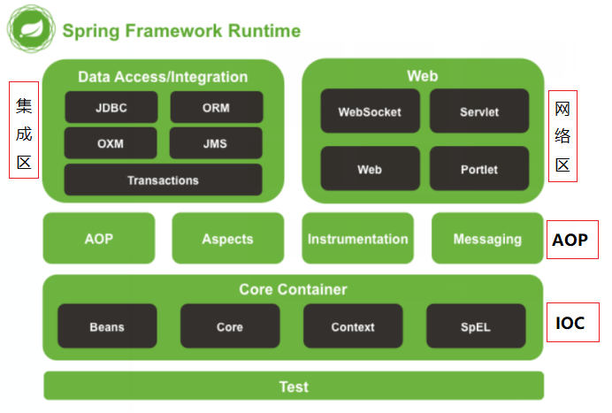

## 第1天: Spring 源码分析

### 一、目标

1. 理解Spring框架ioc的 **体系结构**
2. 理解Spring框架ioc的 **设计原理**
3. 掌握Spring框架ioc的 **构建流程** (源码分析)
4. 掌握Spring框架ioc的 **常见问题** (常见面试题)


### 二、Spring 应用案例

#### 2.1 需求

1. 使用Spring IOC创建并且存储对象
2. 使用Spring IOC管理对象依赖关系


#### 2.2 环境准备

1. 创建工程: spring01_source_01

2. 添加依赖: pom.xml

   ```xml
   <!-- 添加SpringIOC依赖 -->
   <dependency>
       <groupId>org.springframework</groupId>
       <artifactId>spring-context</artifactId>
       <version>5.2.0.RELEASE</version>
   </dependency>
   <!-- 添加Junit依赖 -->
   <dependency>
       <groupId>junit</groupId>
       <artifactId>junit</artifactId>
       <version>4.12</version>
   </dependency>
   ```

#### 2.3 代码开发

1. 持久层: com.itheima.source.dao.UserDao

   ```java
   package com.itheima.source.dao;
   
   /**
    * 持久层.
    *
    * @author : Jason.lee
    * @version : 1.0
    */
   public class CustomDao {
   
       /**
        * 保存用户.
        */
       public void save(){
           System.out.println("保存用户成功..");
       }
   }
   
   ```

   

2. 业务层: com.itheima.source.service.UserService

   ```java
   package com.itheima.source.service;
   
   import com.itheima.source.dao.CustomDao;
   
   /**
    * 业务层.
    *
    * @author : Jason.lee
    * @version : 1.0
    */
   public class CustomService {
   
       CustomDao customDao;
   
       public void setCustomDao(CustomDao customDao) {
           this.customDao = customDao;
       }
   
       /**
        * 保存用户.
        */
       public void save(){
           customDao.save();
       }
   }
   
   ```

   

3. 控制层: com.itheima.source.controller.UserController

   ```java
   package com.itheima.source.controller;
   
   import com.itheima.source.service.CustomService;
   
   /**
    * 控制层/表现层/视图层.
    *
    * @author : Jason.lee
    * @version : 1.0
    */
   public class CustomController {
   
       CustomService customService;
   
       public void setCustomService(CustomService customService) {
           this.customService = customService;
       }
   
       /**
        * 用户注册.
        */
       public void save(){
           customService.save();
       }
   }
   
   ```

4. 配置文件: beans.xml

   ```xml
   <?xml version="1.0" encoding="UTF-8"?>
   <beans xmlns="http://www.springframework.org/schema/beans"
          xmlns:xsi="http://www.w3.org/2001/XMLSchema-instance"
          xsi:schemaLocation="http://www.springframework.org/schema/beans
          http://www.springframework.org/schema/beans/spring-beans.xsd">
   
       <!-- 定义控制层对象 -->
       <bean id="customController" class="com.itheima.source.controller.CustomController">
           <property name="customService" ref="customService"/>
       </bean>
       <!-- 定义业务层对象 -->
       <bean id="customService" class="com.itheima.source.service.CustomService">
           <property name="customDao" ref="customDao"/>
       </bean>
       <!-- 定义持久层对象 -->
       <bean id="customDao" class="com.itheima.source.dao.CustomDao"/>
   
   </beans>
   ```

   

#### 2.4 单元测试

- IocTests

  ```java
  import com.itheima.source.controller.CustomController;
  import org.junit.After;
  import org.junit.Before;
  import org.junit.Test;
  import org.springframework.context.support.ClassPathXmlApplicationContext;
  
  /**
   * Spring IOC代码测试.
   *
   * @author : Jason.lee
   * @version : 1.0
   */
  public class IocTests {
  
      ClassPathXmlApplicationContext ioc;
  
      @Before
      public void before() {
          // 创建容器
          ioc = new ClassPathXmlApplicationContext("classpath:beans.xml");
      }
  
      @After
      public void after(){
          // 关闭容器
          ioc.close();
      }
  
      @Test
      public void testSave() {
          CustomController customController = ioc.getBean("customController", CustomController.class);
          customController.save();
      }
  }
  
  ```


### 三、Spring 工作流程


### 四、Spring 体系结构



##### Data Access/Integration

- JDBC: 对各大数据库厂商进行抽象处理
- ORM: 集成orm框架支持对象关系映射处理
- OXM: 提供了对 Object/XML映射实现的抽象层
- JMS: 主要包含了一些制造和消费消息的特性
- Transactions: 支持编程和声明式事务管理


##### Web

- Websocket: 提供了WebSocket和SocketJS的实现
- Servlet: 利用MVC(model-view-controller)的实现分离代码
- Web: 提供了基础的面向 Web 的集成特性(如: 文件上传)
- Portlet: 提供了Portlet环境下的MVC实现


##### 中间层

- AOP: 提供了符合AOP要求的面向切面的编程实现

- Aspects: 提供了与AspectJ的集成功能

- Instrumentation: 提供了类植入（Instrumentation）的支持和类加载器的实现
- Messaging: 用于构建基于消息的应用程序


##### Core Container

- Beans: Bean工厂与bean的装配
- Core: 依赖注入IoC与DI的最基本实现
- Content: IOC容器的企业服务扩展
- SpEl: 用于在运行时查询和操纵对象的表达式

##### Test

- 支持使用 JUnit 和 TestNG 对 Spring 组件进行测试


### 五、Spring 核心组件

#### 3.1 Spring核心组件表

| 序号 | 名称                                        | 描述                                                         |
| ---- | ------------------------------------------- | ------------------------------------------------------------ |
| 1    | BeanFactory                                 | 【重点】spring框架工厂体系结构的顶层接口，提供了基础规范：获取bean对象、bean的作用范围、bean的类型。 |
| 2    | ListableBeanFactory                         | BeanFactory接口中的getBean方法只能获取单个对象。ListableBeanFactory可以获取多个对象 |
| 3    | HierarchicalBeanFactory                     | 在一个spring应用中，支持有多个BeanFactory，并且可以设置为它们的父子关系。比如ssm框架整合中的两个ioc容器 |
| 4    | ApplicationContext                          | 【重点】项目中直接使用的工厂接口，它同时继承了ListableBeanFactory和HierarchicalBeanFactory接口 |
| 5    | ConfigurableApplicationContext              | 支持更多系统配置的工厂接口。比如：conversionService、environment、systemProperties、systemEnvironment |
| 6    | AbstractApplicationContext                  | 【重点】ApplicationContext工厂抽象类，提供了ioc容器初始化公共实现 |
| 7    | AbstractRefreshableApplicationContext       | 在AbstractApplicationContext基础上，增加了ioc容器重建支持    |
| 8    | AbstractRefreshableConfigApplicationContext | 增加了配置文件解析处理                                       |
| 9    | AbstractXmlApplicationContext               | 增加了配置文件解析处理                                       |
| 10   | ClassPathXmlApplicationContext              | 【重点】项目中，直接使用的工厂实现类。从类的根路径下加载配置文件，创建spring ioc容器 |
| 11   | DefaultListableBeanFactory                  | 【重点】在spring框架工厂体系结构中，它是最强大的工厂类，也是我们最终创建的ioc容器，它内部持有了一系列Map集合。 |

#### 3.2 Spring核心组件类图

- org.springframework.context.support.ClassPathXmlApplicationContext

  

- org.springframework.beans.factory.support.DefaultListableBeanFactory

  


### 六、Spring 源码分析

#### 4.1 学习目标

1. 熟练debug工具的使用


#### 4.2 Debug使用

1. 在入口方法中调用源代码: 如下第4行

   ```java
   @Before
   public void before() throws Exception {
       // 1. 加载配置文件
       InputStream in = Resources.getResourceAsStream("sqlMapConfig.xml");
       // 2. 构建会话工厂
       SqlSessionFactory sqlSessionFactory = new SqlSessionFactoryBuilder().build(in);
       // 3. 获取会话对象
       sqlSession = sqlSessionFactory.openSession();
       // 4. 生成代理对象
       accountDao = sqlSession.getMapper(AccountDao.class);
   }
   ```

1. 进入源代码所在位置, 在需要调试的位置打下断点

    

1. 以Debug方式运行代码, 图示如下

   

1. Debug模式界面示例

    

1. 步入: 进入方法内部

   

1. 强入: 强迫进入方法内部, 暴力提取源代码

    

1. 下一步: 进行下一行代码的调试

    

1. 步出: 返回上一层调用方法内部

    

1. 放行: 调试完毕 或 进入下一个断点位置


#### 4.3 跟踪: 容器构建主体流程

##### 4.3.1 研究方向

1. 构建容器经历了哪些步骤


##### 4.3.2 小试牛刀

1. 进入new ClassPathXmlApplicationContext()方法

   ```java
   public ClassPathXmlApplicationContext(String configLocation) throws BeansException {
       // 【成果】: 支持多配置文件构建容器
       this(new String[] {configLocation}, true, null);
   }
   ```

2. 进入多配置构建容器方法: ClassPathXmlApplicationContext.ClassPathXmlApplicationContext

   ```java
   public ClassPathXmlApplicationContext(
       String[] configLocations, boolean refresh, @Nullable ApplicationContext parent)
       throws BeansException {
       // 【成果】: Spring IOC容器支持父子关系
       // 【成果】: 支持层级关系必须先创建父容器, 然后在创建子容器时将父容器传递进来
       super(parent);
       // 保存配置文件
       // 变量值提示: configLocations = beans.xml
       setConfigLocations(configLocations);
       if (refresh) {
           // 【成果】: 该方法可以构建新容器也可以刷新已经存在的容器
           refresh();
       }
   }
   ```

3. 进入容器构建方法: ClassPathXmlApplicationContext.refresh

   ```java
   public void refresh() throws BeansException, IllegalStateException {
       // 【成果】: 构建容器已经加了同步锁机制, 避免多个容器创建的线程安全问题
       synchronized (this.startupShutdownMonitor) {
           // 准备工作: 记录容器启动的时间和状态标记
           prepareRefresh();
           /**
   			 * 配置文件解析流程: 封装GenericBeanDefinition对象
   			 * 		1. 将bean标签封装成BeanDefinition对象
   			 * 		2. 将BeanDefinition注册到BeanFactory中
   			 */
           ConfigurableListableBeanFactory beanFactory = obtainFreshBeanFactory();
   
           /**
   			 * 准备容器的基础设施: 创建特殊对象(框架内部使用的对象)
   			 * {@link #prepareBeanFactory(ConfigurableListableBeanFactory)}
   			 * 		1. 创建环境信息: environment 对象
   			 * 		2. 保存系统文件: systemProperties 对象
   			 * 		3. 保存环境变量: systemEnvironment 对象
   			 */
           prepareBeanFactory(beanFactory);
   
           try {
               // 工厂后置处理器: 配合下一步使用: 可以实现扩展
               // 内容提示: null
               // 如果有需要可以往beanFactory.beanFactoryPostProcessors中添加BeanFactoryPostProcessor
               postProcessBeanFactory(beanFactory);
   
               // 后置处理器调用: 配合上一步使用: 可以实现扩展
               // 内容提示: 会将上一步添加的内容实现/调用
               // 获取添加的beanFactory.beanFactoryPostProcessors, 调用BeanFactoryPostProcessor中的方法
               invokeBeanFactoryPostProcessors(beanFactory);
   
               // 注册Bean处理器: 可以在对象创建的前后(参考值：init-method)做一些增强处理
               /** {@link org.springframework.beans.factory.config.BeanPostProcessor} */
               // 		1. 对象创建前执行: postProcessBeforeInitialization()
               // 		2. 对象创建后执行: postProcessAfterInitialization()
               registerBeanPostProcessors(beanFactory);
   
               // 初始化国际化语言的支持
               // 		1. 创建相关对象: messageSource
               initMessageSource();
   
               // 初始化事件广播器
               // 		1. 创建相关对象: SimpleApplicationEventMulticaster
               // 			作用: 可以往对象applicationListeners属性中添加ApplicationListener事件监听器
               //				当有响应的事件发布, 将会执行监听器中的方法
               initApplicationEventMulticaster();
   
               // 初始化特殊对象: 用于扩展
               // 内容提示: null
               onRefresh();
   
               // 注册监听器: 往广播器对象applicationListeners属性中添加监听器
               // 			作用: 如果有相应的事件发布, 该监听器的方法会被调用
               registerListeners();
   
               // 初始化对象流程: 创建所有非延迟加载的单例对象
               finishBeanFactoryInitialization(beanFactory);
   
               // Last step: publish corresponding event.
               // 最后一步: 发布广播世间: 初始化完成 !!!
               finishRefresh();
           }
   
           catch (BeansException ex) {
               if (logger.isWarnEnabled()) {
                   logger.warn("Exception encountered during context initialization - " +
                               "cancelling refresh attempt: " + ex);
               }
   
               // Destroy already created singletons to avoid dangling resources.
               destroyBeans();
   
               // Reset 'active' flag.
               cancelRefresh(ex);
   
               // Propagate exception to caller.
               throw ex;
           }
   
           finally {
               // Reset common introspection caches in Spring's core, since we
               // might not ever need metadata for singleton beans anymore...
               resetCommonCaches();
           }
       }
   }
   ```


##### 4.3.3 研究成果

- 容器支持父子层级关系
- 容器构建的步骤: 
  1. **保存配置文件**
  2. 保存父容器: 支持父子层级关系
  3. 配置基础设施: 创建内部对象
  4. **创建新容器**: 解析配置文件
  5. 注册事件广播
  6. 注册监听器
  7. **初始化对象**: 创建单例对象
  8. 发送构建完成事件


#### 4.4 跟踪: 配置文件解析流程

##### 4.4.1 研究方向

1. 配置文件如何加载的
2. 配置中的对象什么时候创建


##### 4.4.2 牛刀小试

1. 进入配置文件解析方法: org.springframework.context.support.ClassPathXmlApplicationContext

   ```java
   protected ConfigurableListableBeanFactory obtainFreshBeanFactory() {
       // 构建最全功能的工厂空对象: new DefaultListableBeanFactory(null)
       refreshBeanFactory();
       // 获取工厂对象返回
       return getBeanFactory();
   }
   ```

   ```java
   protected final void refreshBeanFactory() throws BeansException {
       if (hasBeanFactory()) {
           destroyBeans();
           closeBeanFactory();
       }
       try {
           // 内部提示: new DefaultListableBeanFactory(null)
           DefaultListableBeanFactory beanFactory = createBeanFactory();
           beanFactory.setSerializationId(getId());
           customizeBeanFactory(beanFactory);
           // 【提示】: 加载配置文件并将bean标签封装成BeanDefinition对象
           loadBeanDefinitions(beanFactory);
           synchronized (this.beanFactoryMonitor) {
               // 【成果】: 对象保存在AbstractRefreshableApplicationContext类中
               this.beanFactory = beanFactory;
           }
       }
       catch (IOException ex) {
           throw new ApplicationContextException("I/O error parsing bean definition source for " + getDisplayName(), ex);
       }
   }
   ```

   

2. 进入加载配置文件流程: org.springframework.beans.factory.support.AbstractBeanDefinitionReader

   ```java
   public int loadBeanDefinitions(String... locations) throws BeanDefinitionStoreException {
       Assert.notNull(locations, "Location array must not be null");
       int count = 0;
       for (String location : locations) {
           // 【成果】: 如果有多个文件会同时加载
           count += loadBeanDefinitions(location);
       }
       return count;
   }
   ```

   ```java
   protected int doLoadBeanDefinitions(InputSource inputSource, Resource resource)
       throws BeanDefinitionStoreException {
   
       try {
           // 【成果】: 调用JDK工具创建XML文档对象
           Document doc = doLoadDocument(inputSource, resource);
           // 【提示】: 解析创建并注册BeanDefinition对象入口
           int count = registerBeanDefinitions(doc, resource);
           if (logger.isDebugEnabled()) {
               logger.debug("Loaded " + count + " bean definitions from " + resource);
           }
           return count;
       }..
   }
   ```

   

3. 进入XML文档解析方法: org.springframework.beans.factory.xml.DefaultBeanDefinitionDocumentReader

   ```java
   protected void doRegisterBeanDefinitions(Element root) {
       // Any nested <beans> elements will cause recursion in this method. In
       // order to propagate and preserve <beans> default-* attributes correctly,
       // keep track of the current (parent) delegate, which may be null. Create
       // the new (child) delegate with a reference to the parent for fallback purposes,
       // then ultimately reset this.delegate back to its original (parent) reference.
       // this behavior emulates a stack of delegates without actually necessitating one.
       BeanDefinitionParserDelegate parent = this.delegate;
       this.delegate = createDelegate(getReaderContext(), root, parent);
   
       if (this.delegate.isDefaultNamespace(root)) {
           // 【成果】: 根标签支持配置生效环境: <bean profile="dev" ..
           String profileSpec = root.getAttribute(PROFILE_ATTRIBUTE);
           if (StringUtils.hasText(profileSpec)) {
               String[] specifiedProfiles = StringUtils.tokenizeToStringArray(
                   profileSpec, BeanDefinitionParserDelegate.MULTI_VALUE_ATTRIBUTE_DELIMITERS);
               // We cannot use Profiles.of(...) since profile expressions are not supported
               // in XML config. See SPR-12458 for details.
               // 提示: 切换环境
               if (!getReaderContext().getEnvironment().acceptsProfiles(specifiedProfiles)) {
                   if (logger.isDebugEnabled()) {
                       logger.debug("Skipped XML bean definition file due to specified profiles [" + profileSpec +
                                    "] not matching: " + getReaderContext().getResource());
                   }
                   return;
               }
           }
       }
   
       // 【成果】： Spring支持在处理配置文件之前做一些扩展, 只需要实现以下方法
       preProcessXml(root);
       parseBeanDefinitions(root, this.delegate);
       // 【成果】： Spring支持在处理配置文件之后做一些扩展, 只需要实现以下方法
       postProcessXml(root);
   
       this.delegate = parent;
   }
   ```

   

4. 进入标签解析方法: org.springframework.beans.factory.xml.DefaultBeanDefinitionDocumentReader

   ```java
   protected void parseBeanDefinitions(Element root, BeanDefinitionParserDelegate delegate) {
       if (delegate.isDefaultNamespace(root)) {
           NodeList nl = root.getChildNodes();
           for (int i = 0; i < nl.getLength(); i++) {
               Node node = nl.item(i);
               // 【成果】: 只解析标签元素, 注释空格等字符不处理
               if (node instanceof Element) {
                   Element ele = (Element) node;
                   // 【成果】: 判断是否是Spring命名空间下的标签, 不是则使用自定义标签的解析方案
                   if (delegate.isDefaultNamespace(ele)) {
                       parseDefaultElement(ele, delegate);
                   }
                   else {
                       delegate.parseCustomElement(ele);
                   }
               }
           }
       }
       else {
           delegate.parseCustomElement(root);
       }
   }
   ```

   ```java
   private void parseDefaultElement(Element ele, BeanDefinitionParserDelegate delegate) {
       // 【提示】: 处理import标签
       if (delegate.nodeNameEquals(ele, IMPORT_ELEMENT)) {
           importBeanDefinitionResource(ele);
       }
       // 【提示】: 处理alias标签
       else if (delegate.nodeNameEquals(ele, ALIAS_ELEMENT)) {
           processAliasRegistration(ele);
       }
       // 【提示】: 处理bean标签
       else if (delegate.nodeNameEquals(ele, BEAN_ELEMENT)) {
           processBeanDefinition(ele, delegate);
       }
       // 【提示】: 处理beans标签
       else if (delegate.nodeNameEquals(ele, NESTED_BEANS_ELEMENT)) {
           // recurse
           doRegisterBeanDefinitions(ele);
       }
   }
   ```

   

5. 进入bean标签的解析: org.springframework.beans.factory.xml.DefaultBeanDefinitionDocumentReader

   ```java
   protected void processBeanDefinition(Element ele, BeanDefinitionParserDelegate delegate) {
       // 【提示】: 创建BeanDefinition对象
       BeanDefinitionHolder bdHolder = delegate.parseBeanDefinitionElement(ele);
       if (bdHolder != null) {
           bdHolder = delegate.decorateBeanDefinitionIfRequired(ele, bdHolder);
           try {
               // Register the final decorated instance.
               // 【提示】： 保存对象, 保存完文件解析流程结束
               BeanDefinitionReaderUtils.registerBeanDefinition(bdHolder, getReaderContext().getRegistry());
           }
           catch (BeanDefinitionStoreException ex) {
               getReaderContext().error("Failed to register bean definition with name '" +
                                        bdHolder.getBeanName() + "'", ele, ex);
           }
           // Send registration event.
           getReaderContext().fireComponentRegistered(new BeanComponentDefinition(bdHolder));
       }
   }
   ```

   

6. 进入BeanDefinition对象的创建: org.springframework.beans.factory.xml.BeanDefinitionParserDelegate

   ```java
   public BeanDefinitionHolder parseBeanDefinitionElement(Element ele, @Nullable BeanDefinition containingBean) {
       // 【成果】: 获取id属性值: customController
       String id = ele.getAttribute(ID_ATTRIBUTE);
       // 【成果】: 获取name属性值: null
       String nameAttr = ele.getAttribute(NAME_ATTRIBUTE);
   
       List<String> aliases = new ArrayList<>();
       if (StringUtils.hasLength(nameAttr)) {
           String[] nameArr = StringUtils.tokenizeToStringArray(nameAttr, MULTI_VALUE_ATTRIBUTE_DELIMITERS);
           aliases.addAll(Arrays.asList(nameArr));
       }
   
       // 【成果】: 将id值赋值给beanName
       String beanName = id;
       if (!StringUtils.hasText(beanName) && !aliases.isEmpty()) {
           beanName = aliases.remove(0);
           if (logger.isTraceEnabled()) {
               logger.trace("No XML 'id' specified - using '" + beanName +
                            "' as bean name and " + aliases + " as aliases");
           }
       }
   
       if (containingBean == null) {
           // 【成果】: 检查名称和别名是否已经使用过, 皆不能重复, 否则抛出异常
           // 内容提示: usedNames.contains(beanName,aliases)
           // 		this.usedNames.add(beanName);
           //		this.usedNames.addAll(aliases);
           checkNameUniqueness(beanName, aliases, ele);
       }
   	// 【提示】: 创建BeanDefinition对象跟踪位置
       AbstractBeanDefinition beanDefinition = parseBeanDefinitionElement(ele, beanName, containingBean);
       if (beanDefinition != null) {
           if (!StringUtils.hasText(beanName)) {
               try {
                   if (containingBean != null) {
                       beanName = BeanDefinitionReaderUtils.generateBeanName(
                           beanDefinition, this.readerContext.getRegistry(), true);
                   }
                   else {
                       //【成果】: 假如没有给id属性赋值, 将会自动生成相应的值
                       // 变量值提示: beanName = com.itheima.source.controller.CustomController#0
                       beanName = this.readerContext.generateBeanName(beanDefinition);
                       // Register an alias for the plain bean class name, if still possible,
                       // if the generator returned the class name plus a suffix.
                       // This is expected for Spring 1.2/2.0 backwards compatibility.
                       String beanClassName = beanDefinition.getBeanClassName();
                       if (beanClassName != null &&
                           beanName.startsWith(beanClassName) && beanName.length() > beanClassName.length() &&
                           !this.readerContext.getRegistry().isBeanNameInUse(beanClassName)) {
                           aliases.add(beanClassName);
                       }
                   }
                   if (logger.isTraceEnabled()) {
                       logger.trace("Neither XML 'id' nor 'name' specified - " +
                                    "using generated bean name [" + beanName + "]");
                   }
               }
               catch (Exception ex) {
                   error(ex.getMessage(), ele);
                   return null;
               }
           }
           String[] aliasesArray = StringUtils.toStringArray(aliases);
           // 【提示】： 最后封装在BeanDefinitionHolder对象中
           return new BeanDefinitionHolder(beanDefinition, beanName, aliasesArray);
       }
   
       return null;
   }
   ```

   ```java
   public static AbstractBeanDefinition createBeanDefinition(
       @Nullable String parentName, @Nullable String className, @Nullable ClassLoader classLoader) throws ClassNotFoundException {
   
       // 【成果】： 使用通用的对象封装标签内容
       GenericBeanDefinition bd = new GenericBeanDefinition();
       bd.setParentName(parentName);
       if (className != null) {
           if (classLoader != null) {
               // 【成果】: 在解析配置文件时加载了字节码对象
               bd.setBeanClass(ClassUtils.forName(className, classLoader));
           }
           else {
               bd.setBeanClassName(className);
           }
       }
       return bd;
   }
   ```

   

7. 进入BeanDefinition注册方法: org.springframework.beans.factory.support.DefaultListableBeanFactory

   ```java
   public void registerBeanDefinition(String beanName, BeanDefinition beanDefinition)
       throws BeanDefinitionStoreException {
   
       Assert.hasText(beanName, "Bean name must not be empty");
       Assert.notNull(beanDefinition, "BeanDefinition must not be null");
   
       BeanDefinition existingDefinition = this.beanDefinitionMap.get(beanName);
       if (existingDefinition != null) {
           ...
       }
       else {
           if (hasBeanCreationStarted()) {
               ...
           }
           else {
               // Still in startup registration phase
               // 【成果】: BeanDefinition保存在工厂中的map集合中(beanDefinitionMap)
               // 【提示】： 配置文件的解析流程完毕
               this.beanDefinitionMap.put(beanName, beanDefinition);
               this.beanDefinitionNames.add(beanName);
               removeManualSingletonName(beanName);
           }
           this.frozenBeanDefinitionNames = null;
       }
   
       if (existingDefinition != null || containsSingleton(beanName)) {
           resetBeanDefinition(beanName);
       }
   }
   ```

##### 4.4.3 研究成果

1. Spring底层用的是JDK代码解析XML文档的
2. 将配置文件中的bean标签内容封装到BeanDefinition(元数据对象)
3. 在解析文件的过程中Bean标签定义的对象并未创建


#### 4.5 跟踪: 对象的初始化流程

##### 4.5.1 研究方向

1. 容器中的对象什么时候创建
2. 容器是什么


##### 4.5.2 牛刀小试

1. 进入对象初始化流程: org.springframework.context.support.AbstractApplicationContext

   ```java
   protected void finishBeanFactoryInitialization(ConfigurableListableBeanFactory beanFactory) {
       // Initialize conversion service for this context.
       if (beanFactory.containsBean(CONVERSION_SERVICE_BEAN_NAME) &&
           beanFactory.isTypeMatch(CONVERSION_SERVICE_BEAN_NAME, ConversionService.class)) {
           beanFactory.setConversionService(
               beanFactory.getBean(CONVERSION_SERVICE_BEAN_NAME, ConversionService.class));
       }
   
       // Register a default embedded value resolver if no bean post-processor
       // (such as a PropertyPlaceholderConfigurer bean) registered any before:
       // at this point, primarily for resolution in annotation attribute values.
       if (!beanFactory.hasEmbeddedValueResolver()) {
           beanFactory.addEmbeddedValueResolver(strVal -> getEnvironment().resolvePlaceholders(strVal));
       }
   
       // Initialize LoadTimeWeaverAware beans early to allow for registering their transformers early.
       String[] weaverAwareNames = beanFactory.getBeanNamesForType(LoadTimeWeaverAware.class, false, false);
       for (String weaverAwareName : weaverAwareNames) {
           getBean(weaverAwareName);
       }
   
       // Stop using the temporary ClassLoader for type matching.
       beanFactory.setTempClassLoader(null);
   
       // Allow for caching all bean definition metadata, not expecting further changes.
       // 【成果】: 创建单例对象时, 配置被冻结, 不可更改
       beanFactory.freezeConfiguration();
   
       // Instantiate all remaining (non-lazy-init) singletons.
       // 【提示】: 创建单例对象的跟踪位置
       beanFactory.preInstantiateSingletons();
   }
   ```

2. 进入单例对象创建的处理方法: org.springframework.beans.factory.support.DefaultListableBeanFactory

   ```java
   public void preInstantiateSingletons() throws BeansException {
       if (logger.isTraceEnabled()) {
           logger.trace("Pre-instantiating singletons in " + this);
       }
   
       // Iterate over a copy to allow for init methods which in turn register new bean definitions.
       // While this may not be part of the regular factory bootstrap, it does otherwise work fine.
       List<String> beanNames = new ArrayList<>(this.beanDefinitionNames);
   
       // Trigger initialization of all non-lazy singleton beans...
       for (String beanName : beanNames) {
           RootBeanDefinition bd = getMergedLocalBeanDefinition(beanName);
           // 判断非抽象类, 非多例模式, 非延迟加载
           if (!bd.isAbstract() && bd.isSingleton() && !bd.isLazyInit()) {
               if (isFactoryBean(beanName)) {
                   ...
               }
               else {
                   // 【成果】: 创建对象是由getBean(String)方法创建的
                   getBean(beanName);
               }
           }
       }
   
       // Trigger post-initialization callback for all applicable beans...
       for (String beanName : beanNames) {
           Object singletonInstance = getSingleton(beanName);
           if (singletonInstance instanceof SmartInitializingSingleton) {
               final SmartInitializingSingleton smartSingleton = (SmartInitializingSingleton) singletonInstance;
               if (System.getSecurityManager() != null) {
                   AccessController.doPrivileged((PrivilegedAction<Object>) () -> {
                       smartSingleton.afterSingletonsInstantiated();
                       return null;
                   }, getAccessControlContext());
               }
               else {
                   smartSingleton.afterSingletonsInstantiated();
               }
           }
       }
   }
   ```

   

3. 进入对象的获取方法: org.springframework.beans.factory.support.AbstractBeanFactory

   ```java
   protected <T> T doGetBean(final String name, @Nullable final Class<T> requiredType,
                             @Nullable final Object[] args, boolean typeCheckOnly) throws BeansException {
   
       final String beanName = transformedBeanName(name);
       Object bean;
   
       // Eagerly check singleton cache for manually registered singletons.
       // 【成果】: 检查对象是否已经在单例对象中 (已创建)
       Object sharedInstance = getSingleton(beanName);
       if (sharedInstance != null && args == null) {
           if (logger.isTraceEnabled()) {
               if (isSingletonCurrentlyInCreation(beanName)) {
                   logger.trace("Returning eagerly cached instance of singleton bean '" + beanName +
                                "' that is not fully initialized yet - a consequence of a circular reference");
               }
               else {
                   logger.trace("Returning cached instance of singleton bean '" + beanName + "'");
               }
           }
           bean = getObjectForBeanInstance(sharedInstance, name, beanName, null);
       }
   
       else {
           // Fail if we're already creating this bean instance:
           // We're assumably within a circular reference.
           //【成果】: 如果有循环的引用(依赖注入)抛出异常..
           if (isPrototypeCurrentlyInCreation(beanName)) {
               throw new BeanCurrentlyInCreationException(beanName);
           }
   
           // Check if bean definition exists in this factory.
           // 【成果】: 当前容器没有则从父容器中获取
           BeanFactory parentBeanFactory = getParentBeanFactory();
           if (parentBeanFactory != null && !containsBeanDefinition(beanName)) {
               ...
           }
   
           if (!typeCheckOnly) {
               // 【成果】: 标记为已经创建的对象  (准备实例化)
               markBeanAsCreated(beanName);
           }
   
           try {
               final RootBeanDefinition mbd = getMergedLocalBeanDefinition(beanName);
               checkMergedBeanDefinition(mbd, beanName, args);
   			...
   
               // Create bean instance.
               // 【成果】: 判断是否单例模式
               if (mbd.isSingleton()) {
                   sharedInstance = getSingleton(beanName, () -> {
                       try {
                           // 提示: 创建并保存对象
                           return createBean(beanName, mbd, args);
                       }
                       catch (BeansException ex) {
                           // 提示: 销毁对象
                           // Explicitly remove instance from singleton cache: It might have been put there
                           // eagerly by the creation process, to allow for circular reference resolution.
                           // Also remove any beans that received a temporary reference to the bean.
                           destroySingleton(beanName);
                           throw ex;
                       }
                   });
                   bean = getObjectForBeanInstance(sharedInstance, name, beanName, mbd);
               }
   
               else if (mbd.isPrototype()) {
                   // It's a prototype -> create a new instance.
                   Object prototypeInstance = null;
                   try {
                       beforePrototypeCreation(beanName);
                       prototypeInstance = createBean(beanName, mbd, args);
                   }
                   finally {
                       afterPrototypeCreation(beanName);
                   }
                   bean = getObjectForBeanInstance(prototypeInstance, name, beanName, mbd);
               }...
       }
       return (T) bean;
   }
   ```

   

4. 进入单例对象创建子流程: org.springframework.beans.factory.support.AbstractAutowireCapableBeanFactory

   ```java
   protected Object doCreateBean(final String beanName, final RootBeanDefinition mbd, final @Nullable Object[] args)
       throws BeanCreationException {
   
       // Instantiate the bean.
       BeanWrapper instanceWrapper = null;
       if (mbd.isSingleton()) {
           instanceWrapper = this.factoryBeanInstanceCache.remove(beanName);
       }
       if (instanceWrapper == null) {
           // 【成果】: 反射调用构造方法创建对象
           instanceWrapper = createBeanInstance(beanName, mbd, args);
       }
       final Object bean = instanceWrapper.getWrappedInstance();
       ...
       Object exposedObject = bean;
   	...
       return exposedObject;
   }
   ```

   

5. 反射调用构造方法创建对象: org.springframework.beans.BeanUtils

   ```java
   public static <T> T instantiateClass(Constructor<T> ctor, Object... args) throws BeanInstantiationException {
       Assert.notNull(ctor, "Constructor must not be null");
       try {
           ReflectionUtils.makeAccessible(ctor);
           if (KotlinDetector.isKotlinReflectPresent() && KotlinDetector.isKotlinType(ctor.getDeclaringClass())) {
               return KotlinDelegate.instantiateClass(ctor, args);
           }
           else {
               Class<?>[] parameterTypes = ctor.getParameterTypes();
               Assert.isTrue(args.length <= parameterTypes.length, "Can't specify more arguments than constructor parameters");
               Object[] argsWithDefaultValues = new Object[args.length];
               for (int i = 0 ; i < args.length; i++) {
                   if (args[i] == null) {
                       Class<?> parameterType = parameterTypes[i];
                       argsWithDefaultValues[i] = (parameterType.isPrimitive() ? DEFAULT_TYPE_VALUES.get(parameterType) : null);
                   }
                   else {
                       argsWithDefaultValues[i] = args[i];
                   }
               }
               //【成果】: 使用构造方法反射创建对象
               return ctor.newInstance(argsWithDefaultValues);
           }
       }...
   }
   
   ```

   

6. 进入保存单例对象到容器子流程: org.springframework.beans.factory.support.DefaultSingletonBeanRegistry

   ```java
   public Object getSingleton(String beanName, ObjectFactory<?> singletonFactory) {
       Assert.notNull(beanName, "Bean name must not be null");
       synchronized (this.singletonObjects) {
           Object singletonObject = this.singletonObjects.get(beanName);
           if (singletonObject == null) {
               if (this.singletonsCurrentlyInDestruction) {
                   throw new BeanCreationNotAllowedException(beanName,
                                                             "Singleton bean creation not allowed while singletons of this factory are in destruction " +
                                                             "(Do not request a bean from a BeanFactory in a destroy method implementation!)");
               }
               ...
               try {
                   // 【提示】: 回调AbstractBeanFactory中的Lambda表达式创建对象
                   // {@code return createBean(beanName, mbd, args)}
                   singletonObject = singletonFactory.getObject();
                   newSingleton = true;
               }
               ...
               if (newSingleton) {
                   // 【成果】: 如果是单例模式, 则保存到容器
                   addSingleton(beanName, singletonObject);
               }
           }
           return singletonObject;
       }
   }
   ```

   

7. 保存到单例对象到容器中: org.springframework.beans.factory.support.DefaultSingletonBeanRegistry

   ```java
   protected void addSingleton(String beanName, Object singletonObject) {
       // 给容器加锁
       synchronized (this.singletonObjects) {
           // 【成果】: IOC容器本质上是名为singletonObjects的Map集合
           // 【成果】: 猜想当调用getBean方法时应该是从此集合中获取对象
           this.singletonObjects.put(beanName, singletonObject);
           this.singletonFactories.remove(beanName);
           this.earlySingletonObjects.remove(beanName);
           this.registeredSingletons.add(beanName);
       }
   }
   ```

   


##### 4.5.3 研究结果

1. 单例对象在配置文件解析完成之后创建的
2. 子容器没有获取到对象再从父容器中尝试
3. IOC容器本质上是名为singletonObjects的Map集合


#### 4.6 跟踪: 根据名称获取对象

##### 4.6.1 研究方向

1. 如何根据名称从容器中获取对象


##### 4.6.2 小试牛刀

1. 进入对象获取方法: org.springframework.context.support.AbstractApplicationContext

   ```java
   public <T> T getBean(String name, Class<T> requiredType) throws BeansException {
       assertBeanFactoryActive();
       // 变量值提示: getBeanFactory() = DefaultListableBeanFactory
       return getBeanFactory().getBean(name, requiredType);
   }
   ```

   

2. 从容器中获取对象: org.springframework.beans.factory.support.AbstractBeanFactory

   ```java
   protected <T> T doGetBean(final String name, @Nullable final Class<T> requiredType,
                             @Nullable final Object[] args, boolean typeCheckOnly) throws BeansException {
   
       final String beanName = transformedBeanName(name);
       Object bean;
   
       // Eagerly check singleton cache for manually registered singletons.
       // 【成果】: 检查对象是否已经在单例对象中 (已创建)
       // 【提示】: 对象获取流程跟踪位置
       Object sharedInstance = getSingleton(beanName);
       ...
       // 【成果】： 名称和类型同时提供， 只使用名称， 得到对象后强转
       return (T) bean;
   }
   
   ```


##### 4.6.3 研究成果

1. 对象的初始化存储就是根据名称为key存储在singletonObjects名称的Map中
2. 如果当前容器没有还会尝试从父容器中获取


#### 4.7 跟踪: 根据类型获取对象

##### 4.7.1 研究方向

1. 如何根据类型获取对象


##### 4.7.2 牛刀小试

1. 根据类型获取对象:  org.springframework.context.support.AbstractApplicationContext

   ```java
   public <T> T getBean(Class<T> requiredType) throws BeansException {
       assertBeanFactoryActive();
       // 变量值提示: getBeanFactory() = DefaultListableBeanFactory
       return getBeanFactory().getBean(requiredType);
   }
   ```

   

2. 根据字节码类型匹配对象:  org.springframework.beans.factory.support.DefaultListableBeanFactory

   ```java
   private <T> T resolveBean(ResolvableType requiredType, @Nullable Object[] args, boolean nonUniqueAsNull) {
       // 【提示】: 根据类型获取匹配的对象
       NamedBeanHolder<T> namedBean = resolveNamedBean(requiredType, args, nonUniqueAsNull);
       if (namedBean != null) {
           return namedBean.getBeanInstance();
       }
       BeanFactory parent = getParentBeanFactory();
       if (parent instanceof DefaultListableBeanFactory) {
           return ((DefaultListableBeanFactory) parent).resolveBean(requiredType, args, nonUniqueAsNull);
       }
       else if (parent != null) {
           ObjectProvider<T> parentProvider = parent.getBeanProvider(requiredType);
           if (args != null) {
               return parentProvider.getObject(args);
           }
           else {
               return (nonUniqueAsNull ? parentProvider.getIfUnique() : parentProvider.getIfAvailable());
           }
       }
       return null;
   }
   ```

   

3. 根据类型与配置中的标签匹配:  org.springframework.beans.factory.support.DefaultListableBeanFactory

   ```java
   private <T> NamedBeanHolder<T> resolveNamedBean(
       ResolvableType requiredType, @Nullable Object[] args, boolean nonUniqueAsNull) throws BeansException {
   
       Assert.notNull(requiredType, "Required type must not be null");
       String[] candidateNames = getBeanNamesForType(requiredType);
       ...
           // 【提示】: 只有一个则直接返回
           if (candidateNames.length == 1) {
               String beanName = candidateNames[0];
               return new NamedBeanHolder<>(beanName, (T) getBean(beanName, requiredType.toClass(), args));
           }
       // 【成果】： 如果有多个符合要求,则抛出异常 (除非设置主要次要关系)
       // 【成果】： bean标签支持配置主要和次要关系:
       // 			(primary="true"): true则是主要的, 当多个类型时使用
       else if (candidateNames.length > 1) {
           Map<String, Object> candidates = new LinkedHashMap<>(candidateNames.length);
           for (String beanName : candidateNames) {
               if (containsSingleton(beanName) && args == null) {
                   Object beanInstance = getBean(beanName);
                   candidates.put(beanName, (beanInstance instanceof NullBean ? null : beanInstance));
               }
               else {
                   candidates.put(beanName, getType(beanName));
               }
           }
           // 【提示】： 根据主次关系选择主要的对象返回
           String candidateName = determinePrimaryCandidate(candidates, requiredType.toClass());
           if (candidateName == null) {
               candidateName = determineHighestPriorityCandidate(candidates, requiredType.toClass());
           }
           if (candidateName != null) {
               Object beanInstance = candidates.get(candidateName);
               if (beanInstance == null || beanInstance instanceof Class) {
                   beanInstance = getBean(candidateName, requiredType.toClass(), args);
               }
               return new NamedBeanHolder<>(candidateName, (T) beanInstance);
           }
           // 【成果】: 决定不了使用具体的对象则抛出异常
           if (!nonUniqueAsNull) {
               throw new NoUniqueBeanDefinitionException(requiredType, candidates.keySet());
           }
       }
   
       return null;
   }
   ```

   

4. 匹配配置中的bean标签: org.springframework.beans.factory.support.DefaultListableBeanFactory

   ```java
   private String[] doGetBeanNamesForType(ResolvableType type, boolean includeNonSingletons, boolean allowEagerInit) {
       List<String> result = new ArrayList<>();
   
       // 【成果】遍历BeanDefinition对象, 逐个匹配
       for (String beanName : this.beanDefinitionNames) {
           // Only consider bean as eligible if the bean name
           // is not defined as alias for some other bean.
           if (!isAlias(beanName)) {
               try {
                   RootBeanDefinition mbd = getMergedLocalBeanDefinition(beanName);
                   // Only check bean definition if it is complete.
                   if (!mbd.isAbstract() && (allowEagerInit ||
                                             (mbd.hasBeanClass() || !mbd.isLazyInit() || isAllowEagerClassLoading()) &&
                                             !requiresEagerInitForType(mbd.getFactoryBeanName()))) {
                       boolean isFactoryBean = isFactoryBean(beanName, mbd);
                       BeanDefinitionHolder dbd = mbd.getDecoratedDefinition();
                       boolean matchFound = false;
                       boolean allowFactoryBeanInit = allowEagerInit || containsSingleton(beanName);
                       boolean isNonLazyDecorated = dbd != null && !mbd.isLazyInit();
                       if (!isFactoryBean) {
                           if (includeNonSingletons || isSingleton(beanName, mbd, dbd)) {
                               // 【提示】: 匹配规则跟踪位置
                               matchFound = isTypeMatch(beanName, type, allowFactoryBeanInit);
                           }
                       }
                       ...
                       if (matchFound) {
                           // 【提示】: 匹配成果则将名称一起返回
                           result.add(beanName);
                       }
                   }
               }
           }
       }
   	...
   
       return StringUtils.toStringArray(result);
   }
   
   ```

   

5. 根据类型获取对象匹配规则: org.springframework.beans.factory.support.AbstractBeanFactory

   ```java
   protected boolean isTypeMatch(String name, ResolvableType typeToMatch, boolean allowFactoryBeanInit)
       throws NoSuchBeanDefinitionException {
   
       String beanName = transformedBeanName(name);
       boolean isFactoryDereference = BeanFactoryUtils.isFactoryDereference(name);
   
       // Check manually registered singletons.
       // 【提示】: 先确认单例对象已经创建
       Object beanInstance = getSingleton(beanName, false);
       if (beanInstance != null && beanInstance.getClass() != NullBean.class) {
           if (beanInstance instanceof FactoryBean) {
               if (!isFactoryDereference) {
                   Class<?> type = getTypeForFactoryBean((FactoryBean<?>) beanInstance);
                   return (type != null && typeToMatch.isAssignableFrom(type));
               }
               else {
                   return typeToMatch.isInstance(beanInstance);
               }
           }
           else if (!isFactoryDereference) {
               // 【成果】: 如果类型相同则匹配成功
               if (typeToMatch.isInstance(beanInstance)) {
                   // 【提示】: 类型相同直接匹配成功
                   return true;
               }
               ...
           }
           return false;
       }
       else if (containsSingleton(beanName) && !containsBeanDefinition(beanName)) {
           // null instance registered
           return false;
       }
   
       // No singleton instance found -> check bean definition.
       BeanFactory parentBeanFactory = getParentBeanFactory();
       // 【成果】: 同时也从父容器中匹配, 如果有则也返回
       // (所以父子容器都存会有冲突)
       if (parentBeanFactory != null && !containsBeanDefinition(beanName)) {
           // No bean definition found in this factory -> delegate to parent.
           return parentBeanFactory.isTypeMatch(originalBeanName(name), typeToMatch);
       }
       ...
   }
   ```

##### 4.7.3 研究成果

1. 指定类型获取对象的方法是遍历配置中所有的bean标签匹配
2. Bean标签支持配置属性(primary="true"), 将对象作为主要的使用对象 (当类型出现多个时使用该对象)


### 七、Spring常见面试题

1. Spring框架中的IOC是什么?

   ```shell
   #题目背景
   	1. 考察对Spring框架IOC概念的理解和应用
   	
   #答题思路
   	1. 控制反转（Inversion of Control，缩写为IoC），是面向对象编程中的一种设计原则，可以用来减低计算机代码之间的耦合度。
   	2. 所谓反转是只对象获得的方式由原先的主动创建变为被动获取
   	3. 在Spring框架中IOC往往也指"容器", 即: BeanFactory中名为singletonObjects的Map集合
   ```

   

2. Spring框架中有哪些设计模式?

   ```shell
   #题目背景
   	1. 考察对Spring框架的设计层面的理解
   	
   #答题思路
   	1. 工厂设计模式 (BeanFactory)
   	2. 单例设计模式 (默认所有的bean都是单例的)
   		应用中有且只有一个对象
   		
   	3. 代理设计模式 (AOP底层是动态代理技术)
   	4. 模板设计模式
   		JdbcTemplate, RedisTemplate, JmsTemplate..
   	5. 构建器设计模式 (Builder)
   		提供更方便灵活的创建对象的方式
   ```

   

3. Spring框架中的对象是线程安全的吗?

   ```shell
   #题目背景
   	1. 结合Spring框架考察并发编程的编码能力
   	
   #答题思路
   	1. Spring IOC负责创建以及管理对象, 但并未负责对象内部的线程安全问题
   	2. 如果被管理的对象本身存在线程安全问题, 那么需要在编码时设计规避此问题
   ```

   

4. Spring框架中的AOP是什么?

   ```shell
   #题目背景
   	1. 考察对Spring框架AOP概念的理解和应用
   	
   #答题思路
   	1. AOP为Aspect Oriented Programming的缩写，意为：面向切面编程，通过预编译方式和运行期动态代理实现程序功能的统一维护的一种技术。
   	2. Spring AOP底层使用的是动态代理技术实现的: 在不修改目标对象的前提下对象目标方法进行增强 功能
   	3. 在实际项目中, AOP常用语声明式事务, 日志处理, 异常监控等..
   ```

5. Spring框架管理事务的方式有几种？

   ```shell
   #题目背景
   	1. 考察对Spring框架事务知识点的广度
   	
   #答题思路
   	1. Spring提供了两种对事务的管理方式, 分别是声明式事务和编程式事务
   	2. Spring声明式事务是基于Spring AOP技术完成的事务管理功能
   	3. Spring编程式事务是Spring使用模板设计模式封装的事务管理API
   	
   ```

   