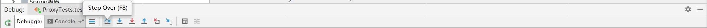
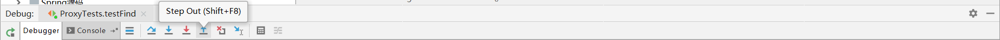

## 第1天: Spring 源码分析

### 一、目标

1. 理解Spring框架ioc的 **体系结构**
2. 理解Spring框架ioc的 **设计原理**
3. 掌握Spring框架ioc的 **构建流程** (源码分析)
4. 掌握Spring框架ioc的 **常见问题** (常见面试题)


### 二、Spring 应用案例

#### 2.1 需求

1. 使用Spring IOC创建并且存储对象
2. 使用Spring IOC管理对象依赖关系


#### 2.2 环境准备

1. 创建工程: spring01_source_01

2. 添加依赖: pom.xml

   ```xml
   <!-- 添加SpringIOC依赖 -->
   <dependency>
       <groupId>org.springframework</groupId>
       <artifactId>spring-context</artifactId>
       <version>5.2.0.RELEASE</version>
   </dependency>
   <!-- 添加Junit依赖 -->
   <dependency>
       <groupId>junit</groupId>
       <artifactId>junit</artifactId>
       <version>4.12</version>
   </dependency>
   ```

#### 2.3 代码开发

1. 持久层: com.itheima.source.dao.UserDao

   ```java
   package com.itheima.source.dao;
   
   /**
    * 持久层.
    *
    * @author : Jason.lee
    * @version : 1.0
    */
   public class CustomDao {
   
       /**
        * 保存用户.
        */
       public void save(){
           System.out.println("保存用户成功..");
       }
   }
   
   ```

   

2. 业务层: com.itheima.source.service.UserService

   ```java
   package com.itheima.source.service;
   
   import com.itheima.source.dao.CustomDao;
   
   /**
    * 业务层.
    *
    * @author : Jason.lee
    * @version : 1.0
    */
   public class CustomService {
   
       CustomDao customDao;
   
       public void setCustomDao(CustomDao customDao) {
           this.customDao = customDao;
       }
   
       /**
        * 保存用户.
        */
       public void save(){
           customDao.save();
       }
   }
   
   ```

   

3. 控制层: com.itheima.source.controller.UserController

   ```java
   package com.itheima.source.controller;
   
   import com.itheima.source.service.CustomService;
   
   /**
    * 控制层/表现层/视图层.
    *
    * @author : Jason.lee
    * @version : 1.0
    */
   public class CustomController {
   
       CustomService customService;
   
       public void setCustomService(CustomService customService) {
           this.customService = customService;
       }
   
       /**
        * 用户注册.
        */
       public void save(){
           customService.save();
       }
   }
   
   ```

4. 配置文件: beans.xml

   ```xml
   <?xml version="1.0" encoding="UTF-8"?>
   <beans xmlns="http://www.springframework.org/schema/beans"
          xmlns:xsi="http://www.w3.org/2001/XMLSchema-instance"
          xsi:schemaLocation="http://www.springframework.org/schema/beans
          http://www.springframework.org/schema/beans/spring-beans.xsd">
   
       <!-- 定义控制层对象 -->
       <bean id="customController" class="com.itheima.source.controller.CustomController">
           <property name="customService" ref="customService"/>
       </bean>
       <!-- 定义业务层对象 -->
       <bean id="customService" class="com.itheima.source.service.CustomService">
           <property name="customDao" ref="customDao"/>
       </bean>
       <!-- 定义持久层对象 -->
       <bean id="customDao" class="com.itheima.source.dao.CustomDao"/>
   
   </beans>
   ```

   

#### 2.4 单元测试

- IocTests

  ```java
  import com.itheima.source.controller.CustomController;
  import org.junit.After;
  import org.junit.Before;
  import org.junit.Test;
  import org.springframework.context.support.ClassPathXmlApplicationContext;
  
  /**
   * Spring IOC代码测试.
   *
   * @author : Jason.lee
   * @version : 1.0
   */
  public class IocTests {
  
      ClassPathXmlApplicationContext ioc;
  
      @Before
      public void before() {
          // 创建容器
          ioc = new ClassPathXmlApplicationContext("classpath:beans.xml");
      }
  
      @After
      public void after(){
          // 关闭容器
          ioc.close();
      }
  
      @Test
      public void testSave() {
          CustomController customController = ioc.getBean("customController", CustomController.class);
          customController.save();
      }
  }
  
  ```

  


### 三、Spring 体系结构

#### 3.1 Spring核心组件表

| 序号 | 名称                                        | 描述                                                         |
| ---- | ------------------------------------------- | ------------------------------------------------------------ |
| 1    | BeanFactory                                 | 【重点】spring框架工厂体系结构的顶层接口，提供了基础规范：获取bean对象、bean的作用范围、bean的类型。 |
| 2    | ListableBeanFactory                         | BeanFactory接口中的getBean方法只能获取单个对象。ListableBeanFactory可以获取多个对象 |
| 3    | HierarchicalBeanFactory                     | 在一个spring应用中，支持有多个BeanFactory，并且可以设置为它们的父子关系。比如ssm框架整合中的两个ioc容器 |
| 4    | ApplicationContext                          | 【重点】项目中直接使用的工厂接口，它同时继承了ListableBeanFactory和HierarchicalBeanFactory接口 |
| 5    | ConfigurableApplicationContext              | 支持更多系统配置的工厂接口。比如：conversionService、environment、systemProperties、systemEnvironment |
| 6    | AbstractApplicationContext                  | 【重点】ApplicationContext工厂抽象类，提供了ioc容器初始化公共实现 |
| 7    | AbstractRefreshableApplicationContext       | 在AbstractApplicationContext基础上，增加了ioc容器重建支持    |
| 8    | AbstractRefreshableConfigApplicationContext | 增加了配置文件解析处理                                       |
| 9    | AbstractXmlApplicationContext               | 增加了配置文件解析处理                                       |
| 10   | ClassPathXmlApplicationContext              | 【重点】项目中，直接使用的工厂实现类。从类的根路径下加载配置文件，创建spring ioc容器 |
| 11   | DefaultListableBeanFactory                  | 【重点】在spring框架工厂体系结构中，它是最强大的工厂类，也是我们最终创建的ioc容器，它内部持有了一系列Map集合。 |

#### 3.2 Spring核心组件类图


### 四、Spring 构建流程

#### 4.1 学习目标

1. 熟练debug工具的使用


#### 4.2 Debug使用

1. 在入口方法中调用源代码: 如下第4行

   ```java
   @Before
   public void before() throws Exception {
       // 1. 加载配置文件
       InputStream in = Resources.getResourceAsStream("sqlMapConfig.xml");
       // 2. 构建会话工厂
       SqlSessionFactory sqlSessionFactory = new SqlSessionFactoryBuilder().build(in);
       // 3. 获取会话对象
       sqlSession = sqlSessionFactory.openSession();
       // 4. 生成代理对象
       accountDao = sqlSession.getMapper(AccountDao.class);
   }
   ```

1. 进入源代码所在位置, 在需要调试的位置打下断点

    

1. 以Debug方式运行代码, 图示如下

   

1. Debug模式界面示例

    

1. 步入: 进入方法内部

   

1. 强入: 强迫进入方法内部, 暴力提取源代码

    

1. 下一步: 进行下一行代码的调试

    

1. 步出: 返回上一层调用方法内部

    

1. 放行: 调试完毕 或 进入下一个断点位置


#### 4.3 跟踪: 使用配置构建容器


### 五、Spring 常见面试题